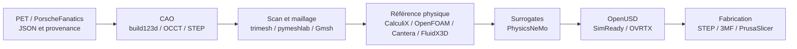
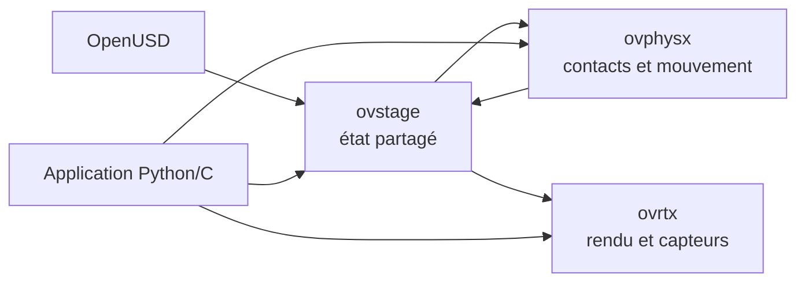

# Stack logicielle du jumeau numérique

Cette page décrit la stack retenue au **8 septembre 2026**. Elle distingue les
outils réellement exécutés des briques seulement définies, évaluées ou encore
bloquées. Les versions propres à une preuve restent aussi inscrites dans son
rapport JSON : une version générale de cette page ne remplace pas la provenance
d'un calcul.

Statuts utilisés :

- **exécuté** : une sortie et son SHA-256 sont conservés dans le dépôt ;
- **image vérifiée** : import/smoke réalisé, sans calcul de pièce implicite ;
- **défini** : Dockerfile, contrat ou runbook présent mais pas de preuve pour la
  pièce considérée ;
- **évalué, non retenu** : outil étudié mais absent du chemin faisant autorité ;
- **bloqué** : entrée, GPU, licence, mesure ou corrélation manquante.

## Chaîne complète et lieu d'exécution

| Étape | Outil faisant autorité | Lieu normal | Entrée → sortie | Statut actuel |
|---|---|---|---|---|
| Catalogue | JSON Schema, Python, PorscheFanatics/PET et sources fabricant | Mac | source → fiche avec provenance | exécuté |
| Orchestration | Codex, Git, GitHub, GitHub Actions, Make | Mac/CI | demande → changement revu et testé | exécuté, jamais preuve CAE |
| CAO BREP | build123d 0.11.1, OCCT 7.9.3.1, FreeCAD pour revue | X1/Mac | paramètres → STEP | exécuté |
| Géométrie implicite | PicoGK 2.3.0 + runtime `picogk.26.2` | X1 amd64 | domaine/keep-outs → voxel/mesh | exécuté sur piston, criblage seulement |
| Scan/reconstruction | COLMAP, GLOMAP, Open3D, pymeshlab, Blender | Vast GPU/X1 | photos/scan → nuage/maillage | image définie; données réelles par pièce requises |
| Maillage | Gmsh 4.12.1 ou version figée par preuve | X1/CPU Vast | STEP → tétraèdres | exécuté |
| Structure/thermique | CalculiX 2.21 | X1/CPU Vast | maillage + cas → contraintes/températures | exécuté |
| CFD/CHT moteur | OpenFOAM 13/14, Cantera 3.2.0, FluidX3D en contre-calcul | CPU/GPU selon cas | domaine + limites → champs | exécuté sur témoins, pas corrélé véhicule |
| Géométrie LPBF | trancheur de couches du dépôt + trimesh 5.1.0 | X1 | maillage fermé → couches/supports proxy | exécuté |
| Bain de fusion | ORNL AdditiveFOAM 2.0.0 sur OpenFOAM 14 | CPU/HPC | carte procédé + coupon → bain fondu | exécuté sur témoins 917, bloqué pour les petits F0 993 |
| CAO → USD | `usd-convert-cad 0.2.0`, OpenUSD 26.8 | X1 | STEP → USD binaire | exécuté |
| Validation USD | `nvidia_usd_validate 1.21.0` | X1 | USD → rapport de règles | exécuté |
| Scène partagée | `ovstage 0.1.1.355824` | X1/Vast | USD composé → état runtime | exécuté sur crochet et levier |
| Corps rigides | `ovphysx 0.5.11` | X1 CPU; Vast pour GPU | ovstage → contacts/mouvements | exécuté sur crochet et levier, cas synthétiques |
| Rendu/senseurs | OVRTX + ovstage | Vast RTX | scène → pixels/senseurs | exécuté sur d'autres révisions; bloqué pour crochet et levier F0 |
| Enrichissement USD | NVIDIA Material Agent, Physics Agent, SimReady Foundation | Vast RTX | USD + références → USD proposé | exécuté ailleurs; toute propriété non sourcée est retirée |
| Surrogate | PhysicsNeMo 2.2.x, PyTorch CUDA | Vast GPU | cas solveur corrélés → modèle accéléré | smoke GPU seulement; aucun surrogate de pièce |
| Préparation machine | logiciel et fichier signé du fournisseur, typiquement EOSPRINT pour EOS | fournisseur | STEP + exigences → build industriel | bloqué tant que la route n'est pas qualifiée |
| Corrélation | métrologie, CT/CND, coupons, bancs | laboratoire/fournisseur | pièce réelle → erreur modèle | non démarré pour les F0 |

Le Mac est le contrôleur et l'environnement documentaire. Le X1/Kali exécute
les conteneurs CPU `linux/amd64`. Vast.ai n'est loué que pour CUDA/RTX,
PhysicsNeMo, photogrammétrie dense, Content Agents ou OVRTX, après verrouillage
de l'image, des entrées, du coût et du mécanisme de destruction.

## Socle

| Couche | Stack | Rôle |
| --- | --- | --- |
| Données | JSON, schémas JSON, Markdown | `catalog/parts/*.json` est la source de vérité |
| Automatisation | Python standard library, GNU Make | Génération, validation et `make check` |
| Versionnement | Git, GitHub, GitHub Actions | Revue, CI et preuves de build |
| Conteneurs | Docker, Buildx, GHCR | Images `linux/amd64` par digest immuable |
| Secrets/location | wrappers OpenBao, CLI Vast.ai | Accès borné, singleton, récupération et destruction |
| Formats maîtres | build123d, `.FCStd`, OpenSCAD, STEP | Géométrie éditable et dimensionnelle |
| Formats dérivés | STL, 3MF, OBJ, PLY, OpenUSD | Impression, scan, assemblage et visualisation |

Voir aussi [TOOLCHAIN.md](TOOLCHAIN.md),
[COMPUTE_ENVIRONMENT.md](COMPUTE_ENVIRONMENT.md) et
[AI_DIGITAL_TWIN_STACK.md](AI_DIGITAL_TWIN_STACK.md).

## CAO, scan et métrologie

- CAO qualifiée : Python 3.12.14, build123d 0.11.1 et OCCT 7.9.3.1
  dans `cad-author-f28` ; sortie BREP/STEP.
- Scan qualifié : NumPy 2.5.2, SciPy 1.18.1, trimesh 5.1.0,
  pymeshlab 2025.7.post1 et Rtree 1.4.1 dans `scan-mesh-f17`.
- Image générale `mesh-cfd` : Blender, Gmsh, OpenFOAM 13, build123d,
  meshio et manifold3d.
- FreeCAD et OpenSCAD servent à l'auteur/revue humaine ; STEP reste le format
  d'échange dimensionnel et STL/3MF restent des dérivés.

L'image `mesh-cfd` est native sur le X1 `amd64`. Sur le Mac Apple Silicon, son
exécution `amd64` utilise QEMU et Blender n'est pas fiable ; les gros scans
partent donc sur le X1 ou une machine louée.

## Solveurs physiques

| Domaine | Stack retenue | Limite actuelle |
| --- | --- | --- |
| Maillage | Gmsh | La convergence reste à démontrer par cas |
| Structure/thermique | CalculiX `ccx` | Pas de validation physique automatique |
| CFD | OpenFOAM 13 ; OpenFOAM 14 + ICengines/AATE au commit `c0f75f953d67cd325d28d1300672d14288f22934` | Un build ne valide pas un moteur |
| Thermochimie/réseaux | Cantera 3.2.0, NumPy 2.5.2 | Fixtures et modèles non corrélés |
| Contre-calcul LBM | FluidX3D au commit `aba941305a2cc67b0953ba1d2ba177b590dcccc3` | Licence non commerciale |
| Post-traitement | meshio, PyVista, ParaView, `ccx2paraview` | Inspection et conversion des champs |

## IA et PhysicsNeMo

PhysicsNeMo **n'est pas un LLM** et ne remplace pas le solveur de référence.
La stack qualifiée hors GPU est :

- NVIDIA PhysicsNeMo 2.2.1 ;
- Python 3.12.3 ;
- PyTorch 2.10.0 + CUDA 12.8, torchvision 0.25.0 ;
- PyTorch Geometric 2.8.0.post1 ;
- imports vérifiés : DoMINO, GeoTransolver et MeshGraphNet.

Le build, le pull public par digest et les smokes hors GPU sont verts. Un smoke
GPU PhysicsNeMo 2.2.0/PyTorch 2.10.0+cu129 a aussi été exécuté sur le worker du
piston le 8 septembre 2026. Il prouve seulement l'accès CUDA et les opérations
tensor ; l'entraînement, le holdout/OOD et la corrélation physique restent
bloqués.

La voie LLM documentée prévoit Qwen3-Coder-30B-A3B-Instruct pour le code/CAO et
Qwen3-VL-8B-Instruct pour la lecture multimodale, servis par vLLM. L'image
`simready-local-ai` définit aussi Qwen2.5-VL-7B-Instruct au commit
`cc594898137f460bfe9f0759e9844b3ce807cfb5`, vLLM 0.26.0+cu129 et
PyTorch 2.11.0 CUDA 12.9. Cette variante est définie, pas qualifiée comme
runtime courant. Codex orchestre le travail mais n'est jamais une preuve CAE.

PicoGK 2.3.0 avec le runtime natif `picogk.26.2` est maintenant exécuté sur le
X1 amd64. Un balayage de six variantes du piston CP1 F0 a atteint `1,60 %`
d'allègement brut au mieux, mais aucune variante ne satisfait la marge
mécanique provisoire et tous les STL bruts échouent l'intégrité manifold.
PicoGK est donc qualifié comme générateur géométrique de criblage, pas comme
optimiseur physique ni comme source d'une pièce libérée.

CalculiX 2.21 a ensuite exécuté, hors réseau sur le X1, six cas du master piston
sain : statique froide et température–déplacement séquentiel à `5`, `3,5` et
`2,5 mm`. Le niveau fin compte `139 924` nœuds et `81 861` C3D10. Le p95 passe
de `112,17 MPa` à froid à `323,46 MPa` à chaud dans l'enveloppe synthétique ; le
ratio face aux `297 MPa` publiés à l'ambiante tombe à `0,918`. Cette exécution
qualifie la chaîne numérique, mais rejette le dessin F0 et ne fournit ni
admissible CP1 chaud, ni fatigue, ni validation moteur.

## Omniverse et SimReady

La génération Omniverse visible dans l'organisation NVIDIA est une suite de
bibliothèques embarquables, et non une application monolithique :

- `ovstage` charge une fois la scène composée et porte l'état partagé ;
- `ovphysx` lit collisions/corps/joints et réécrit mouvements/états ;
- `ovrtx` lit ce même état pour le rendu et les capteurs RTX ;
- `ovstorage` traite le stockage local, objet ou Omniverse Storage ;
- `ovui` ne sert que si une interface autonome est nécessaire ;
- `ovstream` transporte image/audio/données vers un client ;
- `ovpackage` intervient seulement après validation pour empaqueter/publier.

Pour le calcul de pièce, `ovui`, `ovstream`, `ovstorage` et `ovpackage` sont
donc hors chemin critique. Les ajouter ne rendrait ni la CAO plus exacte, ni le
calcul EF plus fiable.

Le runtime CPU reproductible [`ov-libraries-cpu.Dockerfile`](../containers/ov-libraries-cpu.Dockerfile)
épingle Python 3.12 par digest, NumPy 2.5.2, `ovstage 0.1.1.355824` et
`ovphysx 0.5.11`. Sur le crochet et le levier F0, il a exécuté la séquence création,
population USD, scellement d'ordinal, attachement, 240 pas synchrones, lecture
des positions, détachement et destruction. Les témoins tombent respectivement
de `22` à `17 mm` et de `35` à `29 mm`, puis s'immobilisent sur les maillages
importés.

La conversion et le contrôle de cette même révision utilisent
`usd-convert-cad 0.2.0`, OpenUSD 26.8 et
`usd-validation-nvidia 1.21.0`. La commande actuelle est
`nvidia_usd_validate`; elle remplace l'ancien chemin `omni.asset_validator`
pour les nouveaux runs. Le premier export ASCII a été rejeté uniquement par la
règle de performance, puis l'asset binaire et la scène rigide ont passé toutes
les règles.

L'image Content Agents historique reste séparée. Elle isole OVRTX, Material
Agent et Physics Agent dans Ubuntu 24.04/Python 3.12, mais son environnement
interne Physics Agent est encore épinglé à `ovphysx 0.4.13`. Il ne doit pas être
présenté comme une preuve de la boucle partagée `ovstage/ovphysx 0.5` ci-dessus.
Ses sources verrouillées sont :

- NVIDIA Content Agents : commit `36dbf3f274f8e256637230a05a085853f65cc175` ;
- SimReady Foundation : commit de l'image `0ed0dfbc539c9de99289771bd6848effe3ef5779` ;
- workflow isolé du passage embout : SimReady Foundation
  `a1e9dd68ee2d107f74dc6cd6da875b54ad3f8fd3` et `usd-convert-cad`
  `208fe2c1cd71ae2bb7bd825daf712617000ae028` ;
- `usd-convert-cad` 0.2.0 ;
- base `simready-workflow` : digest
  `sha256:0562c69276c0d3065990cb9b1b8641dcd29355d0dccb9082dcf266fa2d22e90a` ;
- base `simready-local-ai` : digest workflow
  `sha256:41ddde8e527fcc17a3f29ac90183bd1326c330388240baf2004f99de980d6ebe`.

Le Mac ne porte toujours pas tous ces runtimes. Sur un worker Vast.ai
`linux/amd64`, le piston CP1 F0 passe désormais OpenUSD minimum, NVIDIA Asset
Validator, Geometry, Physics, `Prop-Robotics-Neutral 1.0.0` et les rendus OVRTX.
Cette preuve est bornée à un accessoire d'inspection isolé ; l'assemblage moteur
et le véhicule restent non validés. Voir
[le résumé SimReady](../twins/993-m64-60-piston-gallery-f0/evidence/simready-f0/simready-validation-summary.json).

Le second passage, sur l'embout ovale IN625 F0, passe les mêmes validateurs et
le profil SimReady après suppression des propriétés physiques inventées. La
scène EOS M 290 et les rendus OVRTX sont validés comme préparation visuelle,
pas comme simulation de procédé ou preuve d'installation.

Sur le levier F0, le préflight du 8 septembre 2026 a confirmé les accès
OpenBao/GHCR/Vast mais aucune instance Content Agents active. Le workflow
complet s'est donc arrêté avant Material Agent et Physics Agent. La conversion
OpenUSD minimale, les deux validations NVIDIA et le témoin ovstage/ovphysx CPU
ont été exécutés séparément ; aucune propriété LLM, conformance de profil ou
image OVRTX n'est revendiquée.

Sources NVIDIA primaires :
[ovstage](https://github.com/NVIDIA-Omniverse/ovstage),
[ovphysx dans PhysX](https://github.com/NVIDIA-Omniverse/PhysX),
[OVRTX](https://github.com/NVIDIA-Omniverse/ovrtx),
[conversion CAD→USD](https://github.com/NVIDIA-Omniverse/usd-convert-cad) et
[usd-validation-nvidia](https://github.com/NVIDIA-Omniverse/usd-validation-nvidia).

## Agent Skills et services d'assistance

Le workflow `omniverse-cad-to-simready` sert d'orchestrateur documentaire :
prévol, conversion, validation minimale, assignation éventuelle de propriétés,
conformance SimReady, rendu et empaquetage. Il ne remplace aucun solveur. Le
crochet F0 a utilisé ses étapes conversion et validation, puis la skill
`ovphysx-basic-workflow` pour respecter l'ordre de vie `create → populate →
attach → step → detach → destroy`.
Le levier applique la même discipline, mais le préflight conserve explicitement
`property_assignment_intent=run` comme bloqué tant que les services Material et
Physics ne sont pas prêts.

L'assignation par Material Agent ou Physics Agent reste une proposition. Une
densité, un frottement, une restitution, une masse ou une gravité non reliés à
une source et à un cas d'essai sont supprimés ou marqués synthétiques. Les
serveurs MCP USD/Kit servent à retrouver API et exemples ; ils ne créent pas de
preuve physique.

## Outils vus dans la recherche, mais hors stack autoritative

| Outil proposé | Décision | Motif |
|---|---|---|
| OpenFOAM « avec extensions AM » | retenu seulement via ORNL AdditiveFOAM verrouillé | le solveur et la révision exacts doivent être nommés; OpenFOAM générique ne prouve pas un bain de fusion |
| PRISMA-Plasticity / MOOSE | évalué, non retenu dans le chemin courant | aucune image, carte procédé corrélée ou preuve de pièce n'est maintenue dans ce dépôt |
| NVIDIA Modulus | remplacé ici par PhysicsNeMo | même un PINN ou surrogate exige d'abord des cas de référence convergés et des données de corrélation |
| Marlin / Klipper | non retenu pour LPBF métal industriel | firmware d'imprimante générique, pas autorité pour laser, gaz, poudre, recoater ou sécurité EOS |
| Node-RED | option de télémétrie future | utile seulement après fourniture d'une interface de données signée par le fabricant; il ne pilote pas la machine |

La capture Google est donc une liste d'idées. La stack du projet est la matrice
exécutée et versionnée de cette page, pas le texte généré par un moteur de
recherche.

## Simulation d'impression métal

Le pipeline ajoute maintenant un tranchage géométrique générique de chaque
couche LPBF, un écran d'épaisseur, un contrôle de volume fermé et une enveloppe
conservative de supports. Le premier passage réel sur le piston compte 2 390
couches à 50 µm. CalculiX reste le solveur de distorsion de référence et
AdditiveFOAM le solveur local du bain de fusion, mais ils ne doivent être
exécutés comme preuve que lorsqu'une carte matière-machine-procédé cohérente est
disponible. Pour le CP1/Sapphire, cette carte complète manque encore.

Le second passage réel compte `3 702` couches à `40 µm` pour l'embout IN625 sur
une enveloppe EOS M 290. Cette route possède une fiche matière-machine-procédé
cohérente de criblage, mais ni trajectoires EOSPRINT, ni supports fournisseur,
ni carte constitutive calibrée de construction complète.

La politique et les onze étapes obligatoires sont dans
[AM_VALIDATION_PIPELINE.md](AM_VALIDATION_PIPELINE.md). Le validateur suit les
25 fiches qui proposent LPBF ou DMLS et empêche leur libération si une étape est
contournée.

## Images OCI verrouillées

| Image | Digest SHA-256 | Preuve actuelle |
| --- | --- | --- |
| `obj-metrology-f15` | `827e639cd126441dfa98fc097d4c8b09a01a28e25545de62ca3a01da963b959a` | Smoke CPU hors réseau |
| `scan-mesh-f17` | `b48f23d64ceab9c2e6b7b7474cdd81011d27b8a584f7af6b50b6cc05823c5189` | Smoke CPU synthétique |
| `boundary-review-f23` | `860fb1c481a8a4b72cf14d9f1d15d65b9adf327cf268ebbcc26da127427126c9` | Smoke CPU hors réseau |
| `topology-context-f26` | `41764d6d6ed935a763a6b1e07524c68961555b2724e67bbf48a2f261c35a3b10` | Smoke CPU hors réseau |
| `cad-author-f28` | `18dbfa559306a31c909480695acf0e89a9bc904c83d280065c1d9d29036fec57` | STEP synthétique, SBOM, provenance |
| `air-oil-cycle-f34b` | `369d51ee12c259e844d01817702d8debedcf400087ab9b289b8e59671d296664` | Prévol et fixture Cantera non moteur |
| `physicsnemo-cae-cu12` | `045e8bc3151e0938d0f339aceb74c8583878effe5d0e316715e10818a018598a` | Pull public et smoke hors GPU |
| `ov-libraries-cpu` | image locale `90b9906fac5bc62d639c630f80490d5253211b0e7d015eb65413685715a912fa` | Build X1 amd64 et contact rigide ovstage/ovphysx |

Les images générales `recon`, `cadsim`, `mesh-cfd`, `physicsml`, `simready`,
`simready-workflow`, `simready-local-ai` et `ov-libraries-cpu` sont définies mais
n'ont pas toutes un lock GHCR équivalent. L'identifiant `ov-libraries-cpu`
ci-dessus est celui du build local X1, pas un digest de registre publié.

## Infrastructure observée

| Nœud | Stack observée | Rôle |
| --- | --- | --- |
| Mac Apple Silicon | macOS 27.0, `arm64`, 10 CPU, 64 Gio ; Docker 29.7.2, Compose 5.4.0, Python 3.10.11 | Contrôleur, catalogue, tests et revue |
| X1 | Kali Rolling, `x86_64`, 12 CPU, 15 Gio ; Docker 28.5.2, Buildx 0.29.1, Compose 2.40.3, Python 3.13.14 | Worker Docker CPU natif `linux/amd64` |
| Vast.ai | conteneurs `linux/amd64` par digest sur GPU NVIDIA loué à la demande | Reconstruction CUDA, PhysicsNeMo, Omniverse |

Les adresses privées, comptes et clés ne sont pas publiés. Les scripts de
[`deploy/vast/simready/`](../deploy/vast/simready/) contrôlent l'instance,
transfèrent une allowlist, récupèrent les résultats et vérifient la destruction.
Le wrapper GHCR installé correspond au dépôt. Le wrapper Vast.ai répond à son
contrôle de lecture mais diffère de la copie versionnée ; il doit être
resynchronisé avant toute location payante.

## Gates avant calcul GPU payant

1. Image `linux/amd64` verte et référencée par digest immuable.
2. Pull GHCR, clé SSH et smoke GPU vérifiés.
3. Entrées et SHA-256 figés, sans secret ni donnée interdite.
4. Coût et unicité de l'instance contrôlés.
5. Récupération et destruction préparées avant le lancement.

Le runbook est [917_VAST_SIMREADY_NATIVE.md](../archive/917/docs/917_VAST_SIMREADY_NATIVE.md).
Une sortie verte valide la chaîne logicielle, jamais la précision d'une pièce,
la physique d'un moteur ou une autorisation de fabrication.
