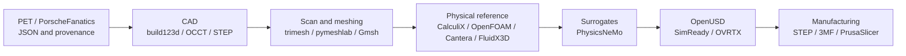
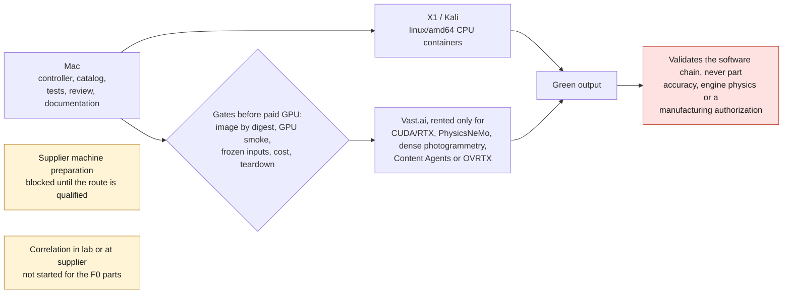
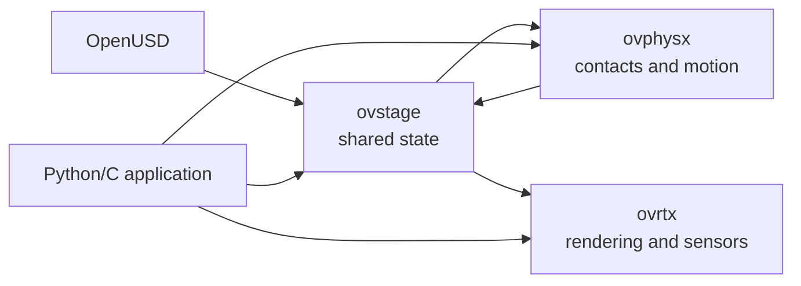

# Digital twin software stack

This page describes the stack selected as of **September 8, 2026**. It
separates the tools actually executed from the components that are only
defined, evaluated or still blocked. The versions specific to a piece of
evidence also stay recorded in its JSON report: a general version on this page
does not replace the provenance of a computation.

Statuses used:

- **executed**: an output and its SHA-256 are kept in the repository;
- **image verified**: import/smoke done, with no implied part computation;
- **defined**: Dockerfile, contract or runbook present but no evidence for the
  part in question;
- **evaluated, not selected**: tool studied but absent from the authoritative
  path;
- **blocked**: missing input, GPU, license, measurement or correlation.

```mermaid
flowchart LR
    PET["PET / PorscheFanatics<br/>JSON and provenance"] --> CAD["CAD<br/>build123d / OCCT / STEP"]
    CAD --> MESH["Scan and meshing<br/>trimesh / pymeshlab / Gmsh"]
    MESH --> CAE["Physical reference<br/>CalculiX / OpenFOAM / Cantera / FluidX3D"]
    CAE --> PN["Surrogates<br/>PhysicsNeMo"]
    PN --> USD["OpenUSD<br/>SimReady / OVRTX"]
    USD --> MFG["Manufacturing<br/>STEP / 3MF / PrusaSlicer"]
```

## Full chain and where it runs

| Step | Authoritative tool | Normal location | Input → output | Current status |
|---|---|---|---|---|
| Catalog | JSON Schema, Python, PorscheFanatics/PET and manufacturer sources | Mac | source → record with provenance | executed |
| Orchestration | Codex, Git, GitHub, GitHub Actions, Make | Mac/CI | request → reviewed and tested change | executed, never CAE evidence |
| BREP CAD | build123d 0.11.1, OCCT 7.9.3.1, FreeCAD for review | X1/Mac | parameters → STEP | executed |
| Implicit geometry | PicoGK 2.3.0 + runtime `picogk.26.2` | X1 amd64 | domain/keep-outs → voxel/mesh | executed on the piston, screening only |
| Scan/reconstruction | COLMAP, GLOMAP, Open3D, pymeshlab, Blender | Vast GPU/X1 | photos/scan → point cloud/mesh | image defined; real per-part data required |
| Meshing | Gmsh 4.12.1 or the version pinned by the evidence | X1/Vast CPU | STEP → tetrahedra | executed |
| Structural/thermal | CalculiX 2.21 | X1/Vast CPU | mesh + case → stresses/temperatures | executed |
| Engine CFD/CHT | OpenFOAM 13/14, Cantera 3.2.0, FluidX3D as cross-check | CPU/GPU depending on case | domain + boundaries → fields | executed on reference cases, not correlated to the vehicle |
| LPBF geometry | repository layer slicer + trimesh 5.1.0 | X1 | closed mesh → layers/proxy supports | executed |
| Melt pool | ORNL AdditiveFOAM 2.0.0 on OpenFOAM 14 | CPU/HPC | process map + coupon → melt pool | executed on 917 reference cases, blocked for the small 993 F0 parts |
| CAD → USD | `usd-convert-cad 0.2.0`, OpenUSD 26.8 | X1 | STEP → binary USD | executed |
| USD validation | `nvidia_usd_validate 1.21.0` | X1 | USD → rule report | executed |
| Shared scene | `ovstage 0.1.1.355824` | X1/Vast | composed USD → runtime state | executed on the hook and the lever |
| Rigid bodies | `ovphysx 0.5.11` | X1 CPU; Vast for GPU | ovstage → contacts/motion | executed on the hook and the lever, synthetic cases |
| Rendering/sensors | OVRTX + ovstage | Vast RTX | scene → pixels/sensors | executed on other revisions; blocked for the F0 hook and lever |
| USD enrichment | NVIDIA Material Agent, Physics Agent, SimReady Foundation | Vast RTX | USD + references → proposed USD | executed elsewhere; any unsourced property is removed |
| Surrogate | PhysicsNeMo 2.2.x, PyTorch CUDA | Vast GPU | correlated solver cases → accelerated model | GPU smoke only; no part surrogate |
| Machine preparation | supplier software and signed file, typically EOSPRINT for EOS | supplier | STEP + requirements → industrial build | blocked until the route is qualified |
| Correlation | metrology, CT/NDT, coupons, test rigs | lab/supplier | real part → model error | not started for the F0 parts |

The Mac is the controller and the documentation environment. The X1/Kali runs
the `linux/amd64` CPU containers. Vast.ai is rented only for CUDA/RTX,
PhysicsNeMo, dense photogrammetry, Content Agents or OVRTX, after the image,
the inputs, the cost and the teardown mechanism are locked.

Where each part of the chain runs, and what a green run can and cannot say:

```mermaid
flowchart LR
    MAC["Mac<br/>controller, catalog,<br/>tests, review, documentation"] --> X1["X1 / Kali<br/>linux/amd64 CPU containers"]
    MAC --> G{"Gates before paid GPU:<br/>image by digest, GPU smoke,<br/>frozen inputs, cost, teardown"}
    G --> VAST["Vast.ai, rented only for<br/>CUDA/RTX, PhysicsNeMo, dense photogrammetry,<br/>Content Agents or OVRTX"]
    X1 --> OUT["Green output"]
    VAST --> OUT
    OUT --> NO["Validates the software chain, never part<br/>accuracy, engine physics or a<br/>manufacturing authorization"]:::stop
    SUP["Supplier machine preparation<br/>blocked until the route is qualified"]:::open
    LAB["Correlation in lab or at supplier<br/>not started for the F0 parts"]:::open
    classDef stop fill:#fde2e1,stroke:#c0392b,color:#1a1a1a;
    classDef ok fill:#e3f1e6,stroke:#2e7d32,color:#1a1a1a;
    classDef open fill:#fff4d6,stroke:#b7791f,color:#1a1a1a;
```

## Foundation

| Layer | Stack | Role |
| --- | --- | --- |
| Data | JSON, JSON schemas, Markdown | `catalog/parts/*.json` is the source of truth |
| Automation | Python standard library, GNU Make | Generation, validation and `make check` |
| Version control | Git, GitHub, GitHub Actions | Review, CI and build evidence |
| Containers | Docker, Buildx, GHCR | `linux/amd64` images by immutable digest |
| Secrets/rental | OpenBao wrappers, Vast.ai CLI | Bounded access, singleton, retrieval and teardown |
| Master formats | build123d, `.FCStd`, OpenSCAD, STEP | Editable and dimensional geometry |
| Derived formats | STL, 3MF, OBJ, PLY, OpenUSD | Printing, scanning, assembly and visualization |

See also [TOOLCHAIN.md](TOOLCHAIN.md),
[COMPUTE_ENVIRONMENT.md](COMPUTE_ENVIRONMENT.md) and
[AI_DIGITAL_TWIN_STACK.md](AI_DIGITAL_TWIN_STACK.md).

## CAD, scanning and metrology

- Qualified CAD: Python 3.12.14, build123d 0.11.1 and OCCT 7.9.3.1
  in `cad-author-f28`; BREP/STEP output.
- Qualified scanning: NumPy 2.5.2, SciPy 1.18.1, trimesh 5.1.0,
  pymeshlab 2025.7.post1 and Rtree 1.4.1 in `scan-mesh-f17`.
- General `mesh-cfd` image: Blender, Gmsh, OpenFOAM 13, build123d,
  meshio and manifold3d.
- FreeCAD and OpenSCAD serve human authoring/review; STEP remains the
  dimensional exchange format and STL/3MF remain derivatives.

The `mesh-cfd` image is native on the `amd64` X1. On the Apple Silicon Mac, its
`amd64` execution uses QEMU and Blender is not reliable; large scans therefore
go to the X1 or a rented machine.

## Physics solvers

| Domain | Selected stack | Current limit |
| --- | --- | --- |
| Meshing | Gmsh | Convergence still has to be demonstrated case by case |
| Structural/thermal | CalculiX `ccx` | No automatic physical validation |
| CFD | OpenFOAM 13; OpenFOAM 14 + ICengines/AATE at commit `c0f75f953d67cd325d28d1300672d14288f22934` | A build does not validate an engine |
| Thermochemistry/networks | Cantera 3.2.0, NumPy 2.5.2 | Uncorrelated fixtures and models |
| LBM cross-check | FluidX3D at commit `aba941305a2cc67b0953ba1d2ba177b590dcccc3` | Non-commercial license |
| Post-processing | meshio, PyVista, ParaView, `ccx2paraview` | Field inspection and conversion |

## AI and PhysicsNeMo

PhysicsNeMo **is not an LLM** and does not replace the reference solver.
The stack qualified without a GPU is:

- NVIDIA PhysicsNeMo 2.2.1;
- Python 3.12.3;
- PyTorch 2.10.0 + CUDA 12.8, torchvision 0.25.0;
- PyTorch Geometric 2.8.0.post1;
- verified imports: DoMINO, GeoTransolver and MeshGraphNet.

The build, the public pull by digest and the non-GPU smokes are green. A
PhysicsNeMo 2.2.0/PyTorch 2.10.0+cu129 GPU smoke was also run on the piston
worker on September 8, 2026. It only proves CUDA access and tensor operations;
training, holdout/OOD and physical correlation remain blocked.

The documented LLM path plans Qwen3-Coder-30B-A3B-Instruct for code/CAD and
Qwen3-VL-8B-Instruct for multimodal reading, served by vLLM. The
`simready-local-ai` image also defines Qwen2.5-VL-7B-Instruct at commit
`cc594898137f460bfe9f0759e9844b3ce807cfb5`, vLLM 0.26.0+cu129 and
PyTorch 2.11.0 CUDA 12.9. This variant is defined, not qualified as the current
runtime. Codex orchestrates the work but is never CAE evidence.

PicoGK 2.3.0 with the native runtime `picogk.26.2` now runs on the X1 amd64.
A sweep of six variants of the CP1 F0 piston reached at best `1.60%` gross
weight reduction, but no variant meets the provisional mechanical margin and
every raw STL fails the manifold integrity check. PicoGK is therefore qualified
as a screening geometry generator, not as a physics optimizer nor as the source
of a released part.

CalculiX 2.21 then ran, offline on the X1, six cases of the sound piston
master: cold static and sequential temperature–displacement at `5`, `3.5` and
`2.5 mm`. The fine level has `139,924` nodes and `81,861` C3D10. The p95 goes
from `112.17 MPa` cold to `323.46 MPa` hot in the synthetic envelope; the ratio
against the `297 MPa` published at room temperature drops to `0.918`. This run
qualifies the numerical chain, but rejects the F0 design and provides no hot
CP1 allowable, no fatigue and no engine validation.

## Omniverse and SimReady

The Omniverse generation visible in the NVIDIA organization is a suite of
embeddable libraries, not a monolithic application:

```mermaid
flowchart LR
    USD[OpenUSD] --> STAGE[ovstage\nshared state]
    STAGE --> PHYSX[ovphysx\ncontacts and motion]
    PHYSX --> STAGE
    STAGE --> RTX[ovrtx\nrendering and sensors]
    APP[Python/C application] --> STAGE
    APP --> PHYSX
    APP --> RTX
```

- `ovstage` loads the composed scene once and holds the shared state;
- `ovphysx` reads collisions/bodies/joints and writes back motion/states;
- `ovrtx` reads that same state for RTX rendering and sensors;
- `ovstorage` handles local, object or Omniverse Storage;
- `ovui` is only used if a standalone interface is needed;
- `ovstream` carries image/audio/data to a client;
- `ovpackage` only comes in after validation, to package/publish.

For part computation, `ovui`, `ovstream`, `ovstorage` and `ovpackage` are
therefore off the critical path. Adding them would make neither the CAD more
accurate nor the FE computation more reliable.

The reproducible CPU runtime [`ov-libraries-cpu.Dockerfile`](../containers/ov-libraries-cpu.Dockerfile)
pins Python 3.12 by digest, NumPy 2.5.2, `ovstage 0.1.1.355824` and
`ovphysx 0.5.11`. On the F0 hook and lever, it ran the sequence create,
USD population, ordinal sealing, attach, 240 synchronous steps, position
readout, detach and destroy. The test bodies drop from `22` to `17 mm` and
from `35` to `29 mm` respectively, then come to rest on the imported meshes.

Conversion and checking of this same revision use
`usd-convert-cad 0.2.0`, OpenUSD 26.8 and
`usd-validation-nvidia 1.21.0`. The current command is
`nvidia_usd_validate`; it replaces the old `omni.asset_validator` path
for new runs. The first ASCII export was rejected only by the performance rule;
the binary asset and the rigid scene then passed every rule.

The historical Content Agents image stays separate. It isolates OVRTX, Material
Agent and Physics Agent in Ubuntu 24.04/Python 3.12, but its internal Physics
Agent environment is still pinned to `ovphysx 0.4.13`. It must not be
presented as evidence for the shared `ovstage/ovphysx 0.5` loop above.
Its locked sources are:

- NVIDIA Content Agents: commit `36dbf3f274f8e256637230a05a085853f65cc175`;
- SimReady Foundation: image commit `0ed0dfbc539c9de99289771bd6848effe3ef5779`;
- isolated workflow for the nozzle pass: SimReady Foundation
  `a1e9dd68ee2d107f74dc6cd6da875b54ad3f8fd3` and `usd-convert-cad`
  `208fe2c1cd71ae2bb7bd825daf712617000ae028`;
- `usd-convert-cad` 0.2.0;
- `simready-workflow` base: digest
  `sha256:0562c69276c0d3065990cb9b1b8641dcd29355d0dccb9082dcf266fa2d22e90a`;
- `simready-local-ai` base: workflow digest
  `sha256:41ddde8e527fcc17a3f29ac90183bd1326c330388240baf2004f99de980d6ebe`.

The Mac still does not carry all these runtimes. On a `linux/amd64` Vast.ai
worker, the CP1 F0 piston now passes OpenUSD minimum, NVIDIA Asset
Validator, Geometry, Physics, `Prop-Robotics-Neutral 1.0.0` and the OVRTX
renders. This evidence is bounded to an isolated inspection prop; the engine
assembly and the vehicle remain not validated. See
[the SimReady summary](../twins/993-m64-60-piston-gallery-f0/evidence/simready-f0/simready-validation-summary.json).

The second pass, on the F0 IN625 oval nozzle, passes the same validators and
the SimReady profile after invented physical properties were removed. The
EOS M 290 scene and the OVRTX renders are validated as visual preparation,
not as process simulation or installation evidence.

On the F0 lever, the September 8, 2026 preflight confirmed
OpenBao/GHCR/Vast access but no active Content Agents instance. The full
workflow therefore stopped before Material Agent and Physics Agent. The minimal
OpenUSD conversion, the two NVIDIA validations and the CPU ovstage/ovphysx test
were run separately; no LLM property, profile conformance or OVRTX image is
claimed.

Primary NVIDIA sources:
[ovstage](https://github.com/NVIDIA-Omniverse/ovstage),
[ovphysx in PhysX](https://github.com/NVIDIA-Omniverse/PhysX),
[OVRTX](https://github.com/NVIDIA-Omniverse/ovrtx),
[CAD→USD conversion](https://github.com/NVIDIA-Omniverse/usd-convert-cad) and
[usd-validation-nvidia](https://github.com/NVIDIA-Omniverse/usd-validation-nvidia).

## Agent Skills and assistance services

The `omniverse-cad-to-simready` workflow serves as a documentation
orchestrator: preflight, conversion, minimal validation, optional property
assignment, SimReady conformance, rendering and packaging. It replaces no
solver. The F0 hook used its conversion and validation steps, then the
`ovphysx-basic-workflow` skill to respect the lifecycle order `create → populate →
attach → step → detach → destroy`.
The lever applies the same discipline, but the preflight explicitly keeps
`property_assignment_intent=run` as blocked until the Material and
Physics services are ready.

Assignment by Material Agent or Physics Agent remains a proposal. A
density, friction, restitution, mass or gravity not tied to a source and to a
test case is removed or marked synthetic. The USD/Kit MCP servers serve to find
APIs and examples; they create no physical evidence.

## Tools seen in research, but outside the authoritative stack

| Proposed tool | Decision | Reason |
|---|---|---|
| OpenFOAM "with AM extensions" | selected only through locked ORNL AdditiveFOAM | the exact solver and revision must be named; generic OpenFOAM does not prove a melt pool |
| PRISMA-Plasticity / MOOSE | evaluated, not selected in the current path | no image, correlated process map or part evidence is maintained in this repository |
| NVIDIA Modulus | replaced here by PhysicsNeMo | even a PINN or surrogate first requires converged reference cases and correlation data |
| Marlin / Klipper | not selected for industrial metal LPBF | generic printer firmware, no authority over laser, gas, powder, recoater or EOS safety |
| Node-RED | future telemetry option | useful only once a manufacturer-signed data interface is supplied; it does not control the machine |

The Google capture is therefore a list of ideas. The project stack is the
executed and versioned matrix on this page, not text generated by a search
engine.

## Metal print simulation

The pipeline now adds a generic geometric slicing of each LPBF layer, a
thickness screen, a closed-volume check and a conservative support envelope.
The first real pass on the piston has 2,390 layers at 50 µm. CalculiX remains
the reference distortion solver and AdditiveFOAM the local melt-pool solver,
but they must only be run as evidence when a consistent
material-machine-process map is available. For CP1/Sapphire, that complete map
is still missing.

The second real pass has `3,702` layers at `40 µm` for the IN625 nozzle in an
EOS M 290 envelope. This route has a consistent screening
material-machine-process record, but no EOSPRINT scan paths, no supplier
supports and no calibrated constitutive map for a full build.

The policy and the eleven mandatory steps are in
[AM_VALIDATION_PIPELINE.md](AM_VALIDATION_PIPELINE.md). The validator tracks
the 25 records that propose LPBF or DMLS and blocks their release if a step is
bypassed.

## Locked OCI images

| Image | SHA-256 digest | Current evidence |
| --- | --- | --- |
| `obj-metrology-f15` | `827e639cd126441dfa98fc097d4c8b09a01a28e25545de62ca3a01da963b959a` | Offline CPU smoke |
| `scan-mesh-f17` | `b48f23d64ceab9c2e6b7b7474cdd81011d27b8a584f7af6b50b6cc05823c5189` | Synthetic CPU smoke |
| `boundary-review-f23` | `860fb1c481a8a4b72cf14d9f1d15d65b9adf327cf268ebbcc26da127427126c9` | Offline CPU smoke |
| `topology-context-f26` | `41764d6d6ed935a763a6b1e07524c68961555b2724e67bbf48a2f261c35a3b10` | Offline CPU smoke |
| `cad-author-f28` | `18dbfa559306a31c909480695acf0e89a9bc904c83d280065c1d9d29036fec57` | Synthetic STEP, SBOM, provenance |
| `air-oil-cycle-f34b` | `369d51ee12c259e844d01817702d8debedcf400087ab9b289b8e59671d296664` | Preflight and non-engine Cantera fixture |
| `physicsnemo-cae-cu12` | `045e8bc3151e0938d0f339aceb74c8583878effe5d0e316715e10818a018598a` | Public pull and non-GPU smoke |
| `ov-libraries-cpu` | local image `90b9906fac5bc62d639c630f80490d5253211b0e7d015eb65413685715a912fa` | X1 amd64 build and ovstage/ovphysx rigid contact |

The general images `recon`, `cadsim`, `mesh-cfd`, `physicsml`, `simready`,
`simready-workflow`, `simready-local-ai` and `ov-libraries-cpu` are defined but
do not all have an equivalent GHCR lock. The `ov-libraries-cpu` identifier
above is that of the local X1 build, not a published registry digest.

## Observed infrastructure

| Node | Observed stack | Role |
| --- | --- | --- |
| Apple Silicon Mac | macOS 27.0, `arm64`, 10 CPUs, 64 GiB; Docker 29.7.2, Compose 5.4.0, Python 3.10.11 | Controller, catalog, tests and review |
| X1 | Kali Rolling, `x86_64`, 12 CPUs, 15 GiB; Docker 28.5.2, Buildx 0.29.1, Compose 2.40.3, Python 3.13.14 | Native `linux/amd64` Docker CPU worker |
| Vast.ai | `linux/amd64` containers by digest on NVIDIA GPUs rented on demand | CUDA reconstruction, PhysicsNeMo, Omniverse |

Private addresses, accounts and keys are not published. The scripts in
[`deploy/vast/simready/`](../deploy/vast/simready/) control the instance,
transfer an allowlist, retrieve the results and verify teardown.
The installed GHCR wrapper matches the repository. The Vast.ai wrapper answers
its read check but differs from the versioned copy; it must be
resynchronized before any paid rental.

## Gates before paid GPU computation

1. `linux/amd64` image green and referenced by immutable digest.
2. GHCR pull, SSH key and GPU smoke verified.
3. Inputs and SHA-256 frozen, with no secret or prohibited data.
4. Cost and instance uniqueness checked.
5. Retrieval and teardown prepared before launch.

The runbook is [917_VAST_SIMREADY_NATIVE.md](../archive/917/docs/917_VAST_SIMREADY_NATIVE.md).
A green output validates the software chain, never the accuracy of a part,
the physics of an engine or a manufacturing authorization.
