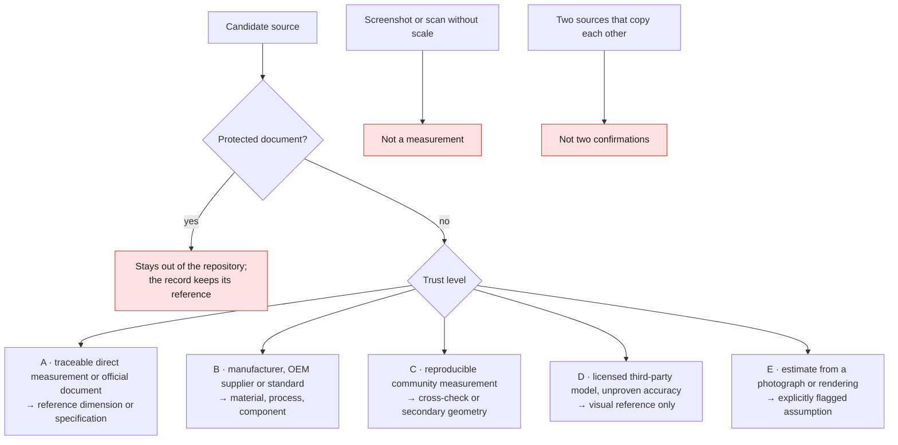

# Source policy

## Trust hierarchy

| Level | Type | Use |
|---|---|---|
| A | Traceable direct measurement or official document | Reference dimension or specification |
| B | Manufacturer, OEM supplier or standard | Material, process, component |
| C | Reproducible community measurement | Cross-check or secondary geometry |
| D | Third-party model with a license but unproven accuracy | Visual reference only |
| E | Estimate from a photograph or rendering | Explicitly flagged assumption |

## Rules

- Public data is not automatically royalty-free.
- A screenshot or a scan without scale is not a measurement.
- An exploded view informs the assembly, not necessarily the dimensions.
- Two sources that copy each other are not two confirmations.
- Protected documents stay out of the repository; the record keeps their
  reference.
- Every contradiction stays visible until it is resolved.

## Auditing a 3D model

Record: author, URL, license, format, variant, number of parts, whether the
interior or the underbody is present, units, declared dimensions, whether it may
be modified and redistributed, and the results of comparison with known
dimensions.
