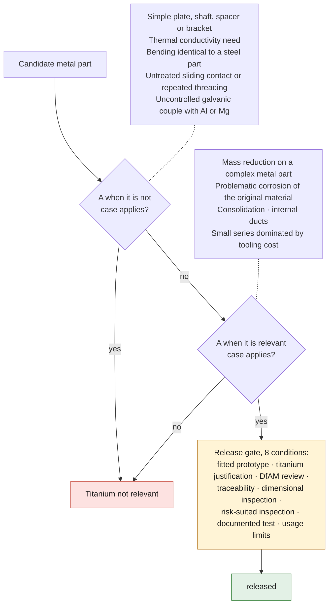
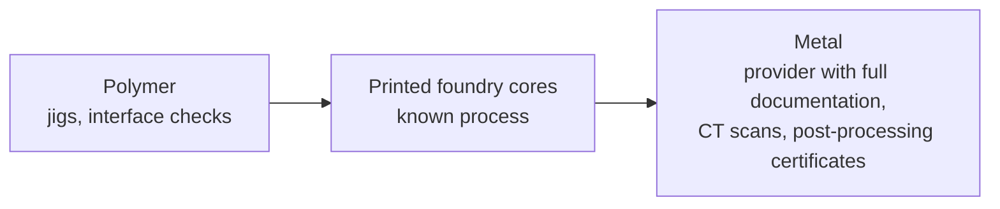

# Titanium guideline

## Project position

The reference material for LPBF is **Ti-6Al-4V Grade 5**. Grade 23 ELI is
reserved for cases where ductility or toughness justify its cost. The final
choice must match the manufacturer's qualified process, not merely a commercial
powder designation.

## When titanium is relevant

- Mass reduction on a complex metal part
- Problematic corrosion with the original material
- Consolidation of several components
- Ducts or internal shapes impossible to machine
- Small series where traditional tooling dominates the cost

## When it is not

- Simple plate, shaft, spacer or bracket that is easy to machine
- Significant need for thermal conductivity
- Part whose bending must stay identical to that of a steel part
- Untreated sliding contact or repeated threading exposed to galling
- Environment creating an uncontrolled galvanic couple with aluminum or magnesium

The two lists and the release gate below, as one decision:

## The criterion applies beyond titanium

The same grid decides the use of additive manufacturing in general. It wins in
three families of cases:

- **internal passages that cannot be machined** — the LPBF piston Porsche
  developed with MAHLE and TRUMPF carries a closed cooling duct that no
  conventional foundry can core;
- **castings that cannot be cored any other way**, now accessible through
  sand-printed cores, which is additive manufacturing applied to the tooling,
  not to the part;
- **consolidation**, when a subassembly of dozens of parts becomes a single one.

A part that belongs to none of these three families has nothing to gain from
being printed, whatever its material. The 993 engine carrier illustrates this:
a one-piece blade, with no internal channel and no subassembly to consolidate —
see `parts/993-eng-carrier-0001/evidence/load-cases.md`.

Printed cores, on the other hand, deserve to be kept in mind for this project:
they open up small cast series with no pattern and no tooling, which is the
usual bottleneck in reproducing classic parts. The technical press in fact
describes them as decisive for « moteurs anciens dont les modèles de fonderie
n'existent plus » ("old engines whose foundry patterns no longer exist").

## The real cost of a printed metal part

An LPBF part is not finished when it comes out of the machine. The commonly
described chain is: heat treatment, **hot isostatic pressing to close the
porosity**, surface finishing, shot peening and chemical smoothing — because the
as-built roughness **degrades fatigue strength** — then **machining of the
functional surfaces** to tolerance. Inspection adds CT scanning, a pressure test
and a laser scan after machining.

In other words, a printed part meant to last is also a machined part. This is
not an argument against additive manufacturing: it is what must go into the cost
comparison, and it explains why a simple geometry is rarely worth printing.

## Recommended progression

Start with polymer, for jigs and interface checks. Then move to printed foundry
cores, which stay within a known process. Only then tackle metal, with a service
provider supplying complete documentation, CT scans and post-processing
certificates.

This is exactly the order of phases 2 and 3 of this project.

## Minimum manufacturer dossier

- Master `STEP` and PDF drawing with revision
- Ti-6Al-4V and the requested standard
- LPBF process and qualified machine
- Proposed orientation and support strategy
- Machining allowances
- Stress relief and heat treatment under controlled atmosphere
- HIP required, optional or not relevant, with justification
- Areas to polish or shot-peen
- Machined threads and bores
- Dimensional and non-destructive inspection
- Material certificate, lot identification and job traceability

## Specific risks

### Fatigue

Roughness, pores, orientation and stress concentration often dominate service
life. High static strength is not enough. For a cycled part, plan finished
critical surfaces, radii, HIP if relevant and representative tests.

### Distortion and anisotropy

The model must account for orientation, supports, stress relief and machining.
The properties of a generic test specimen do not replace those of the
machine-powder-parameters combination actually used.

### Galling

Avoid frequently loaded titanium-on-titanium threads. Plan inserts, coatings, a
compatible lubricant or a suitable material pairing.

### Galvanic corrosion

Document insulating washers, coating, sealant or drainage when titanium is
assembled with aluminum or magnesium.

## Release gate

A titanium part cannot reach `released` without:

1. a fitted prototype;
2. a justification for choosing titanium;
3. a DfAM review;
4. manufacturing traceability;
5. dimensional inspection;
6. inspection suited to the risk;
7. a documented test;
8. published usage limits.
