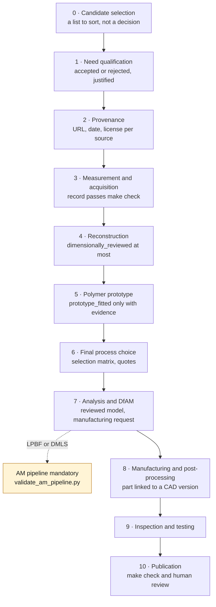
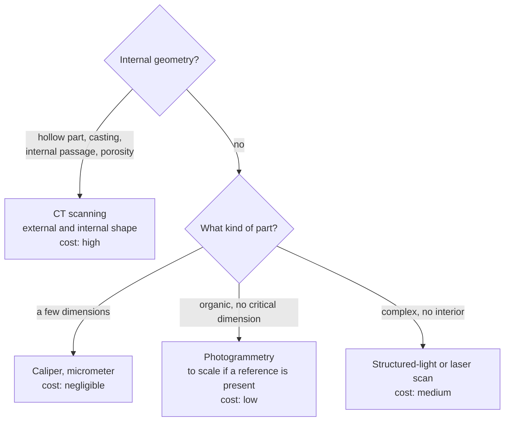

# Part workflow



## 0. Candidate selection

Reproducing a part costs time and money; buying them all to find out which ones
are worth the effort does not scale. Reading the catalogue does.

`scripts/select_candidates.py` reduces an entire generation to a short list by
setting aside two populations: the domains that `SAFETY.md` presumes critical,
and standard fasteners, which are bought, not reproduced.

```bash
python3 scripts/select_candidates.py --listing <atlas>/oem-listed.json \
    --generation 993 --limit 40
```

Of the 12,864 lines of the 993 catalogue: 22% belong to excluded domains, 39%
are hardware, 11% come out as candidates — about 219 distinct shapes to examine
instead of twelve thousand.

The output is a list to sort, not a decision. A catalogue description does not
say whether a part is loaded, sealed, heated or merely decorative.

## 1. Need qualification

Open an issue and state: part number, function, variants, availability, failure
symptom, environment, price or sourcing difficulty.

Output: candidate accepted or rejected, with justification.

## 2. Provenance

List the official documents, direct measurements, photographs and third-party
models. Every source gets a URL, a date and a license.

Output: no data of unknown origin in the publishable model.

## 3. Measurement and acquisition

Choose the minimal means that gives the required accuracy: caliper, micrometer,
gauge, jig, photogrammetry or structured-light scan. Use the template in
`catalog/templates/measurement-plan.md` to prepare the session.

Then record the result in verifiable form, in `catalog/measurements/`. When the
instrument has a data output, capture directly rather than copying by hand:

```bash
python3 scripts/capture_caliper.py --record catalog/measurements/meas-<pièce>.json \
    --dimension D01 --description "Alésage de l'œil" --port /dev/ttyUSB0 --repeats 3
```

For a photogrammetry set, `scripts/capture_photoset.py` writes a manifest and
requires the scale reference: without it, the reconstruction remains a shape,
not a measurement.

Output: reference frames, units, uncertainties and critical measurements
documented, and a measurement record that passes `make check`.

### Choosing the acquisition method

Not every method serves the same part. The criterion is the presence of
**internal** geometry.

| Method | What it captures | When to choose it | Cost order |
|---|---|---|---|
| Caliper, micrometer | interface dimensions | part describable by a few dimensions | negligible |
| Photogrammetry | external shape, to scale if a reference is present | organic shape with no critical dimension | low |
| Structured-light or laser scan | dense external shape, a few tens of µm | complex part with no interior | medium |
| **CT scanning** | **external and internal shape**, material included | hollow part, casting, internal passage, porosity | high |



CT scanning is the reference method of reverse engineering because it sees the
inside. That is also what makes it **needlessly expensive on a solid part**: a
massive arm with no internal channel is captured just as well by a surface scan.

It remains, however, the only way to inspect a printed metal part, where the
issue is internal porosity — that is how Porsche uses it at Weissach, and what
phase 3 will have to plan for.

## 4. Reconstruction

- Import the scan as a reference, never as absolute truth.
- Rebuild planes, axes, cylinders, holes and interfaces in parametric CAD.
- Separate measured dimensions from assumed dimensions.
- Export a STEP and a prototype 3MF.

Output: editable master model and a record at status `dimensionally_reviewed`
at most.

## 5. Polymer prototype

Print quickly, check the fit, note the clearances and photograph the interfaces.
Correct the master model rather than the exported mesh.

Output: status `prototype_fitted` only if the evidence is recorded.

## 6. Choice of the final process

Compare at least: final polymer, CNC, sheet metal, casting and metal additive
manufacturing. Titanium is chosen only if mass, corrosion, geometry or small
series justify its cost.

Output: selection matrix and comparable quotes.

## 7. Analysis and DfAM

Define load cases, contacts, preloads, temperature, vibration and service life.
Adapt surfaces, radii, thicknesses, powder evacuation, supports and machining
allowances.

Output: reviewed model and manufacturing request.

For any part proposing `LPBF` or `DMLS`, the
[metal printing and Omniverse pipeline](AM_VALIDATION_PIPELINE.md) is mandatory:
slicing of every layer, material-machine-process map, local thermal analysis,
full-build thermomechanics, recoater, SimReady, functional assembly and
physical correlation. The register is checked by
`scripts/validate_am_pipeline.py`.

## 8. Manufacturing and post-processing

Keep certificates, material lot, heat treatment, any HIP, support removal,
machining and finishing.

Output: an identified part linked to a precise CAD version.

## 9. Inspection and testing

Dimensional inspection, non-destructive inspection if needed, static fit,
progressive testing, then monitoring. A successful test on one vehicle does not
prove universal compatibility.

## 10. Publication

Update the record, the known limits and the evidence. The PR must pass
`make check` and a human review.
