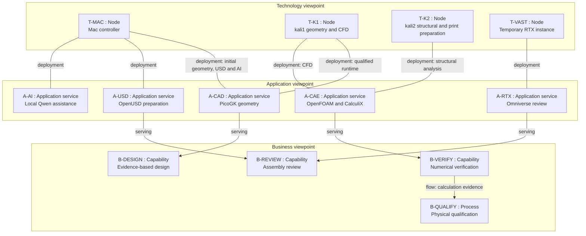

# M64/60 engineering architecture

Status: target architecture with an implemented local AI pilot. This document
is not a deployment or physical-qualification receipt. The owner approved the
architecture, then requested documentation followed by local model training.

Read [the workflow](engineering-workflow.md), [delivery and verification](migration-verification.md),
and [ADR 0012](../decisions/0012-local-compute-gpu-last.md).

## Objectives and authority

The scope is the complete Porsche 993 Turbo M64/60 engine. Prove the engineering
pipeline on a synthetic, non-pressurized air duct before applying it to measured
parts. No synthetic dimension is a Porsche dimension.

`catalog/parts/*.json` remains the part source of truth;
`twins/m64-engine-system/program.json` remains the engine program registry.
Existing CAD and evidence remain authoritative for their own revisions. New
geometry uses PicoGK; do not migrate existing build123d/STEP masters.

The owner sets scope and spending limits. The engineering reviewer accepts
physical assumptions and qualification plans. The compute operator runs jobs
and collects evidence. Qwen assists these roles but cannot approve their gates.

## Method and modeling conventions

Apply a tailored TOGAF ADM cycle: requirements and principles; baseline and
target business, information-system and technology views; gap assessment;
transition increments; implementation review; controlled change. Each increment
has a requirement, an architecture element, an ADR and an acceptance check.
This is a project practice, not a certification claim.

Use ArchiMate concepts to express capabilities, processes, services, data and
infrastructure. Mermaid is the textual rendering format, not an ArchiMate
exchange model. Every box has a stable ID and an explicit element type. Edges
name their relationship; a flow edge is not interchangeable with realization
or assignment. Business/application/technology grouping is a project viewpoint,
not a claim to implement the complete ArchiMate metamodel.

Use UML-style class, sequence and state views for contracts and behavior.
Mermaid's subset does not provide full UML conformance or code generation.
Maintain the Markdown Mermaid blocks as the diagram source of truth; validate
rendering before review. Do not maintain a second manually edited drawing.

All new prose, diagrams, comments, prompts, reports and command messages are
English. The existing [translation policy](../TRANSLATION.md) governs legacy
material: preserve identifiers and never translate pinned evidence in place.

## Baseline and gaps

| Element | Verified repository baseline | Remaining live check |
|---|---|---|
| T-MAC | M1 Max, 64 GiB RAM observed; Apple USD Tools 0.25.11 available | MLX training receipt and disk reserve |
| T-K1 | Existing [PicoGK CPU worker](../../deploy/intel/picogk-cpu.md), portable .NET 9 runtime and hashed bundle | Reconnect through the documented backhaul; rerun witness |
| T-K2 | Existing station/container deployment and collector | CPU, RAM, disk, images and solver availability |
| A-CAD | [StationDemo](../../twins/picogk-station-demo/Program.cs), runtime witness and Linux qualification | Synthetic duct and resolution study |
| A-CAE | CPU containers, Poiseuille benchmark and CalculiX workflows | Per-host execution and cross-host agreement |
| A-USD | Existing OpenUSD assembly generator and validators | Portable complete bundle for the selected engine review |
| A-AI | No existing Mac MLX training pipeline found | Implement and run the local pilot documented below |

Bare `ssh kali1` / `ssh kali2` did not resolve during the initial inspection.
That does not negate the existing qualification receipts or prove a host is down.
Use the documented connection path; never bypass host-key checking. Older .NET 8
worker notes and the newer .NET 9 station are distinct runtimes: do not mix them.

## Target viewpoint: capabilities and deployment

`deployment` is an explicit project shorthand, not a standard ArchiMate edge.
The view documents allocation; the workflow defines execution order.

## Runtime choices

- Mac: control, catalogue, Qwen/MLX, USD preparation and evidence collection.
  Native PicoGK is the fallback if the existing Linux worker is unavailable.
- kali1: PicoGK geometry and OpenFOAM; kali2: CalculiX and manufacturing
  preparation. Both can run independent CPU cases after qualification.
- Reuse current bounded SSH runners, pinned images and manifests. Start with
  one heavy job per host and MPI confined to one host. No new cluster scheduler.
- Vast: final Omniverse/RTX only. Build images and package dependencies before
  rental. Never rent it to train this local Qwen pilot or run baseline CFD.
- Physical printing, coupon tests, CT/metrology and fatigue qualification happen
  on appropriate equipment, not on a Kali computer or in a renderer.

## References

- [TOGAF and ArchiMate roles](https://help.opengroup.org/hc/en-us/articles/32115987894930-How-the-ArchiMate-Language-and-the-TOGAF-Standard-Complement-Each-Other)
- [ArchiMate practical introduction](https://archimate-community.pages.opengroup.org/workgroups/archimate-101/)
- [Mermaid class diagrams](https://mermaid.js.org/syntax/classDiagram)
- [OpenUSD toolset](https://openusd.org/release/toolset.html)
- [MLX-LM](https://github.com/ml-explore/mlx-lm)
