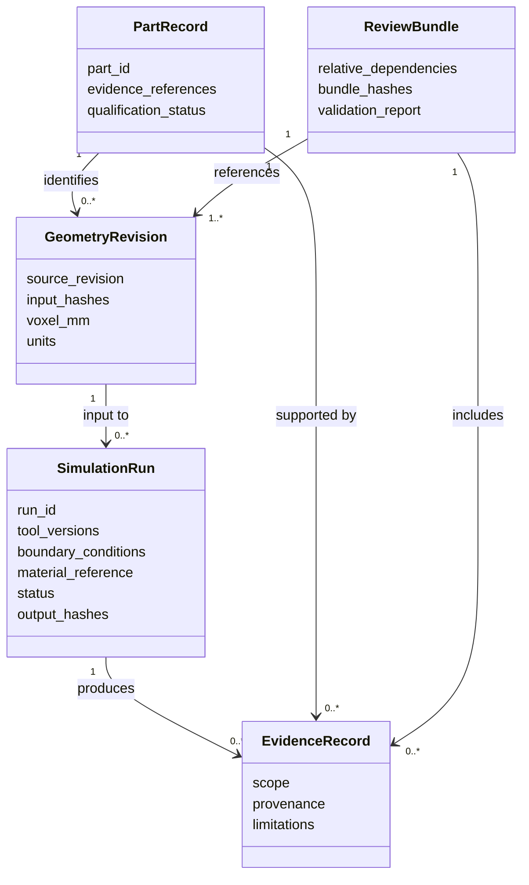
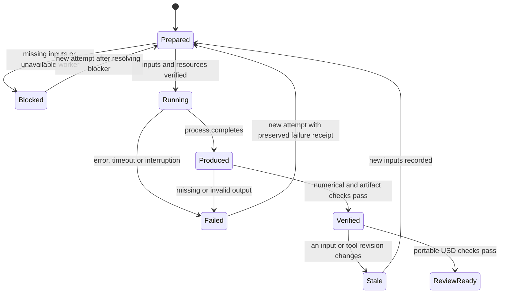
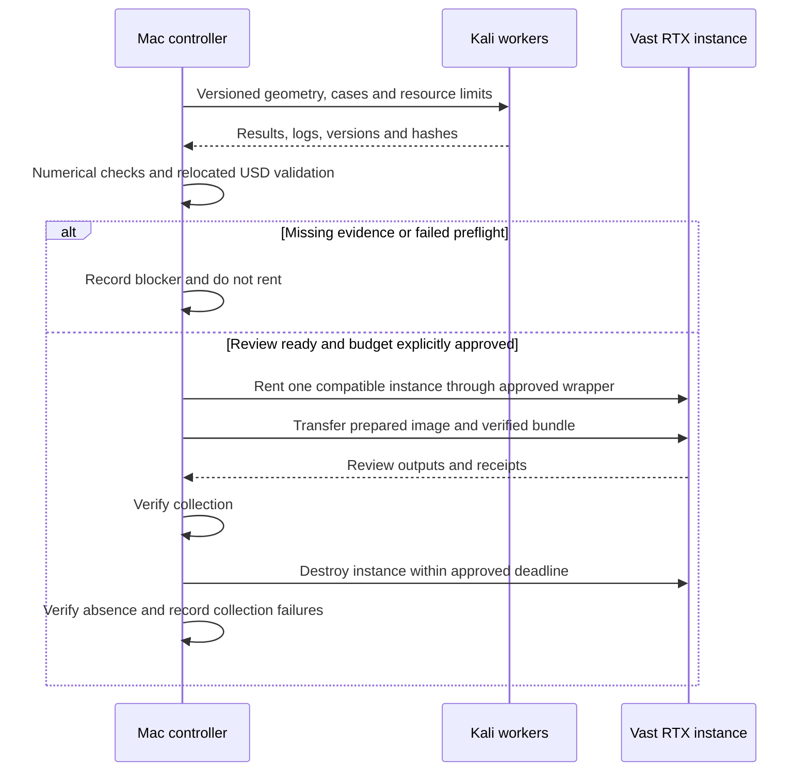

# Engineering workflow and local AI

## Geometry, analysis and review contracts

The following is the target contract; it does not introduce a competing part
catalogue or claim that all remote orchestration is implemented.

Keep editable C# and parameters, then export separate analysis, print and visual
meshes. A mesh is not a native editable STEP solid. Resolve dimensional units at
each boundary; use millimeters and Z-up in the assembled USD, consistent with
the existing assembly validator, with explicit conversion from SI solver data.

Every result records source revision, input/output hashes, tool versions,
material and boundary-condition sources, resource limits, exit status and logs.
Incomplete, interrupted or stale results must not be promoted. Restart into a
new output directory; retain earlier receipts. Check current inputs again at
handoff, not merely when the job starts.

Material cards require alloy/grade, temperature range, process, orientation,
heat treatment and provenance. Unknown fatigue data is not replaced by a
fabricated curve. Mesh convergence and conservation are separate from matching
real experiments. Qualify OpenFOAM Foundation 13 with the existing Poiseuille
benchmark; do not silently substitute OpenCFD v2312 decks.

For additive manufacturing, document supports, orientation, minimum features,
cleaning, machining allowances, inspection and coupon plans. Slicer success is
only preparation evidence. Titanium additionally requires fatigue assumptions
and galvanic isolation. Highly loaded parts retain professional-review gates.

## Local USD and final rental

Compose geometry, assembly, display materials and result visualizations as
separate USD layers. Keep full scientific fields in solver formats and link
their hashes. Use relative assets, an explicit default prim, units and axis.
Validate a relocated copy so the original workspace cannot conceal dependencies.
Run `usdchecker --strict` and the relevant semantic validator before handoff.

Numerical and USD readiness applies to the declared review scope, not an
implicit claim that the whole engine is complete. Physical qualification may
remain pending. Rendering does not close it. A rental needs an exact compatible
image, adequate VRAM, cost ceiling, deadline and approval; no default budget.
Reuse the existing Vast deadline guard and narrow OpenBao wrapper. A collection
failure must not leave an unlimited rental running. Never upload raw restricted
scans or proprietary manuals as part of an AI dataset.

## Local Qwen pilot

The owner's follow-up changes the first increment to **documentation, then
local training**. Start with Qwen2.5-Coder-1.5B-Instruct in MLX 4-bit format:
the inspected Mac has 64 GiB RAM but only about 5 GiB free disk. This is a
storage-driven pilot choice; 7B remains a later measured comparison.

Use the [training directory](../../training/m64-qwen/README.md) for exact
commands, revisions and results. Train a small QLoRA adapter on authored,
reviewed synthetic workflow examples. Keep model weights, caches and adapters
under ignored `work/`; never fuse or publish them automatically. Do not scrape
the repository, raw scans, mail, credentials or supplier material into training.

The first model task is structured engineering-workflow assistance: identify
where work runs, preserve unknowns, convert units and respect evidence gates.
It is not a learned mechanics solver or a proven general PicoGK programmer.
Documentation and API examples remain prompt context. Compilers, validators,
solvers and engineering reviewers remain the authorities.

Use disjoint part families for train/validation/test. Freeze 20 test cases
before training. Compare deterministic structured-output accuracy, completion
latency, generated-token throughput, memory and held-out loss for the base and
adapter. Exact-match checks are a narrow synthetic benchmark; they do not
prove broad CAD coding capability. Do not execute model-generated code.

Promote only if strict accuracy improves, no content case regresses after
removing display fences, all safety-gate cases pass, and loss and runtime remain
acceptable. Otherwise retain the base model and keep the adapter
as an experiment. An executed training run is not automatically a better model.
