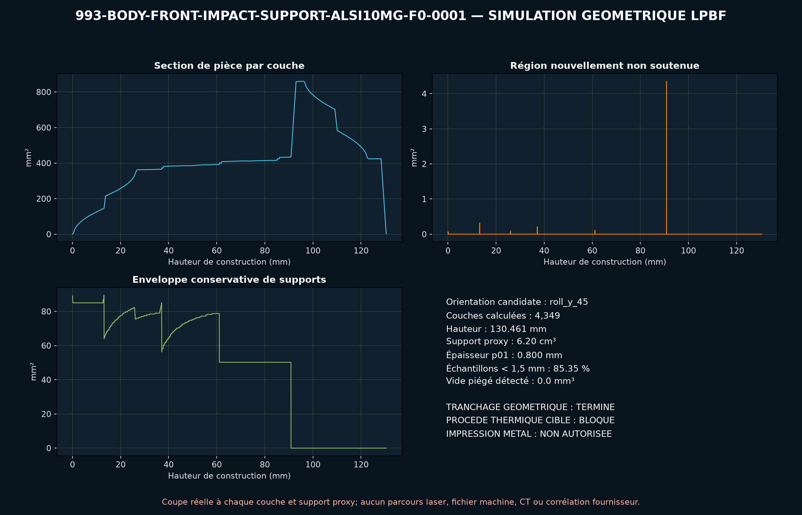

<!-- engendre par scripts/render_part_pages.py - ne pas editer a la main -->

# Support d'impact avant 993, concept AlSi10Mg à cœur gradué F0

**Statut : **interdit en l'état**. Aucune pièce n'est libérée ; voir [SAFETY.md](../../SAFETY.md).**

Concept indépendant de support avant à coque elliptique et cœur cruciforme ouvert gradué pour cribler l'intérêt du LPBF AlSi10Mg. PorscheFanatics recoupe le support allégé FVD à 145 g ; FVD publie une enveloppe de 139 x 100 x 53 mm et indique seulement aluminium, sans alliage ni géométrie d'interface.

Fiche du catalogue : [`catalog/parts/993-body-front-impact-support-alsi10mg-f0-0001.json`](../../catalog/parts/993-body-front-impact-support-alsi10mg-f0-0001.json)

## Identité

| champ | valeur |
|---|---|
| identifiant | 993-BODY-FRONT-IMPACT-SUPPORT-ALSI10MG-F0-0001 |
| génération | 993 |
| variantes | 993_Carrera, 993_Turbo, 993_GT2 |
| années | 1994 à 1998 |
| références Porsche | non renseigné |
| catégorie | front_bumper_impact_support |
| classe de sécurité | prohibited_pending_engineering |
| usage prévu | Criblage CAO, masse, stabilité, énergie et DfAM uniquement ; fabrication, montage, roulage et essai d'impact interdits sans programme crash approuvé |

## Matière et fabrication

| champ | valeur |
|---|---|
| procédé préféré | à décider |
| procédés candidats | LPBF, DMLS, CNC, sheet_metal |
| famille de matière | alliage aluminium LPBF candidat |
| nuance | AlSi10Mg générique de criblage ; alliage et état du produit FVD inconnus |
| norme | ASTM F3318 et spécification crash propre au programme à contractualiser si le LPBF est retenu |
| exigences fournisseur | poudre, machine, paramètres, orientation, lot et recyclage traçables, capabilité démontrée sur coque 1,2 mm et cœur gradué jusqu'à 0,8 mm, coupons dans les orientations pièce avec traction quasi-statique et dynamique, simulation de distorsion, stratégie de supports et contrôle recoater avant lancement, CT de la coque et du cœur, métrologie complète et ressuage après finition, courbes force-course quasi-statiques et dynamiques sur lots représentatifs, validation sous-système puis véhicule par un ingénieur crash qualifié |
| post-traitement | évacuation complète de la poudre par les quatre canaux ouverts, détensionnement et traitement thermique qualifiés sur coupons représentatifs, découpe du plateau sans amorcer les parois d'écrasement, usinage des interfaces uniquement après mesure et ajout de surépaisseurs, ébavurage sans supprimer les amorces de pliage définies par le futur calcul, protection galvanique et anticorrosion à définir avec le pare-chocs et la caisse |

## Géométrie

| champ | valeur |
|---|---|
| type de source | mixed |
| format du maître | build123d |
| unités | mm |
| précision (mm) | non renseigné |

**Fichier maître**

- [`parts/993-body-front-impact-support-alsi10mg-f0-0001/source/front_impact_support.py`](../../parts/993-body-front-impact-support-alsi10mg-f0-0001/source/front_impact_support.py)

**Fichiers dérivés**

- [`parts/993-body-front-impact-support-alsi10mg-f0-0001/derived/front_impact_support_alsi10mg_f0.step`](../../parts/993-body-front-impact-support-alsi10mg-f0-0001/derived/front_impact_support_alsi10mg_f0.step)

## Images

*parts/993-body-front-impact-support-alsi10mg-f0-0001/evidence/lpbf-f0/993-body-front-impact-support-alsi10mg-f0-0001-lpbf-geometry-screen.png*

## Provenance et sources

| champ | valeur |
|---|---|
| licence de la fiche | MIT pour le concept, le script et les calculs ; aucune photographie, marque, illustration ou géométrie commerciale redistribuée |

**Sources**

- [PorscheFanatics - support de pare-chocs avant allégé 993](https://porschefanatics.com/993/)
- [FVD - support d'impact avant aluminium 993](https://www.fvd.net/de-ch/shop/prallrohr-993-vorne-alu-1stk-ca-145-gr-fvd50501700~p237473)
- [EOS Aluminium AlSi10Mg material page](https://www.eos.info/metal-solutions/metal-materials/data-sheets/mds-eos-aluminium-alsi10mg)

## Validation

| champ | valeur |
|---|---|
| statut | concept |
| essais véhicule | non renseigné |
| revu par |  |
| limites | non renseigné |

**Preuves**

- [`catalog/sources/src-porschefanatics-993-lightweight-bumper-support.json`](../../catalog/sources/src-porschefanatics-993-lightweight-bumper-support.json)
- [`catalog/sources/src-fvd-993-front-impact-tube-dimensions.json`](../../catalog/sources/src-fvd-993-front-impact-tube-dimensions.json)
- [`catalog/sources/src-eos-alsi10mg-current-page.json`](../../catalog/sources/src-eos-alsi10mg-current-page.json)
- [`parts/993-body-front-impact-support-alsi10mg-f0-0001/evidence/engineering-screen.json`](../../parts/993-body-front-impact-support-alsi10mg-f0-0001/evidence/engineering-screen.json)

## Dossiers de conception

- [993_FRONT_IMPACT_SUPPORT_ALSI10MG_F0](../../docs/993/993_FRONT_IMPACT_SUPPORT_ALSI10MG_F0.md)

---

*Page engendrée depuis la fiche du catalogue par `scripts/render_part_pages.py`, vérifiée par `make check`. Toute correction se fait dans la fiche, pas ici.*
