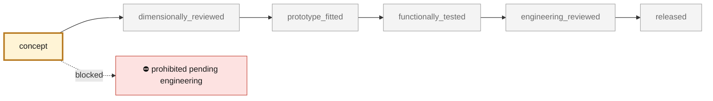
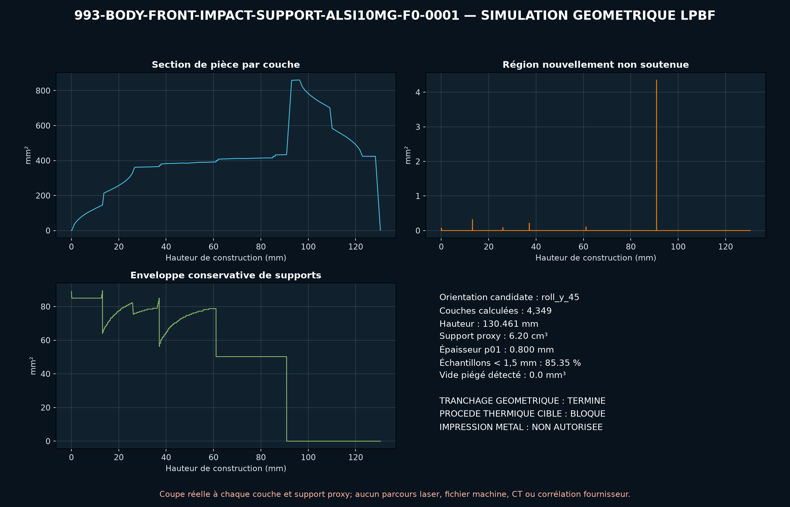

<!-- generated by scripts/render_part_pages.py - do not edit by hand -->

# 993 front impact support, AlSi10Mg graded-core concept F0

**Status: **prohibited pending engineering**. No part is released; see [SAFETY.md](../../SAFETY.md).**

Independent front support concept with an elliptical shell and a graded open cruciform core, used to screen the value of LPBF AlSi10Mg. PorscheFanatics corroborates the lightweight FVD support at 145 g; FVD publishes a 139 x 100 x 53 mm envelope and states only aluminum, with no alloy and no interface geometry.

```mermaid
flowchart LR
    L0["concept"]
    L1["dimensionally_reviewed"]
    L2["prototype_fitted"]
    L3["functionally_tested"]
    L4["engineering_reviewed"]
    L5["released"]
    L0 --> L1 --> L2 --> L3 --> L4 --> L5
    X["⛔ prohibited pending engineering"]
    L0 -. blocked .-> X
    classDef here fill:#fff4d6,stroke:#b7791f,color:#1a1a1a,stroke-width:3px;
    classDef done fill:#e3f1e6,stroke:#2e7d32,color:#1a1a1a;
    classDef todo fill:#f4f4f4,stroke:#9e9e9e,color:#6b6b6b;
    classDef stop fill:#fde2e1,stroke:#c0392b,color:#1a1a1a;
    class L0 here
    class L1 todo
    class L2 todo
    class L3 todo
    class L4 todo
    class L5 todo
    class X stop
```

*Validation ladder of `catalog/schemas/part.schema.json`; this record is at `concept`.*

Catalogue record: [`catalog/parts/993-body-front-impact-support-alsi10mg-f0-0001.json`](../../catalog/parts/993-body-front-impact-support-alsi10mg-f0-0001.json)

## Identity

| field | value |
|---|---|
| identifier | 993-BODY-FRONT-IMPACT-SUPPORT-ALSI10MG-F0-0001 |
| generation | 993 |
| variants | 993_Carrera, 993_Turbo, 993_GT2 |
| model years | 1994 to 1998 |
| Porsche part numbers | not recorded |
| category | front_bumper_impact_support |
| safety class | prohibited_pending_engineering |
| intended use | CAD, mass, stability, energy and DfAM screening only; manufacture, fitting, driving and impact testing prohibited without an approved crash program |

## Material and manufacturing

| field | value |
|---|---|
| preferred process | undecided |
| candidate processes | LPBF, DMLS, CNC, sheet_metal |
| material family | candidate LPBF aluminum alloy |
| grade | generic screening AlSi10Mg; alloy and temper of the FVD product unknown |
| standard | ASTM F3318 and a program-specific crash specification to be contracted if LPBF is retained |
| supplier requirements | traceable powder, machine, parameters, orientation, batch and recycling, capability demonstrated on a 1.2 mm shell and a core graded down to 0.8 mm, coupons in the part orientations with quasi-static and dynamic tensile tests, distortion simulation, support strategy and recoater check before launch, CT of the shell and the core, full metrology and dye-penetrant inspection after finishing, quasi-static and dynamic force-displacement curves on representative batches, subsystem then vehicle validation by a qualified crash engineer |
| post-processing | complete powder removal through the four open channels, stress relief and heat treatment qualified on representative coupons, build plate cut-off without initiating cracks in the crush walls, interface machining only after measurement and addition of machining stock, deburring without removing the folding triggers defined by the future calculation, galvanic and corrosion protection to be defined with the bumper and the body shell |

## Geometry

| field | value |
|---|---|
| source type | mixed |
| master format | build123d |
| units | mm |
| accuracy (mm) | not recorded |

**Master file**

- [`parts/993-body-front-impact-support-alsi10mg-f0-0001/source/front_impact_support.py`](../../parts/993-body-front-impact-support-alsi10mg-f0-0001/source/front_impact_support.py)

**Derived files**

- [`parts/993-body-front-impact-support-alsi10mg-f0-0001/derived/front_impact_support_alsi10mg_f0.step`](../../parts/993-body-front-impact-support-alsi10mg-f0-0001/derived/front_impact_support_alsi10mg_f0.step)

## Images

*parts/993-body-front-impact-support-alsi10mg-f0-0001/evidence/lpbf-f0/993-body-front-impact-support-alsi10mg-f0-0001-lpbf-geometry-screen.png*

## Provenance and sources

| field | value |
|---|---|
| record license | MIT for the concept, the script and the calculations; no photograph, trademark, illustration or commercial geometry redistributed |

**Sources**

- [PorscheFanatics - lightweight 993 front bumper support](https://porschefanatics.com/993/)
- [FVD - 993 aluminum front impact support](https://www.fvd.net/de-ch/shop/prallrohr-993-vorne-alu-1stk-ca-145-gr-fvd50501700~p237473)
- [EOS Aluminium AlSi10Mg material page](https://www.eos.info/metal-solutions/metal-materials/data-sheets/mds-eos-aluminium-alsi10mg)

## Validation

| field | value |
|---|---|
| status | concept |
| vehicle tested | not recorded |
| reviewed by |  |
| limitations | not recorded |

**Evidence**

- [`catalog/sources/src-porschefanatics-993-lightweight-bumper-support.json`](../../catalog/sources/src-porschefanatics-993-lightweight-bumper-support.json)
- [`catalog/sources/src-fvd-993-front-impact-tube-dimensions.json`](../../catalog/sources/src-fvd-993-front-impact-tube-dimensions.json)
- [`catalog/sources/src-eos-alsi10mg-current-page.json`](../../catalog/sources/src-eos-alsi10mg-current-page.json)
- [`parts/993-body-front-impact-support-alsi10mg-f0-0001/evidence/engineering-screen.json`](../../parts/993-body-front-impact-support-alsi10mg-f0-0001/evidence/engineering-screen.json)

## Design dossiers

- [993_FRONT_IMPACT_SUPPORT_ALSI10MG_F0](../../docs/993/993_FRONT_IMPACT_SUPPORT_ALSI10MG_F0.md)

---

*Page generated from the catalogue record by `scripts/render_part_pages.py`, checked by `make check`. Corrections go in the record, not here.*
