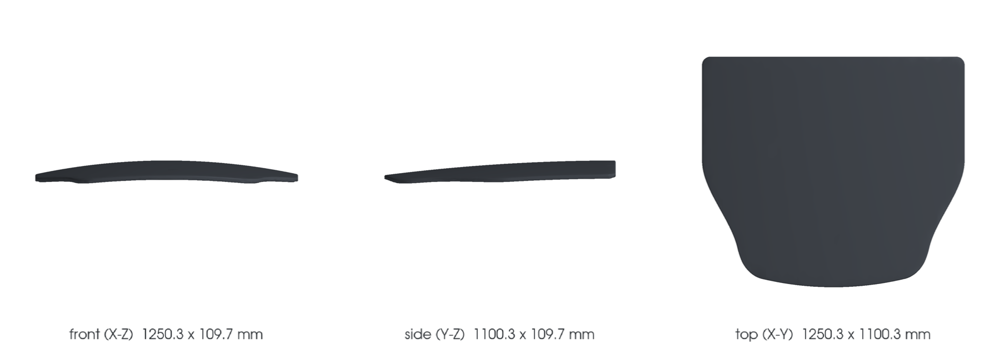

<!-- generated by scripts/render_part_pages.py - do not edit by hand -->

# Front lid, composite panel

**Status: functional. No part is released; see [SAFETY.md](../../SAFETY.md).**

993 front lid reproduced in composite from the original steel panel. Bolted skin part, with no structural function and no anti-intrusion bar, retained as the first lightweight body pilot.

```mermaid
flowchart LR
    L0["concept"]
    L1["dimensionally_reviewed"]
    L2["prototype_fitted"]
    L3["functionally_tested"]
    L4["engineering_reviewed"]
    L5["released"]
    L0 --> L1 --> L2 --> L3 --> L4 --> L5
    classDef here fill:#fff4d6,stroke:#b7791f,color:#1a1a1a,stroke-width:3px;
    classDef done fill:#e3f1e6,stroke:#2e7d32,color:#1a1a1a;
    classDef todo fill:#f4f4f4,stroke:#9e9e9e,color:#6b6b6b;
    classDef stop fill:#fde2e1,stroke:#c0392b,color:#1a1a1a;
    class L0 here
    class L1 todo
    class L2 todo
    class L3 todo
    class L4 todo
    class L5 todo
```

*Validation ladder of `catalog/schemas/part.schema.json`; this record is at `concept`.*

Catalogue record: [`catalog/parts/993-body-front-lid-0001.json`](../../catalog/parts/993-body-front-lid-0001.json)

## Identity

| field | value |
|---|---|
| identifier | 993-BODY-FRONT-LID-0001 |
| generation | 993 |
| variants | to_confirm_on_vehicle |
| model years | 1994 to 1998 |
| Porsche part numbers | 993 511 010 01, 993 511 010 31 |
| category | body_panel |
| safety class | functional |
| intended use | Closes the front compartment; the part carries no load, but its retention is a safety matter at high speed |

## Material and manufacturing

| field | value |
|---|---|
| preferred process | undecided |
| candidate processes | casting |
| material family | organic matrix composite |
| grade | fiber and resin to be determined; glass, carbon or hybrid |
| standard | none |
| supplier requirements | not recorded |
| post-processing | trimming, fitting of the hinge and latch interfaces, gap and flush check |

## Geometry

| field | value |
|---|---|
| source type | estimated |
| master format | build123d |
| units | mm |
| accuracy (mm) | not recorded |

**Master file**

- [`scripts/build_993_concept_f0.py`](../../scripts/build_993_concept_f0.py)

**Derived files**

- [`parts/993-body-front-lid-0001/derived/front_lid_concept_f0.step`](../../parts/993-body-front-lid-0001/derived/front_lid_concept_f0.step)

## Images

*`parts/993-body-front-lid-0001/media/preview.png` — concept CAD block, **not** the original part, not a print file.*

*`parts/993-body-front-lid-0001/media/views.png` — concept CAD block, **not** the original part, not a print file.*

## Provenance and sources

| field | value |
|---|---|
| record license | MIT for the record, geometry not yet produced |

**Sources**

- [Paul Stephens Autoart - 993R, body weight reduction](https://psautoart.com/993r/)
- [Specialist press - Gunther Werks, carbon-bodied 993](https://www.carscoops.com/2022/08/gunther-werks-project-tornado-is-a-carbon-bodied-porsche-993-turbo-restomod-with-up-to-700-hp/)
- [Federleichte Elfer - mass table, 993 exterior parts](http://www.federleichte-elfer.de/dp93/aussen.html)

## Validation

| field | value |
|---|---|
| status | concept |
| vehicle tested | not recorded |
| reviewed by |  |
| limitations | not recorded |

**Evidence**

- none

---

*Page generated from the catalogue record by `scripts/render_part_pages.py`, checked by `make check`. Corrections go in the record, not here.*
