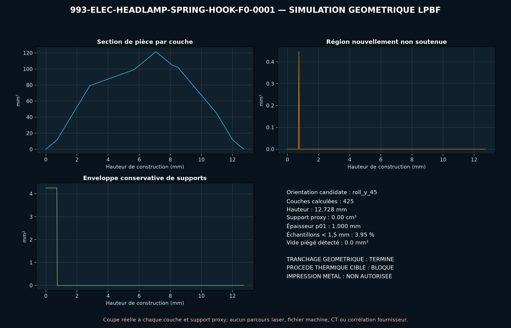

<!-- engendre par scripts/render_part_pages.py - ne pas editer a la main -->

# Crochet de réparation du ressort de lampe, concept F0 aluminium

**Statut : fonctionnel. Aucune pièce n'est libérée ; voir [SAFETY.md](../../SAFETY.md).**

Concept indépendant de crochet creux destiné à étudier une réparation additive du support de ressort de lampe d'un phare 993. Une offre commerciale prouve l'usage réel de l'impression métal pour cette fonction, mais aucune cote publique n'autorise à présenter ce F0 comme sa copie ou comme une pièce ajustée.

Fiche du catalogue : [`catalog/parts/993-elec-headlamp-spring-hook-f0-0001.json`](../../catalog/parts/993-elec-headlamp-spring-hook-f0-0001.json)

## Identité

| champ | valeur |
|---|---|
| identifiant | 993-ELEC-HEADLAMP-SPRING-HOOK-F0-0001 |
| génération | 993 |
| variantes | 993_headlamp_application_declared_by_vendor_to_confirm |
| années | 1994 à 1998 |
| références Porsche | non renseigné |
| catégorie | lighting_repair |
| classe de sécurité | functional |
| usage prévu | Criblage CAO, LPBF et mécanique d'un concept de réparation ; aucun montage ni maintien de lampe autorisé |

## Matière et fabrication

| champ | valeur |
|---|---|
| procédé préféré | LPBF |
| procédés candidats | LPBF, CNC |
| famille de matière | aluminium LPBF |
| nuance | EOS Aluminium AlSi10Mg / AlSi10Mg_FlexM291 2.01 / 30 µm, candidat de criblage non attribué à la pièce commerciale |
| norme | DIN EN 1706 EN AC-43000 et ASTM F3318-18 selon la fiche EOS ; spécification fournisseur à contractualiser |
| exigences fournisseur | poudre, machine, orientation et lot traçables, coupon témoin dans l'orientation critique du bras, CT ou radiographie de la racine et contrôle dimensionnel, rapport de rugosité dans la gorge, essais thermiques, vibratoires et de maintien avant véhicule |
| post-traitement | retrait des supports hors cavité, ébavurage contrôlé de la gorge de ressort, traitement thermique lié à la machine et au jeu de paramètres, finition de la surface de collage sans arrondir les datums futurs |

## Géométrie

| champ | valeur |
|---|---|
| type de source | estimated |
| format du maître | build123d |
| unités | mm |
| précision (mm) | non renseigné |

**Fichier maître**

- [`parts/993-elec-headlamp-spring-hook-f0-0001/source/headlamp_spring_hook.py`](../../parts/993-elec-headlamp-spring-hook-f0-0001/source/headlamp_spring_hook.py)

**Fichiers dérivés**

- [`parts/993-elec-headlamp-spring-hook-f0-0001/derived/headlamp_spring_hook_f0.step`](../../parts/993-elec-headlamp-spring-hook-f0-0001/derived/headlamp_spring_hook_f0.step)

## Images

*parts/993-elec-headlamp-spring-hook-f0-0001/evidence/lpbf-f0/993-elec-headlamp-spring-hook-f0-0001-lpbf-geometry-screen.png*

## Provenance et sources

| champ | valeur |
|---|---|
| licence de la fiche | MIT pour le concept, le script et les calculs ; aucune photo ni géométrie commerciale redistribuée |

**Sources**

- [Roadster-Fashion - Crochet imprimé de ressort de phare pour 993](https://shop.roadster-fashion.de/de/reparaturteil-federhaken-am-scheinwerfer.html)
- [EOS Aluminium AlSi10Mg for EOS M 290 - 30 micrometre process data sheet](https://www.eos.info/metal-solutions/data-sheets/aluminium/pds-eos-aluminium-alsi10mg-eos-m-290-30um)

## Validation

| champ | valeur |
|---|---|
| statut | concept |
| essais véhicule | non renseigné |
| revu par |  |
| limites | non renseigné |

**Preuves**

- [`catalog/sources/src-roadster-fashion-993-headlamp-hook.json`](../../catalog/sources/src-roadster-fashion-993-headlamp-hook.json)
- [`catalog/sources/src-eos-alsi10mg-m290-30um.json`](../../catalog/sources/src-eos-alsi10mg-m290-30um.json)
- [`catalog/manufacturing/processes/eos-m290-alsi10mg-30um.json`](../../catalog/manufacturing/processes/eos-m290-alsi10mg-30um.json)
- [`parts/993-elec-headlamp-spring-hook-f0-0001/evidence/engineering-screen.json`](../../parts/993-elec-headlamp-spring-hook-f0-0001/evidence/engineering-screen.json)
- [`twins/993-headlamp-spring-hook-alsi10mg-f0/evidence/summary.json`](../../twins/993-headlamp-spring-hook-alsi10mg-f0/evidence/summary.json)
- [`twins/993-headlamp-spring-hook-alsi10mg-f0/evidence/lpbf-f0/993-elec-headlamp-spring-hook-f0-0001-lpbf-geometry-report.json`](../../twins/993-headlamp-spring-hook-alsi10mg-f0/evidence/lpbf-f0/993-elec-headlamp-spring-hook-f0-0001-lpbf-geometry-report.json)
- [`twins/993-headlamp-spring-hook-alsi10mg-f0/evidence/calculix-f0/calculix-thermomechanical-screen.json`](../../twins/993-headlamp-spring-hook-alsi10mg-f0/evidence/calculix-f0/calculix-thermomechanical-screen.json)
- [`twins/993-headlamp-spring-hook-alsi10mg-f0/evidence/simready-f0/ovphysx-rigid-screen.json`](../../twins/993-headlamp-spring-hook-alsi10mg-f0/evidence/simready-f0/ovphysx-rigid-screen.json)

## Dossiers de conception

- [993_HEADLAMP_SPRING_HOOK_ALSI10MG_F0](../../docs/993/993_HEADLAMP_SPRING_HOOK_ALSI10MG_F0.md)

---

*Page engendrée depuis la fiche du catalogue par `scripts/render_part_pages.py`, vérifiée par `make check`. Toute correction se fait dans la fiche, pas ici.*
