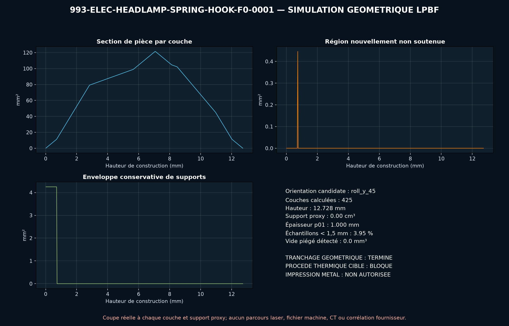
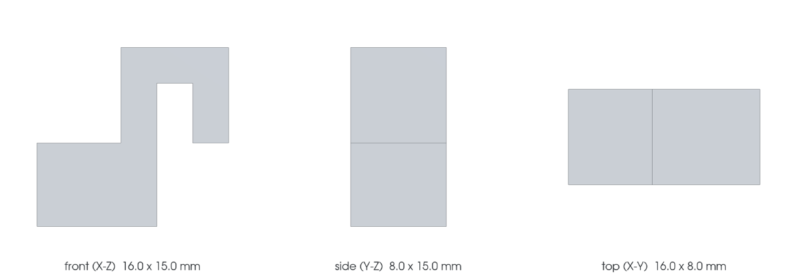

<!-- generated by scripts/render_part_pages.py - do not edit by hand -->

# Headlamp spring hook repair, F0 aluminum concept

**Status: functional. No part is released; see [SAFETY.md](../../SAFETY.md).**

Independent hollow hook concept for studying an additive repair of the lamp spring mount of a 993 headlamp. A commercial offer proves that metal printing is really used for this function, but no public dimension allows this F0 to be presented as its copy or as a fitted part.

```mermaid
flowchart LR
    L0["concept"]
    L1["dimensionally_reviewed"]
    L2["prototype_fitted"]
    L3["functionally_tested"]
    L4["engineering_reviewed"]
    L5["released"]
    L0 --> L1 --> L2 --> L3 --> L4 --> L5
    classDef here fill:#fff4d6,stroke:#b7791f,color:#1a1a1a,stroke-width:3px;
    classDef done fill:#e3f1e6,stroke:#2e7d32,color:#1a1a1a;
    classDef todo fill:#f4f4f4,stroke:#9e9e9e,color:#6b6b6b;
    classDef stop fill:#fde2e1,stroke:#c0392b,color:#1a1a1a;
    class L0 here
    class L1 todo
    class L2 todo
    class L3 todo
    class L4 todo
    class L5 todo
```

*Validation ladder of `catalog/schemas/part.schema.json`; this record is at `concept`.*

Catalogue record: [`catalog/parts/993-elec-headlamp-spring-hook-f0-0001.json`](../../catalog/parts/993-elec-headlamp-spring-hook-f0-0001.json)

## Identity

| field | value |
|---|---|
| identifier | 993-ELEC-HEADLAMP-SPRING-HOOK-F0-0001 |
| generation | 993 |
| variants | 993_headlamp_application_declared_by_vendor_to_confirm |
| model years | 1994 to 1998 |
| Porsche part numbers | not recorded |
| category | lighting_repair |
| safety class | functional |
| intended use | CAD, LPBF and mechanical screening of a repair concept; no fitting and no lamp retention authorized |

## Material and manufacturing

| field | value |
|---|---|
| preferred process | LPBF |
| candidate processes | LPBF, CNC |
| material family | LPBF aluminum |
| grade | EOS Aluminium AlSi10Mg / AlSi10Mg_FlexM291 2.01 / 30 µm, screening candidate not attributed to the commercial part |
| standard | DIN EN 1706 EN AC-43000 and ASTM F3318-18 per the EOS data sheet; supplier specification to be contracted |
| supplier requirements | traceable powder, machine, orientation and batch, witness coupon in the critical orientation of the arm, CT or radiography of the root and dimensional inspection, roughness report inside the groove, thermal, vibration and retention tests before any vehicle use |
| post-processing | removal of supports outside the cavity, controlled deburring of the spring groove, heat treatment tied to the machine and the parameter set, finishing of the bonding surface without rounding the future datums |

## Geometry

| field | value |
|---|---|
| source type | estimated |
| master format | build123d |
| units | mm |
| accuracy (mm) | not recorded |

**Master file**

- [`parts/993-elec-headlamp-spring-hook-f0-0001/source/headlamp_spring_hook.py`](../../parts/993-elec-headlamp-spring-hook-f0-0001/source/headlamp_spring_hook.py)

**Derived files**

- [`parts/993-elec-headlamp-spring-hook-f0-0001/derived/headlamp_spring_hook_f0.step`](../../parts/993-elec-headlamp-spring-hook-f0-0001/derived/headlamp_spring_hook_f0.step)

## Images

*parts/993-elec-headlamp-spring-hook-f0-0001/evidence/lpbf-f0/993-elec-headlamp-spring-hook-f0-0001-lpbf-geometry-screen.png*

*parts/993-elec-headlamp-spring-hook-f0-0001/media/preview.png*

*parts/993-elec-headlamp-spring-hook-f0-0001/media/views.png*

## Provenance and sources

| field | value |
|---|---|
| record license | MIT for the concept, the script and the calculations; no photo and no commercial geometry redistributed |

**Sources**

- [Roadster-Fashion - printed headlamp spring hook for 993](https://shop.roadster-fashion.de/de/reparaturteil-federhaken-am-scheinwerfer.html)
- [EOS Aluminium AlSi10Mg for EOS M 290 - 30 micrometre process data sheet](https://www.eos.info/metal-solutions/data-sheets/aluminium/pds-eos-aluminium-alsi10mg-eos-m-290-30um)

## Validation

| field | value |
|---|---|
| status | concept |
| vehicle tested | not recorded |
| reviewed by |  |
| limitations | not recorded |

**Evidence**

- [`catalog/sources/src-roadster-fashion-993-headlamp-hook.json`](../../catalog/sources/src-roadster-fashion-993-headlamp-hook.json)
- [`catalog/sources/src-eos-alsi10mg-m290-30um.json`](../../catalog/sources/src-eos-alsi10mg-m290-30um.json)
- [`catalog/manufacturing/processes/eos-m290-alsi10mg-30um.json`](../../catalog/manufacturing/processes/eos-m290-alsi10mg-30um.json)
- [`parts/993-elec-headlamp-spring-hook-f0-0001/evidence/engineering-screen.json`](../../parts/993-elec-headlamp-spring-hook-f0-0001/evidence/engineering-screen.json)
- [`twins/993-headlamp-spring-hook-alsi10mg-f0/evidence/summary.json`](../../twins/993-headlamp-spring-hook-alsi10mg-f0/evidence/summary.json)
- [`twins/993-headlamp-spring-hook-alsi10mg-f0/evidence/lpbf-f0/993-elec-headlamp-spring-hook-f0-0001-lpbf-geometry-report.json`](../../twins/993-headlamp-spring-hook-alsi10mg-f0/evidence/lpbf-f0/993-elec-headlamp-spring-hook-f0-0001-lpbf-geometry-report.json)
- [`twins/993-headlamp-spring-hook-alsi10mg-f0/evidence/calculix-f0/calculix-thermomechanical-screen.json`](../../twins/993-headlamp-spring-hook-alsi10mg-f0/evidence/calculix-f0/calculix-thermomechanical-screen.json)
- [`twins/993-headlamp-spring-hook-alsi10mg-f0/evidence/simready-f0/ovphysx-rigid-screen.json`](../../twins/993-headlamp-spring-hook-alsi10mg-f0/evidence/simready-f0/ovphysx-rigid-screen.json)

## Design dossiers

- [993_HEADLAMP_SPRING_HOOK_ALSI10MG_F0](../../docs/993/993_HEADLAMP_SPRING_HOOK_ALSI10MG_F0.md)

---

*Page generated from the catalogue record by `scripts/render_part_pages.py`, checked by `make check`. Corrections go in the record, not here.*
