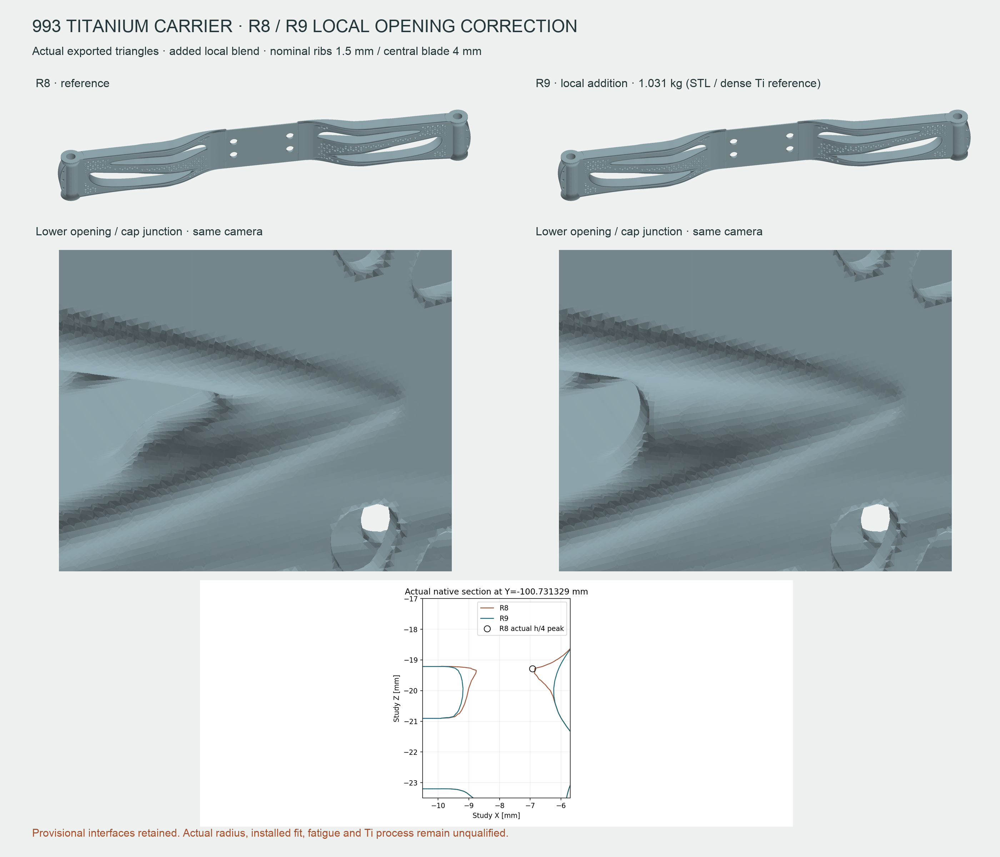
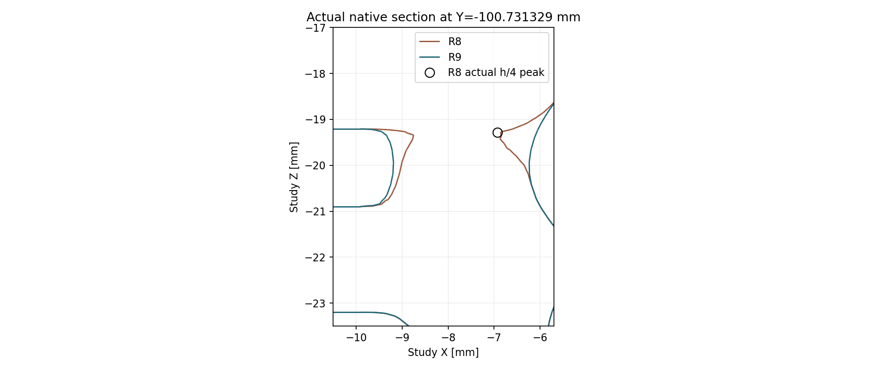
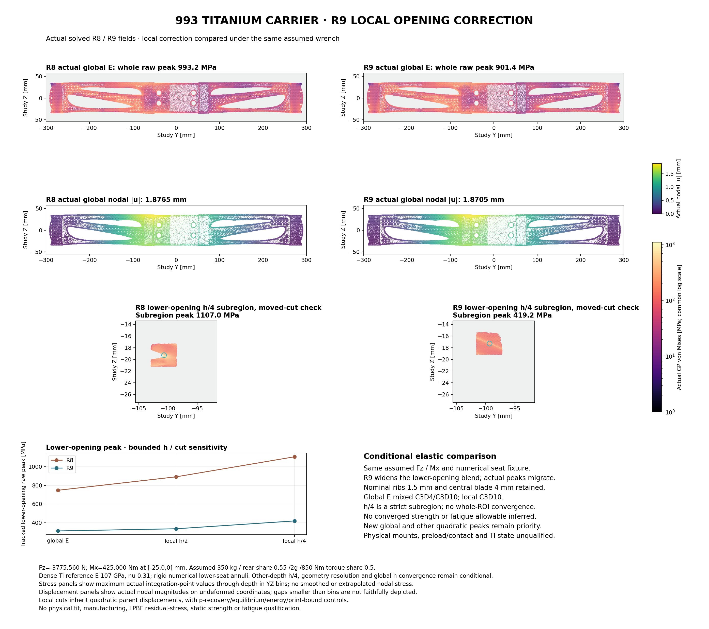
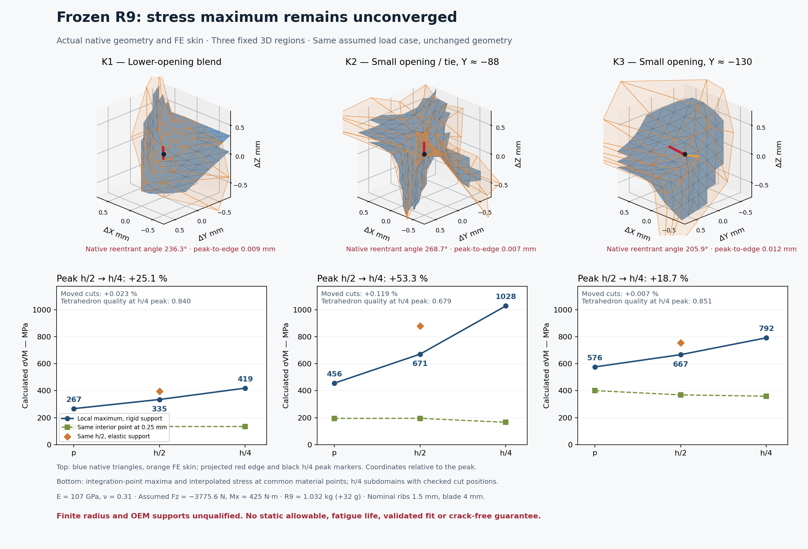

<!-- generated by scripts/render_part_pages.py - do not edit by hand -->

# Turbo engine carrier (Motortraeger)

**`993-ENG-CARRIER-0001`** · Porsche 993 Turbo · 1995–1998

> [!CAUTION]
> **Not ready to print. Safety-critical concept; no manufacturing release.** Catalogue status: `concept`; not a print file. The organic geometry is a design study, not an OEM reconstruction or evidence of fit, strength or fatigue life. See [SAFETY.md](../../SAFETY.md).

## Current design study — R9

R9 explores an organic engine carrier using **Ti-6Al-4V as an unqualified material candidate**, with density **4,420 kg/m³**, nominal **1.5 mm ribs** and a **4.0 mm center section**. These are modeling assumptions, not measured Porsche dimensions or a qualified manufacturing specification.

*Actual exported R8 and R9 triangles: organic carrier and local opening correction; provisional interfaces.*

*Actual native R8 and R9 opening section; study coordinates, not measured OEM geometry.*

### Mass and mechanical screening

| Representation | Calculated mass | Meaning |
| --- | ---: | --- |
| R9 native geometry | 1.032036850 kg | Native volume × candidate dense reference density |
| R9 STL mesh | 1.031119182 kg | Oriented mesh volume × the same density |

The two masses describe different representations; they must not be treated as interchangeable measurements of a physical part.

The R9 mechanical screen used hypothetical **about 3,776 N vertical force + 425 N·m roll torque**. The assumed case uses a 350 kg engine, 55% rear mass share, effective 2g vertical acceleration, 850 N·m engine torque and 50% rear roll-torque share. About the model origin the common wrench is Fz = −3,775.56025 N, Mx = 425,000 N·mm and My = −94,389.00625 N·mm; transport is applied once. Dense reference elasticity E = 107 GPa and ν = 0.31 supplies no process-specific strength or fatigue allowable.

Refining from **h/2 to h/4** increased the reported stress at all three fixed 3D regions:

| Sampled site | h/2 | h/4 |
| --- | ---: | ---: |
| K1 | 335.0 MPa | 419.2 MPa |
| K2 | 670.9 MPa | 1,028.2 MPa |
| K3 | 667.2 MPa | 792.2 MPa |

**The screen is nonconverged.** These local values do not establish allowable stress, a safety factor, strength improvement or fatigue life. No physical load validation, material/process qualification or fit qualification is claimed. Later R10e geometric repair is not admitted as a verified successor; there is no R10 FEM result in this presentation.

*Actual R8 and R9 numerical fields under the same hypothetical wrench; conditional comparison, no converged strength or fatigue result.*

*Frozen R9 verification: three fixed 3D regions, rising refinement peaks and unqualified radii/supports; English labels only.*

The comparison panel's 901.4 MPa raw global R9 maximum and its local R8-to-R9 change are conditional numerical observations, not converged physical stress or strength margins. Moving the local cuts changes the fixed-region peaks by approximately 0.023%, 0.119% and 0.007%, while the peaks continue to rise under refinement. Reentrant faceted edges remain; a finished minimum radius, real mount stiffness and bolt preload/contact are unqualified. This behavior does not establish the OEM crack mechanism or a failure threshold above 700 metric horsepower.

[Public study manifest](../../parts/993-eng-carrier-0001/media/r9/study-public.json) records the revision, artifact SHA-256 digests, representation provenance and publication limits. Original project render bytes are preserved. The selected facts carry hashes for the native source, STL, numerical fields and private render receipts without their storage paths. No third-party OEM pixels or ImageGen were used according to the owner’s frozen receipts; underlying private artifacts were not inspected for this presentation.

[Selected facts and original provenance hashes](../../parts/993-eng-carrier-0001/media/r9/selected-facts-and-provenance.json) and the [owner's publication projection notes](../../parts/993-eng-carrier-0001/media/r9/README.md) retain the exact values and their limits. Permission to publish these originals is not a repository-wide reuse license.

The frozen verification panel uses [English labels from the same renderer](../../parts/993-eng-carrier-0001/media/r9/English-labels-README.md). Its [translation provenance](../../parts/993-eng-carrier-0001/media/r9/render-provenance.json) records both image hashes and unchanged geometry, fields and plotted data. The original historical image is preserved by its owner.

## Interfaces and open work

The original carrier references **993 115 021 53 / 54** are distinct from the separate central console **993 115 103 52 (10352)** and the Turbo engine-mount stack. PET item 17 identifies the carrier; item 18 identifies the separate bracket. A visual match to the blade alone cannot establish the complete assembly or its load path. OEM fit remains unknown.

Measured hole patterns, axes, mating faces, datums, clearances and tolerances are still required for the exact variant, together with validated load cases and assembly checks. Titanium would additionally require a qualified build process and orientation, heat treatment, machining, inspection, fatigue evidence and galvanic isolation. No study render or closed mesh satisfies these requirements.

## Archived F0 catalogue concept

The catalogue master remains [`scripts/build_993_concept_f0.py`](../../scripts/build_993_concept_f0.py), with its [F0 STEP export](../../parts/993-eng-carrier-0001/derived/engine_carrier_concept_f0.step). Its **580 × 45 × 45 mm** block is an estimated software placeholder, not the original carrier. R9 is not promoted to this master or to fabrication authority.

*Archived F0 render. [Orthographic F0 views](../../parts/993-eng-carrier-0001/media/views.png) and [preview provenance](../../parts/993-eng-carrier-0001/media/preview.json) remain tied to the F0 STEP. `scripts/render_part_previews.py` scans direct `derived/` files; these archival previews do not represent R9.*

Earlier concept evidence and historical receipts retain their original scope. They are not upgraded by this presentation.

## Original-part references and related records

Source photographs and catalogue illustrations remain on their rights holders' sites; they are not copied into this presentation.

- [Porsche Classic parts catalogue](https://www.porsche.com/australia/accessoriesandservice/classic/originalpartscatalogue/)
- [Catalogue source of truth](../../catalog/parts/993-eng-carrier-0001.json), including reference provenance and known limits
- [Carrier description page](../../docs/pieces/993-eng-carrier-0001.md)
- [Carrier folder presentation](../../parts/993-eng-carrier-0001/README.md)
- [Safety rules](../../SAFETY.md)

---

*Generated by `scripts/render_part_pages.py` from the catalogue record, the carrier presentation template and its public study manifest. Checked by `make check`; edit the sources, not the generated pages.*
