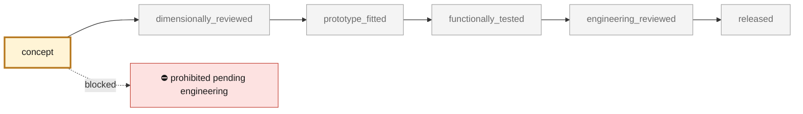

<!-- generated by scripts/render_part_pages.py - do not edit by hand -->

# 993 timing chain case and its lids

**Status: **prohibited pending engineering**. No part is released; see [SAFETY.md](../../SAFETY.md).**

Investigation target: the chain case from factory plate 103-05, its three lids, its oil bridges and its tensioner. The record establishes identity and material reasoning; it is neither a replacement geometry nor a manufacturing authorization. Selected because the factory catalogue triage makes it a serious consolidation case — and because the titanium grid rejects it three times.

*Validation ladder of `catalog/schemas/part.schema.json`; this record is at `concept`.*

Catalogue record: [`catalog/parts/993-eng-chain-case-0001.json`](../../catalog/parts/993-eng-chain-case-0001.json)

## Identity

| field | value |
|---|---|
| identifier | 993-ENG-CHAIN-CASE-0001 |
| generation | 993 |
| variants | 993_all_models_to_confirm_by_variant |
| model years | 1994 to 1998 |
| Porsche part numbers | 993 105 093 05, 964 105 094 04, 993 105 022 01, 964 105 107 01, 964 105 108 01, 993 107 087 51, 993 107 088 52, 993 107 088 00 |
| category | engine_timing_chain_case |
| safety class | prohibited_pending_engineering |
| intended use | Documentary investigation and process comparison; no manufacturing, no fitting, no start-up |

## Material and manufacturing

| field | value |
|---|---|
| preferred process | undecided |
| candidate processes | casting, LPBF, CNC |
| material family | aluminum, for consistency with the engine case |
| grade | unidentified; the original is a casting whose grade is not published |
| standard |  |
| supplier requirements | not recorded |
| post-processing | not recorded |

## Geometry

| field | value |
|---|---|
| source type | estimated |
| master format | build123d |
| units | mm |
| accuracy (mm) | not recorded |

**Master file**

- [`scripts/build_993_concept_f0.py`](../../scripts/build_993_concept_f0.py)

**Derived files**

- [`parts/993-eng-chain-case-0001/derived/chain_case_concept_f0.step`](../../parts/993-eng-chain-case-0001/derived/chain_case_concept_f0.step)

## Images

*`parts/993-eng-chain-case-0001/media/preview.png` — concept CAD block, **not** the original part, not a print file.*

*`parts/993-eng-chain-case-0001/media/views.png` — concept CAD block, **not** the original part, not a print file.*

## Provenance and sources

| field | value |
|---|---|
| record license | All rights reserved (see LICENSE) for the record; no third-party geometry redistributed |

**Sources**

- [993 factory catalogue, plate 103-05 Chain case](https://porschefanatics.com/oem/993/103-05/)

## Validation

| field | value |
|---|---|
| status | concept |
| vehicle tested | not recorded |
| reviewed by |  |
| limitations | not recorded |

**Evidence**

- [`catalog/sources/src-pet-993-103-05-chain-case.json`](../../catalog/sources/src-pet-993-103-05-chain-case.json)
- [`docs/993/993_CACHE_DE_CHAINE_103-05.md`](../../docs/993/993_CACHE_DE_CHAINE_103-05.md)

---

*Page generated from the catalogue record by `scripts/render_part_pages.py`, checked by `make check`. Corrections go in the record, not here.*
