<!-- generated by scripts/render_part_pages.py - do not edit by hand -->

# Left chain case lid 964 105 107 01, Ti-6Al-4V variant

**Status: functional. No part is released; see [SAFETY.md](../../SAFETY.md).**

Bolted, oil-tight left lid of the chain case, factory plate 103-05 position 15, paired with gasket 964 105 181 01. Remanufacture in machined Ti-6Al-4V explicitly requested. The original part is **cast magnesium**, whose failure mode is corrosion of the sealing faces: that is where titanium brings something, not on mass. Against magnesium, titanium is 2.45 times denser and loses both plate-bending trade-offs, strength included. One serious obstacle remains: the titanium/magnesium galvanic couple is the least favorable in the grid.

```mermaid
flowchart LR
    L0["concept"]
    L1["dimensionally_reviewed"]
    L2["prototype_fitted"]
    L3["functionally_tested"]
    L4["engineering_reviewed"]
    L5["released"]
    L0 --> L1 --> L2 --> L3 --> L4 --> L5
    classDef here fill:#fff4d6,stroke:#b7791f,color:#1a1a1a,stroke-width:3px;
    classDef done fill:#e3f1e6,stroke:#2e7d32,color:#1a1a1a;
    classDef todo fill:#f4f4f4,stroke:#9e9e9e,color:#6b6b6b;
    classDef stop fill:#fde2e1,stroke:#c0392b,color:#1a1a1a;
    class L0 here
    class L1 todo
    class L2 todo
    class L3 todo
    class L4 todo
    class L5 todo
```

*Validation ladder of `catalog/schemas/part.schema.json`; this record is at `concept`.*

Catalogue record: [`catalog/parts/993-eng-chain-case-lid-ti-f0-0001.json`](../../catalog/parts/993-eng-chain-case-lid-ti-f0-0001.json)

## Identity

| field | value |
|---|---|
| identifier | 993-ENG-CHAIN-CASE-LID-TI-F0-0001 |
| generation | 993 |
| variants | 993_split_by_variant_to_confirm |
| model years | 1994 to 1998 |
| Porsche part numbers | 964 105 107 01, 964 105 181 01 |
| category | engine_timing_chain_case_lid |
| safety class | functional |
| intended use | Parametric screening and measurement preparation; no manufacturing or fitting authorized before a specimen is measured |

## Material and manufacturing

| field | value |
|---|---|
| preferred process | CNC |
| candidate processes | CNC |
| material family | titanium |
| grade | Ti-6Al-4V Grade 5, plate — deliberate choice; 6061 billet aluminum is the market's answer |
| standard | ASTM B265 for the plate, to be contracted |
| supplier requirements | Material certificate for the plate, Flatness and surface finish held on the gasket plane, Dimensional inspection of the outline, hole spacings and holes |
| post-processing | facing of the gasket plane, flatness to be defined after measurement, edge breaking, bead blasting or titanium anodizing depending on the intended finish, anti-seize paste on fasteners, insulating washers if direct metal contact |

**Titanium**

| field | value |
|---|---|
| alloy | Ti-6Al-4V Grade 5 |
| heat treatment | none: part machined from plate supplied in the annealed condition |
| HIP | not_applicable |
| machined surfaces | gasket plane, fastening holes, outline |
| inspection | gasket plane flatness, hole spacings, thickness |
| galvanic isolation | The lid bolts onto a case that is also magnesium. Magnesium is the most anodic of structural metals and titanium one of the most cathodic: this is the couple TITANIUM.md names explicitly. Gasket 964 105 181 01 isolates the sealing faces, not the fasteners or the moisture paths. A titanium lid could protect its own sealing face while worsening the attack on the case opposite. Unresolved. |
| fatigue assumptions | not recorded |

## Geometry

| field | value |
|---|---|
| source type | estimated |
| master format | none |
| units | mm |
| accuracy (mm) | not recorded |

**Master file**

- [`parts/993-eng-chain-case-lid-ti-f0-0001/source/chain_case_lid_screen.py`](../../parts/993-eng-chain-case-lid-ti-f0-0001/source/chain_case_lid_screen.py)

**Derived files**

- none

## Provenance and sources

| field | value |
|---|---|
| record license | All rights reserved (see LICENSE) for the record and the script; no third-party geometry redistributed |

**Sources**

- [993 factory catalogue, plate 103-05 Chain case](https://porschefanatics.com/oem/993/103-05/)
- [Commercial reproducers of the lid: LN Engineering and Auto-Service Schefter](https://lnengineering.com/porsche-964-993-chain-box-covers.html)

## Validation

| field | value |
|---|---|
| status | concept |
| vehicle tested | not recorded |
| reviewed by |  |
| limitations | not recorded |

**Evidence**

- [`parts/993-eng-chain-case-lid-ti-f0-0001/evidence/parametric-screen.json`](../../parts/993-eng-chain-case-lid-ti-f0-0001/evidence/parametric-screen.json)
- [`catalog/sources/src-pet-993-103-05-chain-case.json`](../../catalog/sources/src-pet-993-103-05-chain-case.json)
- [`docs/993/993_COUVERCLE_CARTER_CHAINE_TI.md`](../../docs/993/993_COUVERCLE_CARTER_CHAINE_TI.md)
- [`catalog/sources/src-couvercle-carter-chaine-964-993-magnesium.json`](../../catalog/sources/src-couvercle-carter-chaine-964-993-magnesium.json)

## Design dossiers

- [993_COUVERCLE_CARTER_CHAINE_TI](../../docs/993/993_COUVERCLE_CARTER_CHAINE_TI.md)

---

*Page generated from the catalogue record by `scripts/render_part_pages.py`, checked by `make check`. Corrections go in the record, not here.*
