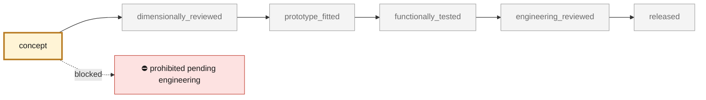
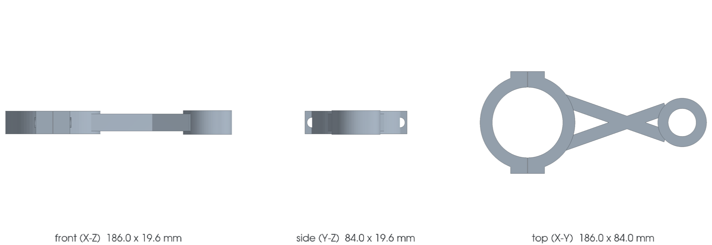

<!-- generated by scripts/render_part_pages.py - do not edit by hand -->

# 993/993 Turbo connecting rod, Ti64 F0 topology concept

**Status: **prohibited pending engineering**. No part is released; see [SAFETY.md](../../SAFETY.md).**

Independent two-open-flange concept to screen an LPBF Ti-6Al-4V connecting rod. The key dimensions come from a PAUTER/TZR record; outer diameters, flanges, cap split and bolt passages remain F0 assumptions with no commercial surface reused.

*Validation ladder of `catalog/schemas/part.schema.json`; this record is at `concept`.*

Catalogue record: [`catalog/parts/993-eng-connecting-rod-ti64-f0-0001.json`](../../catalog/parts/993-eng-connecting-rod-ti64-f0-0001.json)

## Identity

| field | value |
|---|---|
| identifier | 993-ENG-CONNECTING-ROD-TI64-F0-0001 |
| generation | 993 |
| variants | 993, 993_Turbo, M64_60_research |
| model years | 1993 to 1998 |
| Porsche part numbers | not recorded |
| category | connecting_rod |
| safety class | prohibited_pending_engineering |
| intended use | CAD, DfAM, mass, synthetic loads, nominal stresses and buckling screening only; no manufacturing, installation or engine start-up authorized |

## Material and manufacturing

| field | value |
|---|---|
| preferred process | LPBF |
| candidate processes | LPBF, DMLS, CNC |
| material family | candidate titanium |
| grade | Ti-6Al-4V Grade 5 LPBF for screening; PAUTER titanium alloy unknown |
| standard | ASTM F2924 and program-specific connecting rod specification to be contracted |
| supplier requirements | traceable powder, machine, parameters, orientation, lot and powder recycling, oriented coupons with tensile, toughness, fatigue and representative defects after all post-processing, full dimensional analysis of the joint face, center distance, bores, squareness and parallelism, CT of the body and cap, dye penetrant inspection after machining and roughness check, capability evidence on preload, friction, tightening and service life of the selected bolts, proof tests then full-scale fatigue with an approved engine envelope before any dyno run |
| post-processing | powder removal through a fully open topology, stress relief and heat treatment qualified for machine, parameters and orientation, HIP to be decided on defect population and representative fatigue tests, separation and machining of the cap, joint face, bolt bores and seats, machining and finishing of both bores with defined small-end bushing and bearing shells, radiusing, polishing of load paths, end-to-end and set balancing |

**Titanium**

| field | value |
|---|---|
| alloy | Ti-6Al-4V Grade 5 candidate only; the alloy of the PAUTER option is not published |
| heat treatment | EOS stress relief and ductility treatment to be qualified; no recipe is frozen without supplier, orientation and coupons |
| HIP | to_be_determined |
| machined surfaces | big-end bore and bearing shell seats, small-end bore and bushing seat, joint face and cap datums, bolt bores, seats and faces, side faces and crankshaft clearances |
| inspection | CT of the body, cap, fillets and flange transitions, full metrology of bores, center distance, joint face, parallelism and squareness, dye penetrant inspection after machining and finishing, roughness, porosity, alpha case, residual stresses and balancing, proof tests and full-scale fatigue with representative bolts, bearing shells and pins |
| galvanic isolation | Qualify titanium-steel couples with bolts, bearing shells and pin, fretting, galling, coatings, lubrication, expansion and galvanic contamination in engine oil. |
| fatigue assumptions | not recorded |

## Geometry

| field | value |
|---|---|
| source type | mixed |
| master format | build123d |
| units | mm |
| accuracy (mm) | not recorded |

**Master file**

- [`parts/993-eng-connecting-rod-ti64-f0-0001/source/connecting_rod.py`](../../parts/993-eng-connecting-rod-ti64-f0-0001/source/connecting_rod.py)

**Derived files**

- [`parts/993-eng-connecting-rod-ti64-f0-0001/derived/connecting_rod_ti64_f0.step`](../../parts/993-eng-connecting-rod-ti64-f0-0001/derived/connecting_rod_ti64_f0.step)

## Images

*`parts/993-eng-connecting-rod-ti64-f0-0001/media/preview.png` — concept CAD block, **not** the original part, not a print file.*

*`parts/993-eng-connecting-rod-ti64-f0-0001/media/views.png` — concept CAD block, **not** the original part, not a print file.*

## Provenance and sources

| field | value |
|---|---|
| record license | MIT for the concept, the script and the calculations; no photograph, PAUTER/Porsche surface or commercial geometry redistributed |

**Sources**

- [TZR Motorsport - manufacturer dimensions of the PAUTER 993/993 Turbo connecting rod](https://www.tzr-motorsport.de/993-230-580-1270F)
- [PorscheFanatics - titanium connecting rods for the 993 engine](https://porschefanatics.com/engine/993/)
- [EOS Titanium Ti64 Grade 5 material data sheet](https://www.eos.info/metal-solutions/metal-materials/data-sheets/mds-eos-titanium-ti64-grade-5)
- [TIMETAL 6-4 physical properties](https://www.timet.com/documents/datasheets/alpha-and-beta-alloys/timetal-6-4.pdf)
- [elferclassic - 993 Turbo technical data](https://www.elferclassic.de/technik/techdaten/993-turbo-95-98-techdat.php)

## Validation

| field | value |
|---|---|
| status | concept |
| vehicle tested | not recorded |
| reviewed by |  |
| limitations | not recorded |

**Evidence**

- [`catalog/sources/src-tzr-pauter-993-connecting-rod-dimensions.json`](../../catalog/sources/src-tzr-pauter-993-connecting-rod-dimensions.json)
- [`catalog/sources/src-porschefanatics-993-titanium-connecting-rods.json`](../../catalog/sources/src-porschefanatics-993-titanium-connecting-rods.json)
- [`catalog/sources/src-eos-ti64-grade5.json`](../../catalog/sources/src-eos-ti64-grade5.json)
- [`catalog/sources/src-timet-ti64-physical-properties.json`](../../catalog/sources/src-timet-ti64-physical-properties.json)
- [`catalog/sources/src-cecchel-2022-additive-ti-connecting-rod-fatigue.json`](../../catalog/sources/src-cecchel-2022-additive-ti-connecting-rod-fatigue.json)
- [`catalog/sources/src-elferclassic-993-turbo-technical-data.json`](../../catalog/sources/src-elferclassic-993-turbo-technical-data.json)
- [`parts/993-eng-connecting-rod-ti64-f0-0001/evidence/engineering-screen.json`](../../parts/993-eng-connecting-rod-ti64-f0-0001/evidence/engineering-screen.json)

---

*Page generated from the catalogue record by `scripts/render_part_pages.py`, checked by `make check`. Corrections go in the record, not here.*
