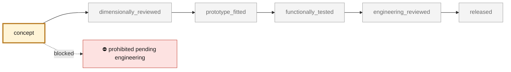

<!-- generated by scripts/render_part_pages.py - do not edit by hand -->

# Engine cooling fan impeller, rotating AlSi10Mg concept F0

**Status: **prohibited pending engineering**. No part is released; see [SAFETY.md](../../SAFETY.md).**

Independent concept of a one-piece impeller combining hub, twelve swept blades and a peripheral ring. PorscheFanatics and resellers establish part number 964 106 015 31, a commercial envelope, two consistent masses and an aluminum claim, but no functional geometry. The assembly test explicitly rejects the interference with the previous F0 housing.

*Validation ladder of `catalog/schemas/part.schema.json`; this record is at `concept`.*

Catalogue record: [`catalog/parts/993-eng-cooling-impeller-alsi10mg-f0-0001.json`](../../catalog/parts/993-eng-cooling-impeller-alsi10mg-f0-0001.json)

## Identity

| field | value |
|---|---|
| identifier | 993-ENG-COOLING-IMPELLER-ALSI10MG-F0-0001 |
| generation | 993 |
| variants | 993_Carrera_fitment_to_confirm, 964_shared_component |
| model years | 1994 to 1998 |
| Porsche part numbers | 96410601531 |
| category | engine_cooling_fan_impeller |
| safety class | prohibited_pending_engineering |
| intended use | F0 screening of open CAD, DfAM value, mass, overspeed, centrifugal stress, modal, target flow, thermal and compatibility with the F0 housing; no manufacture, rotation, installation or start-up authorized |

## Material and manufacturing

| field | value |
|---|---|
| preferred process | undecided |
| candidate processes | LPBF, DMLS, CNC, casting |
| material family | candidate LPBF aluminum-silicon-magnesium alloy |
| grade | EOS Aluminium AlSi10Mg T6 for comparison; commercial part declared only as unspecified aluminum |
| standard | DIN EN 1706 EN AC-43000 and ASTM F3318 for the candidate; program-specific rotating, HCF, balance and overspeed specification to be contracted |
| supplier requirements | traceable machine, parameters, orientation, supports, powder, recycling and batch, oriented coupons with tensile, HCF, fretting and hot corrosion tests, notched specimens and blade-root witnesses in the final surface condition, full CT, FPI and metallography with zoned defect criteria, metrology of hub, bore, runout, concentricity, blades, clearance and mass, proof of balance, overspeed, vibration, flow, blade loss/containment and endurance |
| post-processing | orientation, supports and access between blades to be qualified, stress relief then T6 with quench and distortion monitored, mandatory HIP to be decided by the HCF/defect card, not by habit, machining of the hub, bore, faces and balance correction datums, controlled finishing of the blade roots with no notches and no trapped media, corrosion protection compatible with temperature and fretting, two-plane dynamic balancing in the final condition |

## Geometry

| field | value |
|---|---|
| source type | mixed |
| master format | build123d |
| units | mm |
| accuracy (mm) | not recorded |

**Master file**

- [`parts/993-eng-cooling-impeller-alsi10mg-f0-0001/source/cooling_impeller.py`](../../parts/993-eng-cooling-impeller-alsi10mg-f0-0001/source/cooling_impeller.py)

**Derived files**

- [`parts/993-eng-cooling-impeller-alsi10mg-f0-0001/derived/cooling_impeller_alsi10mg_f0.step`](../../parts/993-eng-cooling-impeller-alsi10mg-f0-0001/derived/cooling_impeller_alsi10mg_f0.step)

## Images

*`parts/993-eng-cooling-impeller-alsi10mg-f0-0001/media/preview.png` — concept CAD block, **not** the original part, not a print file.*

*`parts/993-eng-cooling-impeller-alsi10mg-f0-0001/media/views.png` — concept CAD block, **not** the original part, not a print file.*

## Provenance and sources

| field | value |
|---|---|
| record license | All rights reserved (see LICENSE) for the concept, the script and the calculations; no photograph, illustration, Porsche/PorscheFanatics/FVD/Porsche Poitiers/Partworks/EOS surface or commercial geometry redistributed |

**Sources**

- [PorscheFanatics - 964/993 engine cooling fan impeller](https://porschefanatics.com/parts/c/cooling/)
- [FVD Brombacher - 964/993 impeller 964 106 015 31](https://www.fvd.net/de-ch/shop/laufrad-964-89-94-993-94-98-96410601531~p252655)
- [Centre Service Porsche Poitiers - impeller 964 106 015 31](https://www.boutiqueporschepoitiers.fr/produit/96410601531-turbine-de-refroidissement-moteur-porsche/)
- [Partworks - 964/993 impeller declared as aluminum](https://partworks.de/Original-fan-wheel-for-Porsche-964-993-Carrera-96410601531)
- [EOS Aluminium AlSi10Mg material data sheet](https://www.eos.info/metal-solutions/metal-materials/data-sheets/mds-eos-aluminium-alsi10mg)

## Validation

| field | value |
|---|---|
| status | concept |
| vehicle tested | not recorded |
| reviewed by |  |
| limitations | not recorded |

**Evidence**

- [`catalog/sources/src-porschefanatics-993-engine-cooling-impeller-candidate.json`](../../catalog/sources/src-porschefanatics-993-engine-cooling-impeller-candidate.json)
- [`catalog/sources/src-fvd-964-993-fan-wheel-dimensions.json`](../../catalog/sources/src-fvd-964-993-fan-wheel-dimensions.json)
- [`catalog/sources/src-porsche-poitiers-964-993-fan-wheel-mass.json`](../../catalog/sources/src-porsche-poitiers-964-993-fan-wheel-mass.json)
- [`catalog/sources/src-partworks-964-993-fan-wheel-aluminium.json`](../../catalog/sources/src-partworks-964-993-fan-wheel-aluminium.json)
- [`catalog/sources/src-eos-alsi10mg-current-page.json`](../../catalog/sources/src-eos-alsi10mg-current-page.json)
- [`parts/993-eng-fan-housing-alsi10mg-f0-0001/evidence/engineering-screen.json`](../../parts/993-eng-fan-housing-alsi10mg-f0-0001/evidence/engineering-screen.json)
- [`parts/993-eng-cooling-impeller-alsi10mg-f0-0001/evidence/engineering-screen.json`](../../parts/993-eng-cooling-impeller-alsi10mg-f0-0001/evidence/engineering-screen.json)

## Design dossiers

- [993_COOLING_IMPELLER_ALSI10MG_F0](../../docs/993/993_COOLING_IMPELLER_ALSI10MG_F0.md)
- [993_ENGINE_COOLING_FAN_SYSTEM_F0](../../docs/993/993_ENGINE_COOLING_FAN_SYSTEM_F0.md)

---

*Page generated from the catalogue record by `scripts/render_part_pages.py`, checked by `make check`. Corrections go in the record, not here.*
