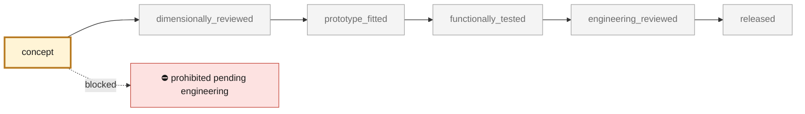

<!-- generated by scripts/render_part_pages.py - do not edit by hand -->

# Engine cooling fan impeller, WE43 magnesium concept F1 redesigned from the Turbo rotor rebuild

**Status: **prohibited pending engineering**. No part is released; see [SAFETY.md](../../SAFETY.md).**

Improved variant of the 993 Turbo cooling fan rotor, drawn from the repository's visual rebuild of the original. It keeps the rebuild's 245 mm envelope, its 165 mm cup 56 mm deep that wraps the alternator end, the cup's twelve windows, three bolt holes and bore, eleven blades and no shroud. It replaces the rebuild's constant-pitch cambered plates with twisted airfoil blades designed from velocity triangles, and moves to LPBF WE43 magnesium. A one-dimensional blade-element model with radial equilibrium, on a duty inferred from the rebuild, estimates about 2 % more air than the rebuild rotor on the same shaft power, and about 9 % with a matched stator. These are model estimates on visual hypotheses, not measurements and not a comparison with the Porsche part.

*Validation ladder of `catalog/schemas/part.schema.json`; this record is at `concept`.*

Catalogue record: [`catalog/parts/993-eng-cooling-impeller-we43-f1-0001.json`](../../catalog/parts/993-eng-cooling-impeller-we43-f1-0001.json)

## Identity

| field | value |
|---|---|
| identifier | 993-ENG-COOLING-IMPELLER-WE43-F1-0001 |
| generation | 993 |
| variants | 993_Turbo, M64_60_research |
| model years | 1994 to 1998 |
| Porsche part numbers | 96410601522 |
| category | engine_cooling_fan_impeller |
| safety class | prohibited_pending_engineering |
| intended use | F1 design study: airfoil blades inside the original rotor's envelope, one-dimensional fan-curve comparison with the rebuild rotor on a duty inferred from it, lighter-alloy comparison; no manufacture, rotation, installation or start-up authorized |

## Material and manufacturing

| field | value |
|---|---|
| preferred process | LPBF |
| candidate processes | LPBF, CNC, casting |
| material family | candidate LPBF magnesium-yttrium-rare-earth alloy |
| grade | WE43 LPBF, solutionized and aged, for comparison; Scalmalloy and AlSi10Mg screened as alternatives |
| standard | ASTM B80/B107 WE43 composition reference only; program-specific LPBF, rotating, HCF, balance and overspeed specification to be contracted |
| supplier requirements | inert, magnesium-rated LPBF machine with powder handling and fire procedure, traceable machine, parameters, orientation, supports, powder, recycling and batch, oriented coupons with tensile, HCF and hot corrosion tests, full CT and metallography with zoned defect criteria, metrology of cup, web, bore, bolt holes, runout, blades and mass, proof of balance, overspeed, vibration, flow, containment and endurance |
| post-processing | orientation with the web on the plate; supports under the open blades, reachable from outside, solutionizing and ageing, distortion monitored, HIP to be decided by the HCF/defect card, steel inserts or creep-rated washers at the three bolt holes, machined web faces and bore, conversion or PEO coating and galvanic isolation from steel and aluminium neighbours, two-plane dynamic balancing in the final condition |

## Geometry

| field | value |
|---|---|
| source type | estimated |
| master format | build123d |
| units | mm |
| accuracy (mm) | not recorded |

**Master file**

- [`parts/993-eng-cooling-impeller-we43-f1-0001/source/cooling_impeller_f1.py`](../../parts/993-eng-cooling-impeller-we43-f1-0001/source/cooling_impeller_f1.py)

**Derived files**

- [`parts/993-eng-cooling-impeller-we43-f1-0001/derived/cooling_impeller_we43_f1.step`](../../parts/993-eng-cooling-impeller-we43-f1-0001/derived/cooling_impeller_we43_f1.step)
- [`parts/993-eng-cooling-impeller-we43-f1-0001/derived/cooling_impeller_we43_f1.stl`](../../parts/993-eng-cooling-impeller-we43-f1-0001/derived/cooling_impeller_we43_f1.stl)

## Images

*`parts/993-eng-cooling-impeller-we43-f1-0001/evidence/fan-curves.png` — a screening output, not a validation.*

*`parts/993-eng-cooling-impeller-we43-f1-0001/evidence/flat-fan-sizing-f2.png` — a screening output, not a validation.*

*`parts/993-eng-cooling-impeller-we43-f1-0001/media/preview.png` — concept CAD block, **not** the original part, not a print file.*

*`parts/993-eng-cooling-impeller-we43-f1-0001/media/views.png` — concept CAD block, **not** the original part, not a print file.*

## Provenance and sources

| field | value |
|---|---|
| record license | All rights reserved (see LICENSE) for the concept, the script and the calculations; no photograph, illustration, Porsche/PorscheFanatics/FVD/Porsche Poitiers/Partworks/APWORKS/EOS surface or commercial geometry redistributed |

**Sources**

- [FVD - Porsche 965/993 Turbo cooling fan rotor 964 106 015 22](https://www.fvd.net/fr/shop/turbine-965-993-turbo-96410601522~p252068)
- [PorscheFanatics - 964/993 engine cooling fan impeller](https://porschefanatics.com/parts/c/cooling/)
- [Additive manufacturing of dense WE43 Mg alloy by laser powder bed fusion (Hyer et al., 2020)](https://impact.ornl.gov/en/publications/additive-manufacturing-of-dense-we43-mg-alloy-by-laser-powder-bed/)
- [AZoM - Magnesium Elektron WE43 alloy properties](https://www.azom.com/article.aspx?ArticleID=9279)
- [APWORKS - Scalmalloy](https://www.apworks.de/scalmalloy)
- [EOS Aluminium AlSi10Mg material data sheet](https://www.eos.info/metal-solutions/metal-materials/data-sheets/mds-eos-aluminium-alsi10mg)
- [Ferdinand magazine - EB Motorsport flat fan kit](https://ferdinandmagazine.com/porsche-flat-fan-kit)
- [Jim Torres Racing - reproduction 935 flat fan](https://jimtorresracing.com/for-sale/reproduction-flat-fan)

## Validation

| field | value |
|---|---|
| status | concept |
| vehicle tested | not recorded |
| reviewed by |  |
| limitations | not recorded |

**Evidence**

- [`catalog/sources/src-porschefanatics-993-engine-cooling-impeller-candidate.json`](../../catalog/sources/src-porschefanatics-993-engine-cooling-impeller-candidate.json)
- [`catalog/sources/src-ornl-we43-lpbf-hyer-2020.json`](../../catalog/sources/src-ornl-we43-lpbf-hyer-2020.json)
- [`catalog/sources/src-azom-elektron-we43-properties.json`](../../catalog/sources/src-azom-elektron-we43-properties.json)
- [`catalog/sources/src-apworks-scalmalloy.json`](../../catalog/sources/src-apworks-scalmalloy.json)
- [`catalog/sources/src-eos-alsi10mg-current-page.json`](../../catalog/sources/src-eos-alsi10mg-current-page.json)
- [`twins/993-engine-cooling-fan-system-f0/source/picogk-reference/reference.json`](../../twins/993-engine-cooling-fan-system-f0/source/picogk-reference/reference.json)
- [`twins/993-engine-cooling-fan-system-f0/results/reference/generation.json`](../../twins/993-engine-cooling-fan-system-f0/results/reference/generation.json)
- [`twins/993-engine-cooling-fan-system-f0/REFERENCE_REBUILD.md`](../../twins/993-engine-cooling-fan-system-f0/REFERENCE_REBUILD.md)
- [`parts/993-eng-fan-housing-alsi10mg-f0-0001/evidence/engineering-screen.json`](../../parts/993-eng-fan-housing-alsi10mg-f0-0001/evidence/engineering-screen.json)
- [`parts/993-eng-cooling-impeller-we43-f1-0001/evidence/engineering-screen.json`](../../parts/993-eng-cooling-impeller-we43-f1-0001/evidence/engineering-screen.json)
- [`parts/993-eng-cooling-impeller-we43-f1-0001/evidence/fan-curves.png`](../../parts/993-eng-cooling-impeller-we43-f1-0001/evidence/fan-curves.png)
- [`parts/993-eng-cooling-impeller-we43-f1-0001/evidence/flat-fan-sizing-f2.json`](../../parts/993-eng-cooling-impeller-we43-f1-0001/evidence/flat-fan-sizing-f2.json)
- [`parts/993-eng-cooling-impeller-we43-f1-0001/evidence/flat-fan-sizing-f2.png`](../../parts/993-eng-cooling-impeller-we43-f1-0001/evidence/flat-fan-sizing-f2.png)
- [`catalog/sources/src-ferdinand-eb-motorsport-flat-fan-kit.json`](../../catalog/sources/src-ferdinand-eb-motorsport-flat-fan-kit.json)
- [`catalog/sources/src-jim-torres-racing-935-reproduction-flat-fan.json`](../../catalog/sources/src-jim-torres-racing-935-reproduction-flat-fan.json)

## Design dossiers

- [993_COOLING_IMPELLER_WE43_F1](../../docs/993/993_COOLING_IMPELLER_WE43_F1.md)
- [993_FAN_STATOR_ALSI10MG_F1](../../docs/993/993_FAN_STATOR_ALSI10MG_F1.md)
- [993_FLAT_FAN_SIZING_F2](../../docs/993/993_FLAT_FAN_SIZING_F2.md)
- [993_K16_ROD_IMPROVEMENT_PROGRAMME](../../docs/993/993_K16_ROD_IMPROVEMENT_PROGRAMME.md)

---

*Page generated from the catalogue record by `scripts/render_part_pages.py`, checked by `make check`. Corrections go in the record, not here.*
