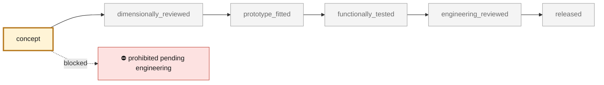

<!-- generated by scripts/render_part_pages.py - do not edit by hand -->

# Engine cooling fan impeller, high-flow shrouded WE43 magnesium concept F1

**Status: **prohibited pending engineering**. No part is released; see [SAFETY.md](../../SAFETY.md).**

High-flow iteration of the F0 impeller. It replaces F0's twelve flat radial paddles with eleven twisted, cambered airfoil blades designed from velocity triangles, ties their tips to a rotating shroud with a two-tooth labyrinth, carries their roots on a 120 mm thin-walled cup hub, shrinks to 248 mm so it clears the F0 housing's 252 mm throat and fits the EOS M 290 plate, and moves to LPBF WE43 magnesium. A one-dimensional blade-element model with radial equilibrium, on the synthetic F0 engine resistance, estimates about 19 % more flow than a conventional reference rotor at the same speed. This is a model estimate on synthetic inputs, not a measurement and not a comparison with the original Porsche part.

*Validation ladder of `catalog/schemas/part.schema.json`; this record is at `concept`.*

Catalogue record: [`catalog/parts/993-eng-cooling-impeller-we43-f1-0001.json`](../../catalog/parts/993-eng-cooling-impeller-we43-f1-0001.json)

## Identity

| field | value |
|---|---|
| identifier | 993-ENG-COOLING-IMPELLER-WE43-F1-0001 |
| generation | 993 |
| variants | 993_Carrera_fitment_to_confirm, 964_shared_component |
| model years | 1994 to 1998 |
| Porsche part numbers | 96410601531 |
| category | engine_cooling_fan_impeller |
| safety class | prohibited_pending_engineering |
| intended use | F1 design study: airfoil blade design, one-dimensional fan-curve simulation against the synthetic engine resistance, lighter-alloy comparison and F0 housing fit; no manufacture, rotation, installation or start-up authorized |

## Material and manufacturing

| field | value |
|---|---|
| preferred process | LPBF |
| candidate processes | LPBF, CNC, casting |
| material family | candidate LPBF magnesium-yttrium-rare-earth alloy |
| grade | WE43 LPBF, solutionized and aged, for comparison; Scalmalloy and AlSi10Mg screened as alternatives |
| standard | ASTM B80/B107 WE43 composition reference only; program-specific LPBF, rotating, HCF, balance and overspeed specification to be contracted |
| supplier requirements | inert, magnesium-rated LPBF machine with powder handling and fire procedure, traceable machine, parameters, orientation, supports, powder, recycling and batch, oriented coupons with tensile, HCF and hot corrosion tests, full CT and metallography with zoned defect criteria, metrology of hub, bore, runout, blades, shroud, teeth and mass, proof of balance, overspeed, vibration, flow, containment and endurance |
| post-processing | orientation and support strategy that keeps supports out of the enclosed shrouded passages, or a split shroud, solutionizing and ageing, distortion monitored, HIP to be decided by the HCF/defect card, steel or titanium bore insert, machined hub faces and bore, machining of the labyrinth teeth to the housing land, conversion or PEO coating and galvanic isolation from steel and aluminium neighbours, two-plane dynamic balancing in the final condition |

## Geometry

| field | value |
|---|---|
| source type | estimated |
| master format | build123d |
| units | mm |
| accuracy (mm) | not recorded |

**Master file**

- [`parts/993-eng-cooling-impeller-we43-f1-0001/source/cooling_impeller_f1.py`](../../parts/993-eng-cooling-impeller-we43-f1-0001/source/cooling_impeller_f1.py)

**Derived files**

- [`parts/993-eng-cooling-impeller-we43-f1-0001/derived/cooling_impeller_we43_f1.step`](../../parts/993-eng-cooling-impeller-we43-f1-0001/derived/cooling_impeller_we43_f1.step)
- [`parts/993-eng-cooling-impeller-we43-f1-0001/derived/cooling_impeller_we43_f1.stl`](../../parts/993-eng-cooling-impeller-we43-f1-0001/derived/cooling_impeller_we43_f1.stl)

## Images

*`parts/993-eng-cooling-impeller-we43-f1-0001/evidence/fan-curves.png` — a screening output, not a validation.*

*`parts/993-eng-cooling-impeller-we43-f1-0001/evidence/flat-fan-sizing-f2.png` — a screening output, not a validation.*

*`parts/993-eng-cooling-impeller-we43-f1-0001/media/preview.png` — concept CAD block, **not** the original part, not a print file.*

*`parts/993-eng-cooling-impeller-we43-f1-0001/media/views.png` — concept CAD block, **not** the original part, not a print file.*

## Provenance and sources

| field | value |
|---|---|
| record license | All rights reserved (see LICENSE) for the concept, the script and the calculations; no photograph, illustration, Porsche/PorscheFanatics/FVD/Porsche Poitiers/Partworks/APWORKS/EOS surface or commercial geometry redistributed |

**Sources**

- [PorscheFanatics - 964/993 engine cooling fan impeller](https://porschefanatics.com/parts/c/cooling/)
- [Additive manufacturing of dense WE43 Mg alloy by laser powder bed fusion (Hyer et al., 2020)](https://impact.ornl.gov/en/publications/additive-manufacturing-of-dense-we43-mg-alloy-by-laser-powder-bed/)
- [AZoM - Magnesium Elektron WE43 alloy properties](https://www.azom.com/article.aspx?ArticleID=9279)
- [APWORKS - Scalmalloy](https://www.apworks.de/scalmalloy)
- [EOS Aluminium AlSi10Mg material data sheet](https://www.eos.info/metal-solutions/metal-materials/data-sheets/mds-eos-aluminium-alsi10mg)
- [Ferdinand magazine - EB Motorsport flat fan kit](https://ferdinandmagazine.com/porsche-flat-fan-kit)
- [Jim Torres Racing - reproduction 935 flat fan](https://jimtorresracing.com/for-sale/reproduction-flat-fan)

## Validation

| field | value |
|---|---|
| status | concept |
| vehicle tested | not recorded |
| reviewed by |  |
| limitations | not recorded |

**Evidence**

- [`catalog/sources/src-porschefanatics-993-engine-cooling-impeller-candidate.json`](../../catalog/sources/src-porschefanatics-993-engine-cooling-impeller-candidate.json)
- [`catalog/sources/src-ornl-we43-lpbf-hyer-2020.json`](../../catalog/sources/src-ornl-we43-lpbf-hyer-2020.json)
- [`catalog/sources/src-azom-elektron-we43-properties.json`](../../catalog/sources/src-azom-elektron-we43-properties.json)
- [`catalog/sources/src-apworks-scalmalloy.json`](../../catalog/sources/src-apworks-scalmalloy.json)
- [`catalog/sources/src-eos-alsi10mg-current-page.json`](../../catalog/sources/src-eos-alsi10mg-current-page.json)
- [`parts/993-eng-cooling-impeller-alsi10mg-f0-0001/evidence/engineering-screen.json`](../../parts/993-eng-cooling-impeller-alsi10mg-f0-0001/evidence/engineering-screen.json)
- [`parts/993-eng-fan-housing-alsi10mg-f0-0001/evidence/engineering-screen.json`](../../parts/993-eng-fan-housing-alsi10mg-f0-0001/evidence/engineering-screen.json)
- [`parts/993-eng-cooling-impeller-we43-f1-0001/evidence/engineering-screen.json`](../../parts/993-eng-cooling-impeller-we43-f1-0001/evidence/engineering-screen.json)
- [`parts/993-eng-cooling-impeller-we43-f1-0001/evidence/fan-curves.png`](../../parts/993-eng-cooling-impeller-we43-f1-0001/evidence/fan-curves.png)
- [`parts/993-eng-cooling-impeller-we43-f1-0001/evidence/flat-fan-sizing-f2.json`](../../parts/993-eng-cooling-impeller-we43-f1-0001/evidence/flat-fan-sizing-f2.json)
- [`parts/993-eng-cooling-impeller-we43-f1-0001/evidence/flat-fan-sizing-f2.png`](../../parts/993-eng-cooling-impeller-we43-f1-0001/evidence/flat-fan-sizing-f2.png)
- [`catalog/sources/src-ferdinand-eb-motorsport-flat-fan-kit.json`](../../catalog/sources/src-ferdinand-eb-motorsport-flat-fan-kit.json)
- [`catalog/sources/src-jim-torres-racing-935-reproduction-flat-fan.json`](../../catalog/sources/src-jim-torres-racing-935-reproduction-flat-fan.json)

## Design dossiers

- [993_COOLING_IMPELLER_WE43_F1](../../docs/993/993_COOLING_IMPELLER_WE43_F1.md)
- [993_FAN_STATOR_ALSI10MG_F1](../../docs/993/993_FAN_STATOR_ALSI10MG_F1.md)
- [993_FLAT_FAN_SIZING_F2](../../docs/993/993_FLAT_FAN_SIZING_F2.md)
- [993_K16_ROD_IMPROVEMENT_PROGRAMME](../../docs/993/993_K16_ROD_IMPROVEMENT_PROGRAMME.md)

---

*Page generated from the catalogue record by `scripts/render_part_pages.py`, checked by `make check`. Corrections go in the record, not here.*
