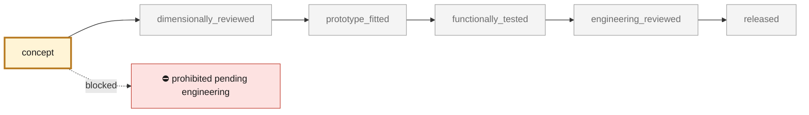

<!-- generated by scripts/render_part_pages.py - do not edit by hand -->

# M64 four-valve cylinder head — creation preparation

**Status: **prohibited pending engineering**. No part is released; see [SAFETY.md](../../SAFETY.md).**

First part in the catalogue-led engine creation sequence. Continues the existing finned four-valve M64 cylinder-head research and its private scan-derived geometry. This record establishes scope, interfaces and verification work; it supplies no released replacement CAD or print file.

*Validation ladder of `catalog/schemas/part.schema.json`; this record is at `concept`.*

Catalogue record: [`catalog/parts/993-eng-cylinder-head-4v-f0-0001.json`](../../catalog/parts/993-eng-cylinder-head-4v-f0-0001.json)

## Identity

| field | value |
|---|---|
| identifier | 993-ENG-CYLINDER-HEAD-4V-F0-0001 |
| generation | 993 |
| variants | 993_Turbo_M64_60_research_target_fitment_unverified |
| model years | 1995 to 1998 |
| Porsche part numbers | not recorded |
| category | engine_cylinder_head |
| safety class | prohibited_pending_engineering |
| intended use | Documentary preparation, controlled CAD research and numerical verification only; no manufacturing or engine installation. |

## Material and manufacturing

| field | value |
|---|---|
| preferred process | undecided |
| candidate processes | CNC, casting, LPBF |
| material family | aluminium candidate for head body |
| grade | not selected; hot-property and process qualification required |
| standard | not selected |
| supplier requirements | Confirm access to the exact target donor and metrology scope., Qualify the exact alloy, machine, process, orientation and heat treatment., Provide traceable inspection, hot fatigue data and professional engineering review before any release. |
| post-processing | Define datum machining, seat and guide bores, sealing faces and internal cleaning after geometry and alloy review. |

## Geometry

| field | value |
|---|---|
| source type | mixed |
| master format | none |
| units | mm |
| accuracy (mm) | not recorded |

**Master file**

- none

**Derived files**

- none

## Provenance and sources

| field | value |
|---|---|
| record license | Repository licence for original records and code; third-party catalogue material is reference-only and private geometry is not redistributed. |

**Sources**

- [PorscheFanatics — 993 engine specification](https://porschefanatics.com/engine/993/)
- [PorscheFanatics — Swindon M64 24-valve head kit](https://porschefanatics.com/parts/swindon-24v-head-kit-m64/)
- [Swindon Powertrain — M64 24-valve cylinder head kit](https://swindonpowertrain.com/products/24-valve-porsche-911-m64-cylinder-head-kit/)

## Validation

| field | value |
|---|---|
| status | concept |
| vehicle tested | not recorded |
| reviewed by |  |
| limitations | not recorded |

**Evidence**

- [`twins/m64-cylinder-head/CREATION.md`](../../twins/m64-cylinder-head/CREATION.md)
- [`twins/m64-cylinder-head/interface-contract.json`](../../twins/m64-cylinder-head/interface-contract.json)
- [`twins/m64-cylinder-head/README.md`](../../twins/m64-cylinder-head/README.md)
- [`catalog/sources/src-swindon-m64-24v-head-kit.json`](../../catalog/sources/src-swindon-m64-24v-head-kit.json)
- [`catalog/scans/scan-935-xtreme-cylinder-head.json`](../../catalog/scans/scan-935-xtreme-cylinder-head.json)

---

*Page generated from the catalogue record by `scripts/render_part_pages.py`, checked by `make check`. Corrections go in the record, not here.*
