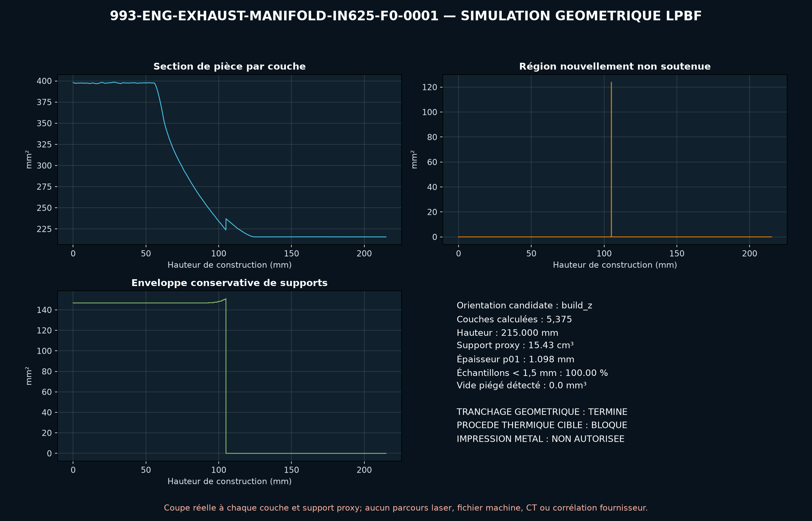

<!-- engendre par scripts/render_part_pages.py - ne pas editer a la main -->

# Collecteur d'échappement trois-en-un 993 Turbo, concept IN625 F0

**Statut : **interdit en l'état**. Aucune pièce n'est libérée ; voir [SAFETY.md](../../SAFETY.md).**

Concept indépendant de noyau d'écoulement trois-en-un en IN625 pour cribler une fabrication LPBF sans soudures internes au collecteur. Kline et PorscheFanatics publient une offre IN625 de 2,9 kg par côté avec échangeur ; le PET identifie les pièces gauche et droite. Aucune géométrie publique n'est utilisée.

Fiche du catalogue : [`catalog/parts/993-eng-exhaust-manifold-in625-f0-0001.json`](../../catalog/parts/993-eng-exhaust-manifold-in625-f0-0001.json)

## Identité

| champ | valeur |
|---|---|
| identifiant | 993-ENG-EXHAUST-MANIFOLD-IN625-F0-0001 |
| génération | 993 |
| variantes | 993_Turbo, M64_60_research |
| années | 1995 à 1998 |
| références Porsche | non renseigné |
| catégorie | exhaust_manifold_flow_core |
| classe de sécurité | prohibited_pending_engineering |
| usage prévu | Criblage CAO, DfAM, débit, pression, acoustique et thermique ; aucune fabrication, installation, mise en route ou fonction chauffage autorisée |

## Matière et fabrication

| champ | valeur |
|---|---|
| procédé préféré | à décider |
| procédés candidats | LPBF, DMLS, sheet_metal |
| famille de matière | superalliage nickel LPBF candidat |
| nuance | EOS NickelAlloy IN625 / UNS N06625 de criblage |
| norme | ASTM F3055, AMS 7000 ou AMS 7001 et spécification échappement propre au programme à contractualiser |
| exigences fournisseur | poudre, machine, paramètres, orientation, lot et recyclage traçables, capabilité démontrée sur paroi chaude de 1,2 mm et collecteur interne sans support, simulation de supports, recoater et distorsion avant lancement, coupons dans les orientations critiques avec propriétés à chaud, fatigue, fluage et oxydation, CT de la jonction trois-en-un et métrologie des parois, ports, brides et futures fixations, comparaison au collecteur cintré/soudé sur coût, masse, perte, durée de vie, réparabilité et inspection |
| post-traitement | évacuation complète de la poudre par trois entrées et une sortie ouvertes, détensionnement, traitement thermique et éventuel HIP qualifiés sur témoins représentatifs, découpe du plateau et retrait des supports sans support interne, usinage des brides et interfaces après ajout de surépaisseurs mesurées, finition interne avec rugosité et épaisseur résiduelle contrôlées, nettoyage particulaire, ressuage, CT et épreuve d'étanchéité avant essai thermique |

## Géométrie

| champ | valeur |
|---|---|
| type de source | mixed |
| format du maître | build123d |
| unités | mm |
| précision (mm) | non renseigné |

**Fichier maître**

- [`parts/993-eng-exhaust-manifold-in625-f0-0001/source/exhaust_manifold.py`](../../parts/993-eng-exhaust-manifold-in625-f0-0001/source/exhaust_manifold.py)

**Fichiers dérivés**

- [`parts/993-eng-exhaust-manifold-in625-f0-0001/derived/exhaust_manifold_in625_f0.step`](../../parts/993-eng-exhaust-manifold-in625-f0-0001/derived/exhaust_manifold_in625_f0.step)

## Images

*parts/993-eng-exhaust-manifold-in625-f0-0001/evidence/lpbf-f0/993-eng-exhaust-manifold-in625-f0-0001-lpbf-geometry-screen.png*

## Provenance et sources

| champ | valeur |
|---|---|
| licence de la fiche | MIT pour le concept, le script et les calculs ; aucune photographie, illustration PET ou géométrie Kline/Porsche redistribuée |

**Sources**

- [Kline Innovation - Porsche 993 Turbo exhaust](https://www.kline-innovation.com/exhaust-collection/porsche/993-2/porsche-993-turbo/)
- [PorscheFanatics - collecteurs IN625 avec échangeur pour 993 Turbo](https://porschefanatics.com/parts/c/exhaust/)
- [Porsche PET 993 - échappement et échangeurs Turbo 202-10](https://assets-v2.porsche.com/us/-/media/Project/PCOM/SharedSite/PorscheClassic/Original-Parts-Catalogue/PDF-EN-US/KAT517_USA_911_98_KATALOG)
- [EOS NickelAlloy IN625 material data sheet](https://www.eos.info/05-datasheet-images/Assets_MDS_Metal/EOS_NickelAlloy_IN625/Material_DataSheet_EOS_NickelAlloy_IN625_en.pdf)
- [Special Metals - INCONEL alloy 625](https://www.specialmetals.com/documents/technical-bulletins/inconel/inconel-alloy-625.pdf)

## Validation

| champ | valeur |
|---|---|
| statut | concept |
| essais véhicule | non renseigné |
| revu par |  |
| limites | non renseigné |

**Preuves**

- [`catalog/sources/src-kline-993-turbo-in625-manifolds.json`](../../catalog/sources/src-kline-993-turbo-in625-manifolds.json)
- [`catalog/sources/src-porschefanatics-993-turbo-in625-manifolds.json`](../../catalog/sources/src-porschefanatics-993-turbo-in625-manifolds.json)
- [`catalog/sources/src-porsche-pet-993-turbo-heat-exchanger-202-10.json`](../../catalog/sources/src-porsche-pet-993-turbo-heat-exchanger-202-10.json)
- [`catalog/sources/src-eos-in625-material-data.json`](../../catalog/sources/src-eos-in625-material-data.json)
- [`catalog/sources/src-special-metals-inconel-625.json`](../../catalog/sources/src-special-metals-inconel-625.json)
- [`parts/993-eng-exhaust-manifold-in625-f0-0001/evidence/engineering-screen.json`](../../parts/993-eng-exhaust-manifold-in625-f0-0001/evidence/engineering-screen.json)

## Dossiers de conception

- [993_EXHAUST_MANIFOLD_IN625_F0](../../docs/993/993_EXHAUST_MANIFOLD_IN625_F0.md)

---

*Page engendrée depuis la fiche du catalogue par `scripts/render_part_pages.py`, vérifiée par `make check`. Toute correction se fait dans la fiche, pas ici.*
