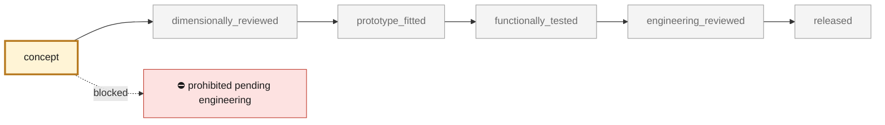
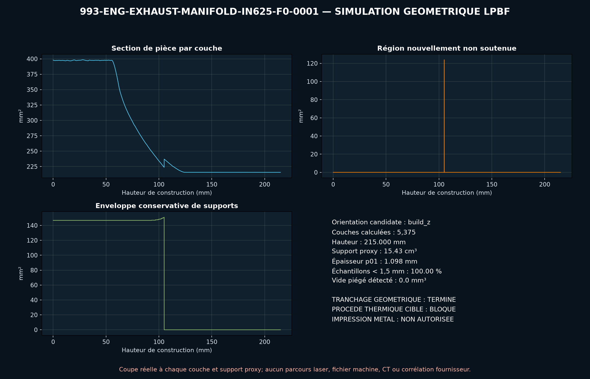

<!-- generated by scripts/render_part_pages.py - do not edit by hand -->

# 993 Turbo three-into-one exhaust manifold, IN625 F0 concept

**Status: **prohibited pending engineering**. No part is released; see [SAFETY.md](../../SAFETY.md).**

Independent concept of an IN625 three-into-one flow core to screen LPBF manufacturing without internal welds in the manifold. Kline and PorscheFanatics publish an IN625 offer at 2.9 kg per side with heat exchanger; the PET identifies the left and right parts. No public geometry is used.

```mermaid
flowchart LR
    L0["concept"]
    L1["dimensionally_reviewed"]
    L2["prototype_fitted"]
    L3["functionally_tested"]
    L4["engineering_reviewed"]
    L5["released"]
    L0 --> L1 --> L2 --> L3 --> L4 --> L5
    X["⛔ prohibited pending engineering"]
    L0 -. blocked .-> X
    classDef here fill:#fff4d6,stroke:#b7791f,color:#1a1a1a,stroke-width:3px;
    classDef done fill:#e3f1e6,stroke:#2e7d32,color:#1a1a1a;
    classDef todo fill:#f4f4f4,stroke:#9e9e9e,color:#6b6b6b;
    classDef stop fill:#fde2e1,stroke:#c0392b,color:#1a1a1a;
    class L0 here
    class L1 todo
    class L2 todo
    class L3 todo
    class L4 todo
    class L5 todo
    class X stop
```

*Validation ladder of `catalog/schemas/part.schema.json`; this record is at `concept`.*

Catalogue record: [`catalog/parts/993-eng-exhaust-manifold-in625-f0-0001.json`](../../catalog/parts/993-eng-exhaust-manifold-in625-f0-0001.json)

## Identity

| field | value |
|---|---|
| identifier | 993-ENG-EXHAUST-MANIFOLD-IN625-F0-0001 |
| generation | 993 |
| variants | 993_Turbo, M64_60_research |
| model years | 1995 to 1998 |
| Porsche part numbers | not recorded |
| category | exhaust_manifold_flow_core |
| safety class | prohibited_pending_engineering |
| intended use | CAD, DfAM, flow, pressure, acoustic and thermal screening; no manufacturing, installation, engine start or heating function authorized |

## Material and manufacturing

| field | value |
|---|---|
| preferred process | undecided |
| candidate processes | LPBF, DMLS, sheet_metal |
| material family | candidate LPBF nickel superalloy |
| grade | EOS NickelAlloy IN625 / UNS N06625 for screening |
| standard | ASTM F3055, AMS 7000 or AMS 7001 and a program-specific exhaust specification to be contracted |
| supplier requirements | traceable powder, machine, parameters, orientation, lot and recycling, demonstrated capability on a 1.2 mm hot wall and an unsupported internal manifold, support, recoater and distortion simulation before build, coupons in critical orientations with hot, fatigue, creep and oxidation properties, CT of the three-into-one junction and metrology of walls, ports, flanges and future fastenings, comparison with the bent/welded manifold on cost, mass, loss, service life, repairability and inspection |
| post-processing | complete powder removal through three open inlets and one open outlet, stress relief, heat treatment and possible HIP qualified on representative witness coupons, build plate cut-off and support removal with no internal support, machining of flanges and interfaces after adding measured machining allowances, internal finishing with controlled roughness and residual wall thickness, particulate cleaning, dye penetrant, CT and leak proof test before thermal testing |

## Geometry

| field | value |
|---|---|
| source type | mixed |
| master format | build123d |
| units | mm |
| accuracy (mm) | not recorded |

**Master file**

- [`parts/993-eng-exhaust-manifold-in625-f0-0001/source/exhaust_manifold.py`](../../parts/993-eng-exhaust-manifold-in625-f0-0001/source/exhaust_manifold.py)

**Derived files**

- [`parts/993-eng-exhaust-manifold-in625-f0-0001/derived/exhaust_manifold_in625_f0.step`](../../parts/993-eng-exhaust-manifold-in625-f0-0001/derived/exhaust_manifold_in625_f0.step)

## Images

*parts/993-eng-exhaust-manifold-in625-f0-0001/evidence/lpbf-f0/993-eng-exhaust-manifold-in625-f0-0001-lpbf-geometry-screen.png*

## Provenance and sources

| field | value |
|---|---|
| record license | MIT for the concept, the script and the calculations; no photograph, PET illustration or Kline/Porsche geometry redistributed |

**Sources**

- [Kline Innovation - Porsche 993 Turbo exhaust](https://www.kline-innovation.com/exhaust-collection/porsche/993-2/porsche-993-turbo/)
- [PorscheFanatics - IN625 manifolds with heat exchanger for 993 Turbo](https://porschefanatics.com/parts/c/exhaust/)
- [Porsche PET 993 - Turbo exhaust and heat exchangers 202-10](https://assets-v2.porsche.com/us/-/media/Project/PCOM/SharedSite/PorscheClassic/Original-Parts-Catalogue/PDF-EN-US/KAT517_USA_911_98_KATALOG)
- [EOS NickelAlloy IN625 material data sheet](https://www.eos.info/05-datasheet-images/Assets_MDS_Metal/EOS_NickelAlloy_IN625/Material_DataSheet_EOS_NickelAlloy_IN625_en.pdf)
- [Special Metals - INCONEL alloy 625](https://www.specialmetals.com/documents/technical-bulletins/inconel/inconel-alloy-625.pdf)

## Validation

| field | value |
|---|---|
| status | concept |
| vehicle tested | not recorded |
| reviewed by |  |
| limitations | not recorded |

**Evidence**

- [`catalog/sources/src-kline-993-turbo-in625-manifolds.json`](../../catalog/sources/src-kline-993-turbo-in625-manifolds.json)
- [`catalog/sources/src-porschefanatics-993-turbo-in625-manifolds.json`](../../catalog/sources/src-porschefanatics-993-turbo-in625-manifolds.json)
- [`catalog/sources/src-porsche-pet-993-turbo-heat-exchanger-202-10.json`](../../catalog/sources/src-porsche-pet-993-turbo-heat-exchanger-202-10.json)
- [`catalog/sources/src-eos-in625-material-data.json`](../../catalog/sources/src-eos-in625-material-data.json)
- [`catalog/sources/src-special-metals-inconel-625.json`](../../catalog/sources/src-special-metals-inconel-625.json)
- [`parts/993-eng-exhaust-manifold-in625-f0-0001/evidence/engineering-screen.json`](../../parts/993-eng-exhaust-manifold-in625-f0-0001/evidence/engineering-screen.json)

## Design dossiers

- [993_EXHAUST_MANIFOLD_IN625_F0](../../docs/993/993_EXHAUST_MANIFOLD_IN625_F0.md)

---

*Page generated from the catalogue record by `scripts/render_part_pages.py`, checked by `make check`. Corrections go in the record, not here.*
