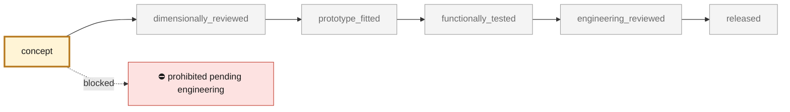
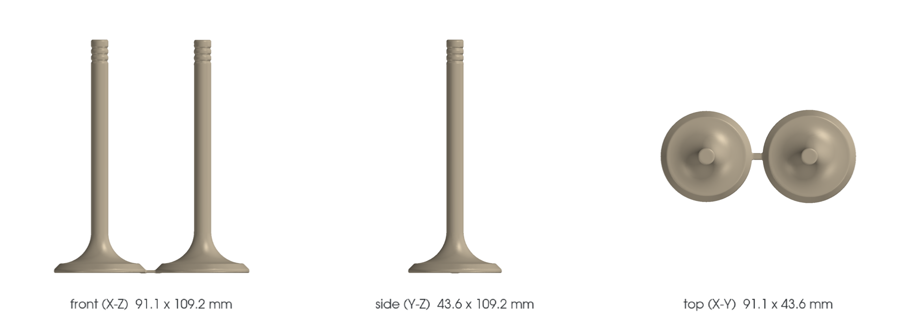

<!-- generated by scripts/render_part_pages.py - do not edit by hand -->

# 993 exhaust valves - F1 proxies

**Status: **prohibited pending engineering**. No part is released; see [SAFETY.md](../../SAFETY.md).**

Non-functional parametric proxies of the Carrera and Turbo exhaust valves to compare packaging and mass between generic steel, Inconel 751 and Ti-6Al-4V, without concluding on engine suitability.

*Validation ladder of `catalog/schemas/part.schema.json`; this record is at `concept`.*

Catalogue record: [`catalog/parts/993-eng-exhaust-valve-f1-0001.json`](../../catalog/parts/993-eng-exhaust-valve-f1-0001.json)

## Identity

| field | value |
|---|---|
| identifier | 993-ENG-EXHAUST-VALVE-F1-0001 |
| generation | 993 |
| variants | 993_Carrera, 993_Turbo |
| model years | 1994 to 1998 |
| Porsche part numbers | 99310541901, 99310541984, 99310541952, 99310541953 |
| category | engine_valvetrain |
| safety class | prohibited_pending_engineering |
| intended use | Preliminary thermal and dynamic simulation, comparative mass and packaging check only |

## Material and manufacturing

| field | value |
|---|---|
| preferred process | CNC |
| candidate processes | CNC, LPBF, DMLS |
| material family | nickel alloy reference |
| grade | INCONEL 751 / UNS N07751 candidate |
| standard | manufacturer bulletin; application-specific qualification required |
| supplier requirements | material heat and lot certificates, process route, dimensional and NDT reports, hot fatigue and oxidation validation, professional engineering release |
| post-processing | precipitation treatment per qualified route, finish machining, stem, seat, groove and tip finishing, coating or hard-facing decision after tribology review |

**Titanium**

| field | value |
|---|---|
| alloy | Ti-6Al-4V retained only as a deliberately challenged comparison for exhaust service |
| heat treatment | not selected |
| HIP | to_be_determined |
| machined surfaces | stem, seat face, tip, keeper groove |
| inspection | CT, metallography, surface roughness, dimensional inspection, hot fatigue, oxidation and wear testing |
| galvanic isolation | seat, guide, retainer and coating compatibility must be reviewed |
| fatigue assumptions | not recorded |

## Geometry

| field | value |
|---|---|
| source type | estimated |
| master format | build123d |
| units | mm |
| accuracy (mm) | not recorded |

**Master file**

- [`twins/reference-935-cylinder-head/source/build_valve_variants.py`](../../twins/reference-935-cylinder-head/source/build_valve_variants.py)

**Derived files**

- [`parts/993-eng-exhaust-valve-f1-0001/derived/993-carrera-exhaust-42_5-f1.step`](../../parts/993-eng-exhaust-valve-f1-0001/derived/993-carrera-exhaust-42_5-f1.step)
- [`parts/993-eng-exhaust-valve-f1-0001/derived/993-turbo-exhaust-43_5-f1.step`](../../parts/993-eng-exhaust-valve-f1-0001/derived/993-turbo-exhaust-43_5-f1.step)

## Images

*`parts/993-eng-exhaust-valve-f1-0001/media/preview.png` — concept CAD block, **not** the original part, not a print file.*

*`parts/993-eng-exhaust-valve-f1-0001/media/views.png` — concept CAD block, **not** the original part, not a print file.*

## Provenance and sources

| field | value |
|---|---|
| record license | All rights reserved (see LICENSE) for code and record; no third-party geometry redistributed |

**Sources**

- [partworks - Stated dimensions of 993 exhaust valves](https://partworks.de/Porsche/993-Ersatzteile_s2)
- [Special Metals - INCONEL alloy 751](https://www.specialmetals.com/documents/technical-bulletins/inconel/inconel-alloy-751.pdf)

## Validation

| field | value |
|---|---|
| status | concept |
| vehicle tested | not recorded |
| reviewed by |  |
| limitations | not recorded |

**Evidence**

- `SRC-PARTWORKS-993-EXHAUST-VALVE-DIMENSIONS` — *missing from the repository*
- `SRC-SPECIAL-METALS-INCONEL-751` — *missing from the repository*

---

*Page generated from the catalogue record by `scripts/render_part_pages.py`, checked by `make check`. Corrections go in the record, not here.*
