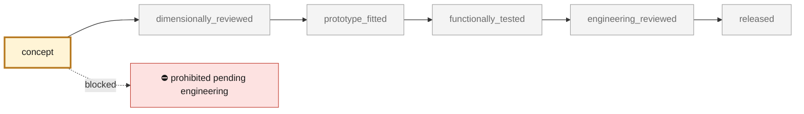
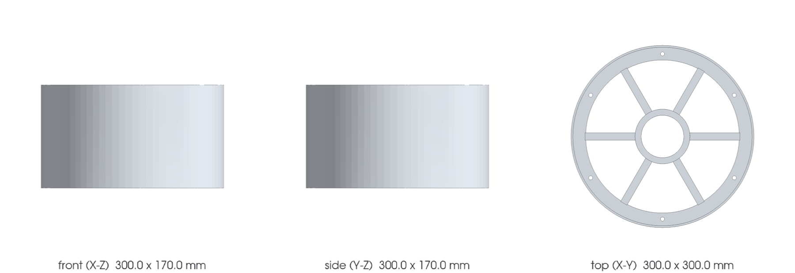

<!-- generated by scripts/render_part_pages.py - do not edit by hand -->

# Stationary engine fan housing, AlSi10Mg F0 concept

**Status: **prohibited pending engineering**. No part is released; see [SAFETY.md](../../SAFETY.md).**

Independent concept of a 993 annular housing combining shell, front flange, alternator support and six spokes. The sources establish the part number, a commercial envelope, two consistent masses and a reseller claim of aluminum, but no interface geometry; the F0 does not reproduce the Porsche part.

*Validation ladder of `catalog/schemas/part.schema.json`; this record is at `concept`.*

Catalogue record: [`catalog/parts/993-eng-fan-housing-alsi10mg-f0-0001.json`](../../catalog/parts/993-eng-fan-housing-alsi10mg-f0-0001.json)

## Identity

| field | value |
|---|---|
| identifier | 993-ENG-FAN-HOUSING-ALSI10MG-F0-0001 |
| generation | 993 |
| variants | 993_air_cooled_fitment_to_confirm |
| model years | 1994 to 1998 |
| Porsche part numbers | 99310666703, 99310666701 |
| category | engine_cooling_fan_housing |
| safety class | prohibited_pending_engineering |
| intended use | F0 screening of open CAD, DfAM value, flow, pressure loss, bending, modal, thermal and mass; no manufacturing, installation, fan rotation or engine start-up authorized |

## Material and manufacturing

| field | value |
|---|---|
| preferred process | undecided |
| candidate processes | LPBF, DMLS, casting, CNC |
| material family | candidate LPBF aluminum-silicon-magnesium alloy |
| grade | EOS Aluminium AlSi10Mg T6 for comparison; commercial replacement declared only as unspecified aluminum |
| standard | DIN EN 1706 EN AC-43000 and ASTM F3318 for the candidate; program-specific cooling, fatigue and containment specification to be contracted |
| supplier requirements | traceable large-platform machine, parameters, orientation, supports, powder and lot, oriented coupons with tensile, fatigue, creep and hot corrosion, witness samples for annular distortion and duct surface finish, full CT, FPI and metallography with zoned defect criteria, metrology of bore, concentricity, alternator, mountings, seal and envelope, evidence of flow, vibration, overspeed/containment, thermal cycling and engine endurance |
| post-processing | orientation and supports of the 300 x 300 x 170 mm ring to be qualified, stress relief then T6 with monitored quench and distortion, HIP to be decided on fatigue, air tightness and tomography results, machining of the fan bore, alternator seat, mounting, seal and datums, deburring, open depowdering and particle-free duct finishing, anti-corrosion treatment compatible with temperatures, fasteners and engine compartment, final clearance check before any rotation |

## Geometry

| field | value |
|---|---|
| source type | mixed |
| master format | build123d |
| units | mm |
| accuracy (mm) | not recorded |

**Master file**

- [`parts/993-eng-fan-housing-alsi10mg-f0-0001/source/fan_housing.py`](../../parts/993-eng-fan-housing-alsi10mg-f0-0001/source/fan_housing.py)

**Derived files**

- [`parts/993-eng-fan-housing-alsi10mg-f0-0001/derived/fan_housing_alsi10mg_f0.step`](../../parts/993-eng-fan-housing-alsi10mg-f0-0001/derived/fan_housing_alsi10mg_f0.step)

## Images

*parts/993-eng-fan-housing-alsi10mg-f0-0001/media/preview.png*

*parts/993-eng-fan-housing-alsi10mg-f0-0001/media/views.png*

## Provenance and sources

| field | value |
|---|---|
| record license | MIT for the concept, the script and the calculations; no photograph, illustration, Porsche/PorscheFanatics/FVD/Centre Porsche Roissy/CarParts/EOS surface or commercial geometry redistributed |

**Sources**

- [PorscheFanatics - 993 engine fan housing and airflow](https://porschefanatics.com/engine/993/)
- [FVD Brombacher - housing 993 106 667 03](https://www.fvd.net/en-us/shop/fan-housing-993-99310666703~p248872)
- [Centre Porsche Roissy - blower housing 993 106 667 03](https://www.boutiqueporscheroissy.fr/produit/99310666703-boitier-de-la-soufflerie-porsche/)
- [CarParts - 993 housing declared aluminum](https://www.carparts.com/details/fan-shroud/genuine-porsche/gxl99310666703)
- [EOS Aluminium AlSi10Mg material data sheet](https://www.eos.info/metal-solutions/metal-materials/data-sheets/mds-eos-aluminium-alsi10mg)

## Validation

| field | value |
|---|---|
| status | concept |
| vehicle tested | not recorded |
| reviewed by |  |
| limitations | not recorded |

**Evidence**

- [`catalog/sources/src-porschefanatics-993-fan-housing-candidate.json`](../../catalog/sources/src-porschefanatics-993-fan-housing-candidate.json)
- [`catalog/sources/src-fvd-993-fan-housing-dimensions.json`](../../catalog/sources/src-fvd-993-fan-housing-dimensions.json)
- [`catalog/sources/src-porsche-roissy-993-fan-housing-mass.json`](../../catalog/sources/src-porsche-roissy-993-fan-housing-mass.json)
- [`catalog/sources/src-carparts-993-fan-housing-aluminium.json`](../../catalog/sources/src-carparts-993-fan-housing-aluminium.json)
- [`catalog/sources/src-eos-alsi10mg-current-page.json`](../../catalog/sources/src-eos-alsi10mg-current-page.json)
- [`parts/993-eng-fan-housing-alsi10mg-f0-0001/evidence/engineering-screen.json`](../../parts/993-eng-fan-housing-alsi10mg-f0-0001/evidence/engineering-screen.json)

## Design dossiers

- [993_ENGINE_COOLING_FAN_SYSTEM_F0](../../docs/993/993_ENGINE_COOLING_FAN_SYSTEM_F0.md)
- [993_FAN_HOUSING_ALSI10MG_F0](../../docs/993/993_FAN_HOUSING_ALSI10MG_F0.md)

---

*Page generated from the catalogue record by `scripts/render_part_pages.py`, checked by `make check`. Corrections go in the record, not here.*
