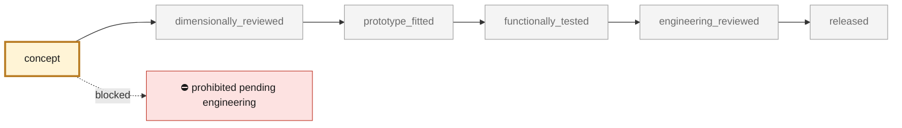

<!-- generated by scripts/render_part_pages.py - do not edit by hand -->

# Engine cooling fan guide-vane ring (stator), AlSi10Mg concept F1

**Status: **prohibited pending engineering**. No part is released; see [SAFETY.md](../../SAFETY.md).**

Fixed ring of seventeen cambered guide vanes placed 15 mm behind the F1 WE43 impeller, in the same 120/239 mm annulus. The vanes turn the rotor's exit swirl back into pressure. Their angles are designed station by station from the F1 rotor's exit flow, and the vane count is the smallest that keeps the blade-pass interaction tone cut off in the duct. A one-dimensional model on the synthetic engine resistance estimates +1.7 % flow over the rotor alone, and +5.5 % with a rounded inlet. These are model estimates on synthetic inputs, not measurements.

*Validation ladder of `catalog/schemas/part.schema.json`; this record is at `concept`.*

Catalogue record: [`catalog/parts/993-eng-fan-stator-alsi10mg-f1-0001.json`](../../catalog/parts/993-eng-fan-stator-alsi10mg-f1-0001.json)

## Identity

| field | value |
|---|---|
| identifier | 993-ENG-FAN-STATOR-ALSI10MG-F1-0001 |
| generation | 993 |
| variants | 993_Carrera_fitment_to_confirm, 964_shared_component |
| model years | 1994 to 1998 |
| Porsche part numbers | not recorded |
| category | engine_cooling_fan_stator |
| safety class | prohibited_pending_engineering |
| intended use | F1 design study: guide-vane design from the F1 rotor exit flow, rotor-stator tone screen, vane modal and aero-load screens, printable envelope; no manufacture, installation or start-up authorized |

## Material and manufacturing

| field | value |
|---|---|
| preferred process | LPBF |
| candidate processes | LPBF, casting, CNC |
| material family | candidate LPBF aluminum-silicon-magnesium alloy |
| grade | EOS Aluminium AlSi10Mg T6 for comparison |
| standard | DIN EN 1706 EN AC-43000 and ASTM F3318 for the candidate; program-specific specification to be contracted |
| supplier requirements | traceable machine, parameters, orientation, powder and batch, metrology of vane angles at hub, mid and tip, ring roundness and faces, tap test or modal survey of the vanes to fix the real end fixity |
| post-processing | print flat on the ring face with the inner web on the plate; vanes at 5 to 10 degrees of stagger stand nearly vertical, stress relief then T6, distortion of the thin outer ring monitored, smooth vane leading edges and ring bores, machine the ring faces and the bore to the housing F1 seat once it exists |

## Geometry

| field | value |
|---|---|
| source type | estimated |
| master format | build123d |
| units | mm |
| accuracy (mm) | not recorded |

**Master file**

- [`parts/993-eng-fan-stator-alsi10mg-f1-0001/source/fan_stator_f1.py`](../../parts/993-eng-fan-stator-alsi10mg-f1-0001/source/fan_stator_f1.py)

**Derived files**

- [`parts/993-eng-fan-stator-alsi10mg-f1-0001/derived/fan_stator_alsi10mg_f1.step`](../../parts/993-eng-fan-stator-alsi10mg-f1-0001/derived/fan_stator_alsi10mg_f1.step)
- [`parts/993-eng-fan-stator-alsi10mg-f1-0001/derived/fan_stator_alsi10mg_f1.stl`](../../parts/993-eng-fan-stator-alsi10mg-f1-0001/derived/fan_stator_alsi10mg_f1.stl)

## Images

*`parts/993-eng-fan-stator-alsi10mg-f1-0001/media/preview.png` — concept CAD block, **not** the original part, not a print file.*

*`parts/993-eng-fan-stator-alsi10mg-f1-0001/media/views.png` — concept CAD block, **not** the original part, not a print file.*

## Provenance and sources

| field | value |
|---|---|
| record license | All rights reserved (see LICENSE) for the concept, the script and the calculations; no Porsche or EOS surface or commercial geometry redistributed |

**Sources**

- [EOS Aluminium AlSi10Mg material data sheet](https://www.eos.info/metal-solutions/metal-materials/data-sheets/mds-eos-aluminium-alsi10mg)

## Validation

| field | value |
|---|---|
| status | concept |
| vehicle tested | not recorded |
| reviewed by |  |
| limitations | not recorded |

**Evidence**

- [`catalog/sources/src-eos-alsi10mg-current-page.json`](../../catalog/sources/src-eos-alsi10mg-current-page.json)
- [`parts/993-eng-fan-housing-alsi10mg-f0-0001/evidence/engineering-screen.json`](../../parts/993-eng-fan-housing-alsi10mg-f0-0001/evidence/engineering-screen.json)
- [`parts/993-eng-cooling-impeller-we43-f1-0001/evidence/engineering-screen.json`](../../parts/993-eng-cooling-impeller-we43-f1-0001/evidence/engineering-screen.json)
- [`parts/993-eng-fan-stator-alsi10mg-f1-0001/evidence/engineering-screen.json`](../../parts/993-eng-fan-stator-alsi10mg-f1-0001/evidence/engineering-screen.json)

## Design dossiers

- [993_FAN_STATOR_ALSI10MG_F1](../../docs/993/993_FAN_STATOR_ALSI10MG_F1.md)
- [993_K16_ROD_IMPROVEMENT_PROGRAMME](../../docs/993/993_K16_ROD_IMPROVEMENT_PROGRAMME.md)

---

*Page generated from the catalogue record by `scripts/render_part_pages.py`, checked by `make check`. Corrections go in the record, not here.*
