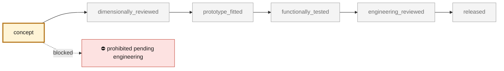
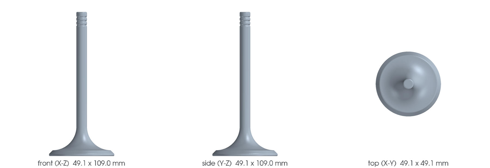

<!-- generated by scripts/render_part_pages.py - do not edit by hand -->

# 993 intake valve - F1 proxy and titanium variant

**Status: **prohibited pending engineering**. No part is released; see [SAFETY.md](../../SAFETY.md).**

Non-functional parametric proxy for comparing the envelope and mass of a 993 intake valve with a 49 mm head and 8 mm stem, with a Ti-6Al-4V variant explicitly limited to simulation.

*Validation ladder of `catalog/schemas/part.schema.json`; this record is at `concept`.*

Catalogue record: [`catalog/parts/993-eng-intake-valve-f1-0001.json`](../../catalog/parts/993-eng-intake-valve-f1-0001.json)

## Identity

| field | value |
|---|---|
| identifier | 993-ENG-INTAKE-VALVE-F1-0001 |
| generation | 993 |
| variants | 993_C2, 993_C4, 993_Turbo |
| model years | 1994 to 1998 |
| Porsche part numbers | 99310540902 |
| category | engine_valvetrain |
| safety class | prohibited_pending_engineering |
| intended use | Mass simulation, collision preparation and envelope check only |

## Material and manufacturing

| field | value |
|---|---|
| preferred process | DMLS |
| candidate processes | CNC, LPBF, DMLS |
| material family | titanium comparison |
| grade | Ti-6Al-4V Grade 5 |
| standard | ASTM F2924 chemistry reference |
| supplier requirements | lot traceability, process qualification, CT and metallography, dimensional report, fatigue and hot-valvetrain validation, professional engineering release |
| post-processing | heat treatment qualified for the exact process, HIP decision by fatigue qualification, finish machining of stem, tip, groove and seat, surface treatment and polishing to be engineered |

**Titanium**

| field | value |
|---|---|
| alloy | Ti-6Al-4V Grade 5 candidate for intake study only |
| heat treatment | to be tied to machine and parameter set; EOS reference recommends stress relief/ductility treatment |
| HIP | to_be_determined |
| machined surfaces | stem, seat face, tip, keeper groove |
| inspection | CT, density, metallography, surface roughness, dimensional inspection, high-cycle fatigue |
| galvanic isolation | compatibility with guide, seat, retainer and coatings must be reviewed |
| fatigue assumptions | not recorded |

## Geometry

| field | value |
|---|---|
| source type | estimated |
| master format | build123d |
| units | mm |
| accuracy (mm) | not recorded |

**Master file**

- [`twins/reference-935-cylinder-head/source/build_valve_variants.py`](../../twins/reference-935-cylinder-head/source/build_valve_variants.py)

**Derived files**

- [`parts/993-eng-intake-valve-f1-0001/derived/993-intake-49-f1.step`](../../parts/993-eng-intake-valve-f1-0001/derived/993-intake-49-f1.step)

## Images

*`parts/993-eng-intake-valve-f1-0001/media/preview.png` — concept CAD block, **not** the original part, not a print file.*

*`parts/993-eng-intake-valve-f1-0001/media/views.png` — concept CAD block, **not** the original part, not a print file.*

## Provenance and sources

| field | value |
|---|---|
| record license | All rights reserved (see LICENSE) for code and record; no third-party geometry redistributed |

**Sources**

- [FVD - Declared 993 intake valve dimensions](https://www.fvd.net/de/shop/einlassventil-49mm-993-94-95-turbo-95-98-m64-05-06-07-08-60-nicht-natrium-gekuehlt-99310540902eq1-99310540902~p306501)
- [EOS Titanium Ti64 Grade 5](https://www.eos.info/metal-solutions/metal-materials/data-sheets/mds-eos-titanium-ti64-grade-5)

## Validation

| field | value |
|---|---|
| status | concept |
| vehicle tested | not recorded |
| reviewed by |  |
| limitations | not recorded |

**Evidence**

- `SRC-FVD-993-INLET-VALVE-DIMENSIONS` — *missing from the repository*
- `SRC-EOS-TI64-GRADE5` — *missing from the repository*

---

*Page generated from the catalogue record by `scripts/render_part_pages.py`, checked by `make check`. Corrections go in the record, not here.*
