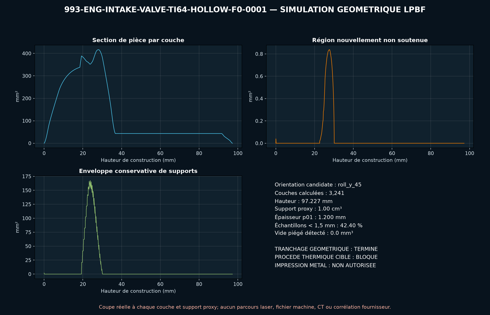

<!-- engendre par scripts/render_part_pages.py - ne pas editer a la main -->

# Soupape d'admission 993 creuse Ti64, concept LPBF F0

**Statut : **interdit en l'état**. Aucune pièce n'est libérée ; voir [SAFETY.md](../../SAFETY.md).**

Concept indépendant de soupape d'admission Ti-6Al-4V creuse avec quatre nervures internes et alésage axial ouvert pour le dépoudrage. Seuls le diamètre de tête, le diamètre de queue, l'encombrement produit, la masse déclarée et la référence sont publiés ; toute la géométrie fonctionnelle reste une hypothèse F0.

Fiche du catalogue : [`catalog/parts/993-eng-intake-valve-ti64-hollow-f0-0001.json`](../../catalog/parts/993-eng-intake-valve-ti64-hollow-f0-0001.json)

## Identité

| champ | valeur |
|---|---|
| identifiant | 993-ENG-INTAKE-VALVE-TI64-HOLLOW-F0-0001 |
| génération | 993 |
| variantes | 993_C2, 993_C4, 993_Turbo, M64_research |
| années | 1994 à 1998 |
| références Porsche | 99310540902 |
| catégorie | intake_valve_hollow |
| classe de sécurité | prohibited_pending_engineering |
| usage prévu | Criblage CAO, DfAM, masse, cinématique harmonique, effort axial, flambement, mode propre et thermique ; aucune fabrication, installation ou mise en route moteur autorisée |

## Matière et fabrication

| champ | valeur |
|---|---|
| procédé préféré | LPBF |
| procédés candidats | LPBF, DMLS, CNC |
| famille de matière | titane candidat |
| nuance | Ti-6Al-4V Grade 5 LPBF de criblage ; matière de la référence 993 et du kit Swindon non publiée |
| norme | ASTM F2924 et spécification soupape propre au programme à contractualiser |
| exigences fournisseur | poudre, machine, paramètres, orientation, lot et recyclage traçables, coupons orientés avec traction, HCF/LCF, impact, fluage, oxydation, usure et couche alpha à température, preuve de dépoudrage de l'alésage 5 mm sur environ 100 mm et critère de propreté interne, qualification de la fermeture d'extrémité, de son étanchéité et de sa rétention, CT intégral, métallographie, ressuage et métrologie après tous post-traitements, essais de soupape grandeur réelle sur banc chaud, culasse entraînée puis moteur avant véhicule |
| post-traitement | orientation axe vertical et stratégie de supports à qualifier, dépoudrage documenté de la cavité par l'alésage axial ouvert, détensionnement et traitement thermique qualifiés pour la machine et les paramètres, HIP à décider sur la population de défauts et la fatigue représentative, fermeture de l'extrémité par un procédé à définir puis CT et épreuve, usinage et finition de la queue, du siège, de la gorge, de la tête et des datums, revêtement, dureté de pointe, appairage guide-siège et équilibrage par jeu |

**Titane**

| champ | valeur |
|---|---|
| alliage | Ti-6Al-4V Grade 5 candidat uniquement ; aucune nuance n'est établie pour la référence Porsche 99310540902 |
| traitement thermique | Traitement de détente et de ductilité EOS à qualifier ; aucune recette gelée sans machine, orientation, coupons et fermeture |
| HIP | to_be_determined |
| surfaces usinées | diamètre, rectitude et état de surface de queue, face et angle de siège, marge et profil de tête, gorge de clavettes et pointe, interface de fermeture de l'alésage axial |
| inspection | CT de la tête, des nervures, de l'alésage, de la fermeture et des transitions, métrologie de longueur, diamètre, rectitude, battement, siège et gorge, rugosité, porosité, couche alpha, contraintes résiduelles et propreté interne, ressuage après usinage et contrôle de la fermeture, essais chauds d'impact, rebond, usure, fatigue et rétention |
| isolation galvanique | Qualifier couples titane-guide, siège, ressort, clavettes et coupelle, fretting, grippage, revêtements, huile, produits de combustion et dilatations différentielles. |
| hypothèses de fatigue | non renseigné |

## Géométrie

| champ | valeur |
|---|---|
| type de source | mixed |
| format du maître | build123d |
| unités | mm |
| précision (mm) | non renseigné |

**Fichier maître**

- [`parts/993-eng-intake-valve-ti64-hollow-f0-0001/source/intake_valve.py`](../../parts/993-eng-intake-valve-ti64-hollow-f0-0001/source/intake_valve.py)

**Fichiers dérivés**

- [`parts/993-eng-intake-valve-ti64-hollow-f0-0001/derived/intake_valve_ti64_hollow_f0.step`](../../parts/993-eng-intake-valve-ti64-hollow-f0-0001/derived/intake_valve_ti64_hollow_f0.step)

## Images

*parts/993-eng-intake-valve-ti64-hollow-f0-0001/evidence/lpbf-f0/993-eng-intake-valve-ti64-hollow-f0-0001-lpbf-geometry-screen.png*

## Provenance et sources

| champ | valeur |
|---|---|
| licence de la fiche | MIT pour le concept, le script et les calculs ; aucune photographie, surface Porsche/FVD/Swindon ou géométrie commerciale redistribuée |

**Sources**

- [FVD - dimensions déclarées de soupape d'admission 993](https://www.fvd.net/de/shop/einlassventil-49mm-993-94-95-turbo-95-98-m64-05-06-07-08-60-nicht-natrium-gekuehlt-99310540902eq1-99310540902~p306501)
- [PorscheFanatics - contexte de soupapes titane pour moteur 993](https://porschefanatics.com/engine/993/)
- [EOS Titanium Ti64 Grade 5](https://www.eos.info/metal-solutions/data-sheets/titanium/pds-eos-titanium-ti64-grade5-eos-m-290-80um)
- [TIMETAL 6-4 physical properties](https://www.timet.com/documents/datasheets/alpha-and-beta-alloys/timetal-6-4.pdf)
- [elferclassic - données techniques du 993 Turbo](https://www.elferclassic.de/technik/techdaten/993-turbo-95-98-techdat.php)

## Validation

| champ | valeur |
|---|---|
| statut | concept |
| essais véhicule | non renseigné |
| revu par |  |
| limites | non renseigné |

**Preuves**

- [`catalog/sources/src-fvd-993-inlet-valve-dimensions.json`](../../catalog/sources/src-fvd-993-inlet-valve-dimensions.json)
- [`catalog/sources/src-porschefanatics-993-titanium-valve-context.json`](../../catalog/sources/src-porschefanatics-993-titanium-valve-context.json)
- [`catalog/sources/src-eos-ti64-grade5.json`](../../catalog/sources/src-eos-ti64-grade5.json)
- [`catalog/sources/src-timet-ti64-physical-properties.json`](../../catalog/sources/src-timet-ti64-physical-properties.json)
- [`catalog/sources/src-elferclassic-993-turbo-technical-data.json`](../../catalog/sources/src-elferclassic-993-turbo-technical-data.json)
- [`parts/993-eng-intake-valve-ti64-hollow-f0-0001/evidence/engineering-screen.json`](../../parts/993-eng-intake-valve-ti64-hollow-f0-0001/evidence/engineering-screen.json)

## Dossiers de conception

- [993_INTAKE_VALVE_TI64_HOLLOW_F0](../../docs/993/993_INTAKE_VALVE_TI64_HOLLOW_F0.md)

---

*Page engendrée depuis la fiche du catalogue par `scripts/render_part_pages.py`, vérifiée par `make check`. Toute correction se fait dans la fiche, pas ici.*
