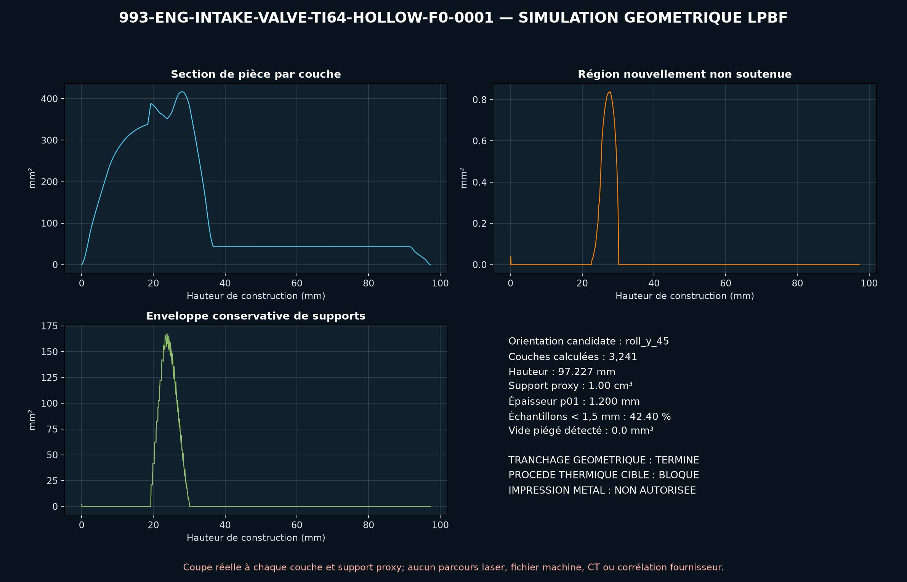

<!-- generated by scripts/render_part_pages.py - do not edit by hand -->

# 993 hollow Ti64 intake valve, F0 LPBF concept

**Status: **prohibited pending engineering**. No part is released; see [SAFETY.md](../../SAFETY.md).**

Independent concept of a hollow Ti-6Al-4V intake valve with four internal ribs and an open axial bore for depowdering. Only the head diameter, stem diameter, product envelope, declared mass and part number are published; all functional geometry remains an F0 hypothesis.

Catalogue record: [`catalog/parts/993-eng-intake-valve-ti64-hollow-f0-0001.json`](../../catalog/parts/993-eng-intake-valve-ti64-hollow-f0-0001.json)

## Identity

| field | value |
|---|---|
| identifier | 993-ENG-INTAKE-VALVE-TI64-HOLLOW-F0-0001 |
| generation | 993 |
| variants | 993_C2, 993_C4, 993_Turbo, M64_research |
| model years | 1994 to 1998 |
| Porsche part numbers | 99310540902 |
| category | intake_valve_hollow |
| safety class | prohibited_pending_engineering |
| intended use | CAD, DfAM, mass, harmonic kinematics, axial load, buckling, natural mode and thermal screening; no manufacturing, installation or engine start-up authorized |

## Material and manufacturing

| field | value |
|---|---|
| preferred process | LPBF |
| candidate processes | LPBF, DMLS, CNC |
| material family | candidate titanium |
| grade | Ti-6Al-4V Grade 5 LPBF, screening; material of the 993 part number and of the Swindon kit not published |
| standard | ASTM F2924 and a program-specific valve specification to be contracted |
| supplier requirements | traceable powder, machine, parameters, orientation, lot and recycling, oriented coupons with tensile, HCF/LCF, impact, creep, oxidation, wear and alpha case at temperature, proof of depowdering of the 5 mm bore over about 100 mm and an internal cleanliness criterion, qualification of the end closure, its sealing and its retention, full CT, metallography, penetrant testing and metrology after all post-processing, full-scale valve tests on a hot rig, a motored cylinder head, then an engine before the vehicle |
| post-processing | vertical-axis orientation and support strategy to be qualified, documented depowdering of the cavity through the open axial bore, stress relief and heat treatment qualified for the machine and parameters, HIP to be decided on the defect population and representative fatigue, closure of the end by a process to be defined, then CT and proof test, machining and finishing of the stem, seat, groove, head and datums, coating, tip hardness, guide-seat matching and clearance balancing |

**Titanium**

| field | value |
|---|---|
| alloy | Ti-6Al-4V Grade 5 candidate only; no grade is established for Porsche part number 99310540902 |
| heat treatment | EOS stress-relief and ductility treatment to be qualified; no recipe frozen without machine, orientation, coupons and closure |
| HIP | to_be_determined |
| machined surfaces | stem diameter, straightness and surface finish, seat face and angle, head margin and profile, keeper groove and tip, axial bore closure interface |
| inspection | CT of the head, ribs, bore, closure and transitions, metrology of length, diameter, straightness, runout, seat and groove, roughness, porosity, alpha case, residual stresses and internal cleanliness, penetrant testing after machining and inspection of the closure, hot impact, bounce, wear, fatigue and retention tests |
| galvanic isolation | Qualify titanium pairings with guide, seat, spring, keepers and retainer, fretting, galling, coatings, oil, combustion products and differential expansion. |
| fatigue assumptions | not recorded |

## Geometry

| field | value |
|---|---|
| source type | mixed |
| master format | build123d |
| units | mm |
| accuracy (mm) | not recorded |

**Master file**

- [`parts/993-eng-intake-valve-ti64-hollow-f0-0001/source/intake_valve.py`](../../parts/993-eng-intake-valve-ti64-hollow-f0-0001/source/intake_valve.py)

**Derived files**

- [`parts/993-eng-intake-valve-ti64-hollow-f0-0001/derived/intake_valve_ti64_hollow_f0.step`](../../parts/993-eng-intake-valve-ti64-hollow-f0-0001/derived/intake_valve_ti64_hollow_f0.step)

## Images

*parts/993-eng-intake-valve-ti64-hollow-f0-0001/evidence/lpbf-f0/993-eng-intake-valve-ti64-hollow-f0-0001-lpbf-geometry-screen.png*

## Provenance and sources

| field | value |
|---|---|
| record license | MIT for the concept, the script and the calculations; no Porsche/FVD/Swindon photograph, surface or commercial geometry redistributed |

**Sources**

- [FVD - declared 993 intake valve dimensions](https://www.fvd.net/de/shop/einlassventil-49mm-993-94-95-turbo-95-98-m64-05-06-07-08-60-nicht-natrium-gekuehlt-99310540902eq1-99310540902~p306501)
- [PorscheFanatics - titanium valve context for the 993 engine](https://porschefanatics.com/engine/993/)
- [EOS Titanium Ti64 Grade 5](https://www.eos.info/metal-solutions/data-sheets/titanium/pds-eos-titanium-ti64-grade5-eos-m-290-80um)
- [TIMETAL 6-4 physical properties](https://www.timet.com/documents/datasheets/alpha-and-beta-alloys/timetal-6-4.pdf)
- [elferclassic - 993 Turbo technical data](https://www.elferclassic.de/technik/techdaten/993-turbo-95-98-techdat.php)

## Validation

| field | value |
|---|---|
| status | concept |
| vehicle tested | not recorded |
| reviewed by |  |
| limitations | not recorded |

**Evidence**

- [`catalog/sources/src-fvd-993-inlet-valve-dimensions.json`](../../catalog/sources/src-fvd-993-inlet-valve-dimensions.json)
- [`catalog/sources/src-porschefanatics-993-titanium-valve-context.json`](../../catalog/sources/src-porschefanatics-993-titanium-valve-context.json)
- [`catalog/sources/src-eos-ti64-grade5.json`](../../catalog/sources/src-eos-ti64-grade5.json)
- [`catalog/sources/src-timet-ti64-physical-properties.json`](../../catalog/sources/src-timet-ti64-physical-properties.json)
- [`catalog/sources/src-elferclassic-993-turbo-technical-data.json`](../../catalog/sources/src-elferclassic-993-turbo-technical-data.json)
- [`parts/993-eng-intake-valve-ti64-hollow-f0-0001/evidence/engineering-screen.json`](../../parts/993-eng-intake-valve-ti64-hollow-f0-0001/evidence/engineering-screen.json)

## Design dossiers

- [993_INTAKE_VALVE_TI64_HOLLOW_F0](../../docs/993/993_INTAKE_VALVE_TI64_HOLLOW_F0.md)

---

*Page generated from the catalogue record by `scripts/render_part_pages.py`, checked by `make check`. Corrections go in the record, not here.*
