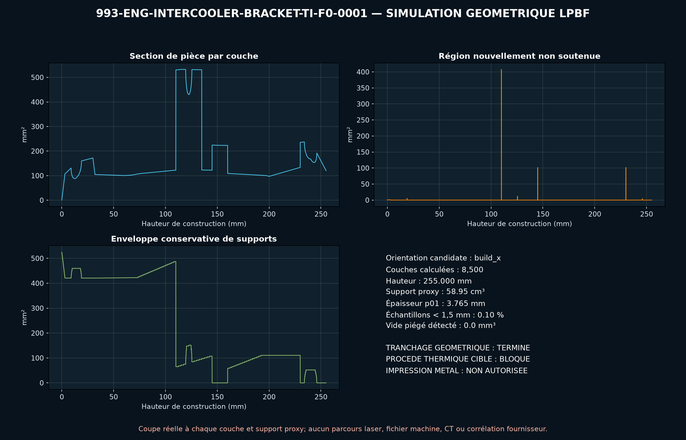

<!-- engendre par scripts/render_part_pages.py - ne pas editer a la main -->

# Support d'intercooler 993 Turbo/GT2, concept titane F0

**Statut : fonctionnel. Aucune pièce n'est libérée ; voir [SAFETY.md](../../SAFETY.md).**

Concept indépendant de support ouvert à deux rails pour cribler l'intérêt d'une refabrication LPBF en Ti-6Al-4V. PorscheFanatics et le PET établissent les références du circuit ; FVD publie l'enveloppe et la masse d'un support renforcé aftermarket, sans géométrie d'interface exploitable.

Fiche du catalogue : [`catalog/parts/993-eng-intercooler-bracket-ti-f0-0001.json`](../../catalog/parts/993-eng-intercooler-bracket-ti-f0-0001.json)

## Identité

| champ | valeur |
|---|---|
| identifiant | 993-ENG-INTERCOOLER-BRACKET-TI-F0-0001 |
| génération | 993 |
| variantes | 993_Turbo, 993_GT2 |
| années | 1995 à 1998 |
| références Porsche | 99311011050, 99311011052 |
| catégorie | charge_air_support |
| classe de sécurité | functional |
| usage prévu | Criblage CAO, DfAM, masse et mécanique d'un support d'intercooler ; aucun montage véhicule autorisé |

## Matière et fabrication

| champ | valeur |
|---|---|
| procédé préféré | CNC |
| procédés candidats | LPBF, CNC, sheet_metal |
| famille de matière | titane LPBF candidat |
| nuance | Ti-6Al-4V Grade 5 de criblage ; matériau OEM et produit FVD inconnus |
| norme | ASTM F2924 ou spécification fournisseur équivalente à contractualiser |
| exigences fournisseur | poudre, machine, paramètres, orientation, lot et recyclage de poudre traçables, coupons témoins en orientations critiques avec traction et fatigue représentatives, contrôle dimensionnel des datums, entraxes, alésages et enveloppe, CT des noeuds et bossages, puis ressuage après usinage, rugosité, porosité, couche alpha et contraintes résiduelles contractualisées, essais statiques, vibratoires et thermiques instrumentés avant tout montage |
| post-traitement | retrait des supports avec accès conservé aux deux évidements ouverts, traitement thermique qualifié pour la machine, les paramètres et l'orientation, HIP à décider après analyse fatigue et population de défauts, usinage des alésages d'extrémité et de l'interface centrale après définition des jeux, ébavurage, rayonnage et finition des chemins de charge, passivation et isolation galvanique après contrôle dimensionnel |

**Titane**

| champ | valeur |
|---|---|
| alliage | Ti-6Al-4V Grade 5 candidat uniquement |
| traitement thermique | Cycle EOS indicatif à confirmer pour la machine et les paramètres retenus ; aucune recette n'est gelée |
| HIP | to_be_determined |
| surfaces usinées | deux alésages d'extrémité, alésage et datum du plot central, portées de fixation à définir sur pièce mesurée |
| inspection | CT des bossages et jonctions de rails, contrôle dimensionnel des interfaces usinées, ressuage après usinage, rugosité et porosité, coupons de traction et fatigue représentatifs de l'orientation |
| isolation galvanique | Séparer électriquement le titane de l'intercooler aluminium et des fixations acier par bagues, rondelles, revêtement et étanchéité qualifiés après identification des matériaux réels. |
| hypothèses de fatigue | non renseigné |

## Géométrie

| champ | valeur |
|---|---|
| type de source | mixed |
| format du maître | build123d |
| unités | mm |
| précision (mm) | non renseigné |

**Fichier maître**

- [`parts/993-eng-intercooler-bracket-ti-f0-0001/source/intercooler_bracket.py`](../../parts/993-eng-intercooler-bracket-ti-f0-0001/source/intercooler_bracket.py)

**Fichiers dérivés**

- [`parts/993-eng-intercooler-bracket-ti-f0-0001/derived/intercooler_bracket_ti_f0.step`](../../parts/993-eng-intercooler-bracket-ti-f0-0001/derived/intercooler_bracket_ti_f0.step)

## Images

*parts/993-eng-intercooler-bracket-ti-f0-0001/evidence/lpbf-f0/993-eng-intercooler-bracket-ti-f0-0001-lpbf-geometry-screen.png*

## Provenance et sources

| champ | valeur |
|---|---|
| licence de la fiche | MIT pour le concept, le script et les calculs ; aucune photographie, illustration PET ou géométrie commerciale redistribuée |

**Sources**

- [PorscheFanatics - relevé PET des groupes Turbo 993](https://porschefanatics.com/oem/993/202-16/)
- [FVD - support renforcé d'intercooler FVD11011050](https://www.fvd.net/de/shop/traeger-ladeluftkuehler-993-turbo-gt2-verstaerkt-fvd11011050~p265005)
- [EOS Titanium Ti64 Grade 5 material data sheet](https://www.eos.info/metal-solutions/metal-materials/data-sheets/mds-eos-titanium-ti64-grade-5)
- [TIMETAL 6-4 physical properties](https://www.timet.com/documents/datasheets/alpha-and-beta-alloys/timetal-6-4.pdf)

## Validation

| champ | valeur |
|---|---|
| statut | concept |
| essais véhicule | non renseigné |
| revu par |  |
| limites | non renseigné |

**Preuves**

- [`catalog/sources/src-porschefanatics-993-turbo-pet.json`](../../catalog/sources/src-porschefanatics-993-turbo-pet.json)
- [`catalog/sources/src-fvd-993-intercooler-bracket-dimensions.json`](../../catalog/sources/src-fvd-993-intercooler-bracket-dimensions.json)
- [`catalog/sources/src-eos-ti64-grade5.json`](../../catalog/sources/src-eos-ti64-grade5.json)
- [`catalog/sources/src-timet-ti64-physical-properties.json`](../../catalog/sources/src-timet-ti64-physical-properties.json)
- [`parts/993-eng-intercooler-bracket-ti-f0-0001/evidence/engineering-screen.json`](../../parts/993-eng-intercooler-bracket-ti-f0-0001/evidence/engineering-screen.json)
- [`parts/993-eng-intercooler-bracket-ti-f0-0001/evidence/calculix-screen.json`](../../parts/993-eng-intercooler-bracket-ti-f0-0001/evidence/calculix-screen.json)
- [`parts/993-eng-intercooler-bracket-ti-f0-0001/evidence/simready-conversion-summary.json`](../../parts/993-eng-intercooler-bracket-ti-f0-0001/evidence/simready-conversion-summary.json)

## Dossiers de conception

- [993_INTERCOOLER_BRACKET_TI_F0](../../docs/993/993_INTERCOOLER_BRACKET_TI_F0.md)

---

*Page engendrée depuis la fiche du catalogue par `scripts/render_part_pages.py`, vérifiée par `make check`. Toute correction se fait dans la fiche, pas ici.*
