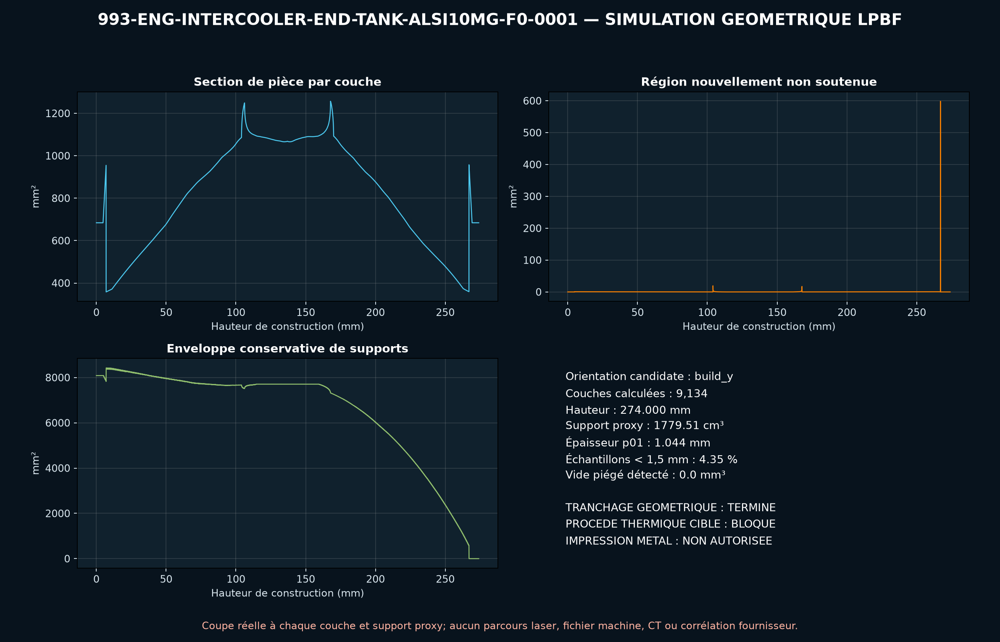

<!-- engendre par scripts/render_part_pages.py - ne pas editer a la main -->

# End-tank d'intercooler 993 Turbo, concept AlSi10Mg F0

**Statut : **interdit en l'état**. Aucune pièce n'est libérée ; voir [SAFETY.md](../../SAFETY.md).**

Concept indépendant de transition ronde vers face rectangulaire avec trois guides internes ouverts, destiné à cribler un end-tank LPBF AlSi10Mg. Les dimensions d'ensemble publiées bornent le F0 mais ne définissent ni l'orientation du noyau, ni une géométrie compatible.

Fiche du catalogue : [`catalog/parts/993-eng-intercooler-end-tank-alsi10mg-f0-0001.json`](../../catalog/parts/993-eng-intercooler-end-tank-alsi10mg-f0-0001.json)

## Identité

| champ | valeur |
|---|---|
| identifiant | 993-ENG-INTERCOOLER-END-TANK-ALSI10MG-F0-0001 |
| génération | 993 |
| variantes | 993_Turbo, 993_GT2, M64_60_research |
| années | 1995 à 1998 |
| références Porsche | non renseigné |
| catégorie | charge_air_intercooler_end_tank |
| classe de sécurité | prohibited_pending_engineering |
| usage prévu | Criblage CAO, DfAM, débit, perte, pression, membrane, panneau guidé, thermique et cycles ; aucune fabrication, installation ou mise en route moteur autorisée |

## Matière et fabrication

| champ | valeur |
|---|---|
| procédé préféré | LPBF |
| procédés candidats | LPBF, DMLS, sheet_metal, casting, CNC |
| famille de matière | alliage aluminium LPBF candidat |
| nuance | EOS Aluminium AlSi10Mg de criblage ; alliage commercial inconnu |
| norme | DIN EN 1706 EN AC-43000, ASTM F3318 et spécification end-tank propre au programme à contractualiser |
| exigences fournisseur | poudre, machine, paramètres, orientation, lot et recyclage traçables, capabilité démontrée sur paroi 2,2 mm et guide 1,5 mm après post-traitement, simulation supports/recoater/distorsion et témoins de transition/flange, CT des guides et jonctions, puis métrologie des parois, face, raccord et datums, coupons orientés avec traction, fatigue, pression et température représentatives, comparaison LPBF, tôle TIG et fonderie sur débit, masse, coût, réparabilité et durée de vie |
| post-traitement | orientation et supports gardant le conduit entièrement ouvert au dépoudrage, traitement thermique qualifié pour machine, paramètres, paroi et guides, découpe plateau et retrait des supports sans endommager les interfaces, usinage de la face noyau et du raccord après ajout des surépaisseurs mesurées, finition interne des guides et de la transition avec rugosité contrôlée, assemblage au noyau par soudure ou brasage qualifié puis épreuve et nettoyage |

## Géométrie

| champ | valeur |
|---|---|
| type de source | mixed |
| format du maître | build123d |
| unités | mm |
| précision (mm) | non renseigné |

**Fichier maître**

- [`parts/993-eng-intercooler-end-tank-alsi10mg-f0-0001/source/end_tank.py`](../../parts/993-eng-intercooler-end-tank-alsi10mg-f0-0001/source/end_tank.py)

**Fichiers dérivés**

- [`parts/993-eng-intercooler-end-tank-alsi10mg-f0-0001/derived/end_tank_alsi10mg_f0.step`](../../parts/993-eng-intercooler-end-tank-alsi10mg-f0-0001/derived/end_tank_alsi10mg_f0.step)

## Images

*parts/993-eng-intercooler-end-tank-alsi10mg-f0-0001/evidence/lpbf-f0/993-eng-intercooler-end-tank-alsi10mg-f0-0001-lpbf-geometry-screen.png*

## Provenance et sources

| champ | valeur |
|---|---|
| licence de la fiche | MIT pour le concept, le script et les calculs ; aucune photographie, surface TA Technix/Albert/Porsche ou géométrie commerciale redistribuée |

**Sources**

- [TA Technix - intercooler pour Porsche 911 Turbo 993](https://www.tatechnix.de/tatechnix/gx/ta-technix-produkte/performance-parts/intercooler/-138841/911-141181/993-159629/ta-technix-intercooler-suitable-for-porsche-911-turbo-type-993.html)
- [Albert Motorsport - intercooler aluminium 993 Turbo/GT2](https://albertmotorsport.de/en/993-turbo-gt2-engine/993-tt-gt2-intercooler-aluminum-oem-replacement-porsche-911)
- [PorscheFanatics - architecture de refroidissement de suralimentation 993](https://porschefanatics.com/engine/993/)
- [EOS Aluminium AlSi10Mg material data sheet](https://www.eos.info/metal-solutions/metal-materials/data-sheets/mds-eos-aluminium-alsi10mg)
- [elferclassic - données techniques allemandes du 993 Turbo](https://www.elferclassic.de/technik/techdaten/993-turbo-95-98-techdat.php)

## Validation

| champ | valeur |
|---|---|
| statut | concept |
| essais véhicule | non renseigné |
| revu par |  |
| limites | non renseigné |

**Preuves**

- [`catalog/sources/src-ta-technix-993-intercooler-dimensions.json`](../../catalog/sources/src-ta-technix-993-intercooler-dimensions.json)
- [`catalog/sources/src-albert-motorsport-993-aluminum-intercooler.json`](../../catalog/sources/src-albert-motorsport-993-aluminum-intercooler.json)
- [`catalog/sources/src-porschefanatics-993-intercooler-end-tank-candidate.json`](../../catalog/sources/src-porschefanatics-993-intercooler-end-tank-candidate.json)
- [`catalog/sources/src-eos-alsi10mg-current-page.json`](../../catalog/sources/src-eos-alsi10mg-current-page.json)
- [`catalog/sources/src-elferclassic-993-turbo-technical-data.json`](../../catalog/sources/src-elferclassic-993-turbo-technical-data.json)
- [`parts/993-eng-intercooler-end-tank-alsi10mg-f0-0001/evidence/engineering-screen.json`](../../parts/993-eng-intercooler-end-tank-alsi10mg-f0-0001/evidence/engineering-screen.json)

## Dossiers de conception

- [993_INTERCOOLER_END_TANK_ALSI10MG_F0](../../docs/993/993_INTERCOOLER_END_TANK_ALSI10MG_F0.md)

---

*Page engendrée depuis la fiche du catalogue par `scripts/render_part_pages.py`, vérifiée par `make check`. Toute correction se fait dans la fiche, pas ici.*
