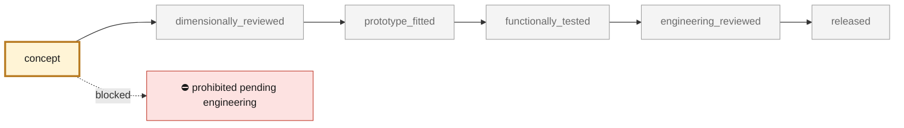
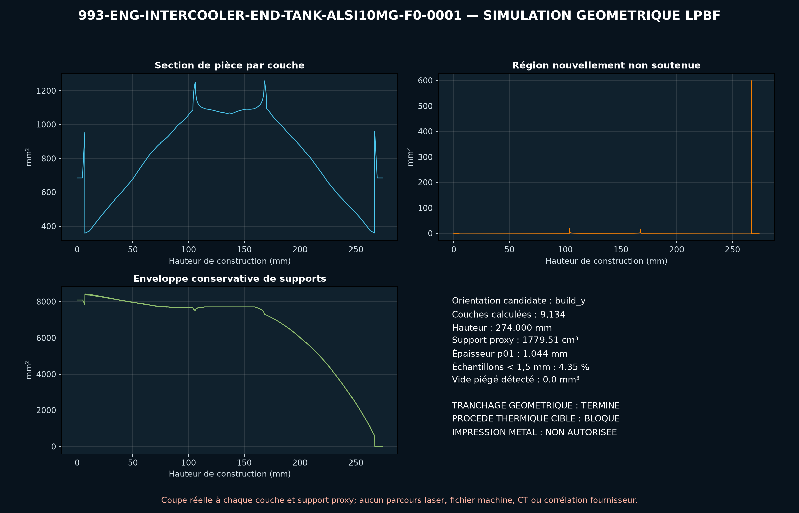
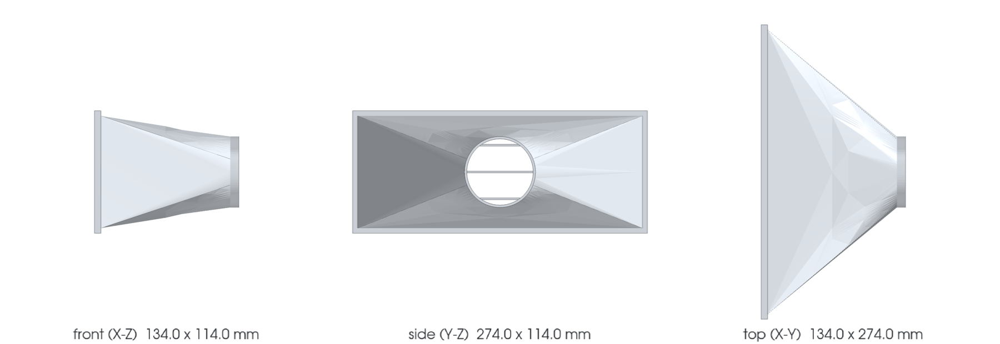

<!-- generated by scripts/render_part_pages.py - do not edit by hand -->

# 993 Turbo intercooler end tank, AlSi10Mg concept F0

**Status: **prohibited pending engineering**. No part is released; see [SAFETY.md](../../SAFETY.md).**

Independent concept of a round-to-rectangular-face transition with three open internal guide vanes, used to screen an LPBF AlSi10Mg end tank. The published overall dimensions bound the F0 but define neither the core orientation nor a compatible geometry.

```mermaid
flowchart LR
    L0["concept"]
    L1["dimensionally_reviewed"]
    L2["prototype_fitted"]
    L3["functionally_tested"]
    L4["engineering_reviewed"]
    L5["released"]
    L0 --> L1 --> L2 --> L3 --> L4 --> L5
    X["⛔ prohibited pending engineering"]
    L0 -. blocked .-> X
    classDef here fill:#fff4d6,stroke:#b7791f,color:#1a1a1a,stroke-width:3px;
    classDef done fill:#e3f1e6,stroke:#2e7d32,color:#1a1a1a;
    classDef todo fill:#f4f4f4,stroke:#9e9e9e,color:#6b6b6b;
    classDef stop fill:#fde2e1,stroke:#c0392b,color:#1a1a1a;
    class L0 here
    class L1 todo
    class L2 todo
    class L3 todo
    class L4 todo
    class L5 todo
    class X stop
```

*Validation ladder of `catalog/schemas/part.schema.json`; this record is at `concept`.*

Catalogue record: [`catalog/parts/993-eng-intercooler-end-tank-alsi10mg-f0-0001.json`](../../catalog/parts/993-eng-intercooler-end-tank-alsi10mg-f0-0001.json)

## Identity

| field | value |
|---|---|
| identifier | 993-ENG-INTERCOOLER-END-TANK-ALSI10MG-F0-0001 |
| generation | 993 |
| variants | 993_Turbo, 993_GT2, M64_60_research |
| model years | 1995 to 1998 |
| Porsche part numbers | not recorded |
| category | charge_air_intercooler_end_tank |
| safety class | prohibited_pending_engineering |
| intended use | CAD, DfAM, flow, pressure loss, pressure, membrane, guided panel, thermal and cycle screening; no manufacture, installation or engine start-up authorized |

## Material and manufacturing

| field | value |
|---|---|
| preferred process | LPBF |
| candidate processes | LPBF, DMLS, sheet_metal, casting, CNC |
| material family | candidate LPBF aluminum alloy |
| grade | EOS Aluminium AlSi10Mg for screening; commercial alloy unknown |
| standard | DIN EN 1706 EN AC-43000, ASTM F3318 and a program-specific end-tank specification to be contracted |
| supplier requirements | traceable powder, machine, parameters, orientation, batch and recycling, capability demonstrated on a 2.2 mm wall and a 1.5 mm guide vane after post-processing, supports/recoater/distortion simulation and transition/flange witnesses, CT of the guide vanes and junctions, then metrology of the walls, face, connection and datums, oriented coupons with representative tensile, fatigue, pressure and temperature tests, comparison of LPBF, TIG-welded sheet and casting on flow, mass, cost, repairability and service life |
| post-processing | orientation and supports keeping the duct fully open for powder removal, heat treatment qualified for machine, parameters, wall and guide vanes, build plate cut-off and support removal without damaging the interfaces, machining of the core face and the connection after adding the measured machining stock, internal finishing of the guide vanes and the transition with controlled roughness, assembly to the core by qualified welding or brazing, then proof test and cleaning |

## Geometry

| field | value |
|---|---|
| source type | mixed |
| master format | build123d |
| units | mm |
| accuracy (mm) | not recorded |

**Master file**

- [`parts/993-eng-intercooler-end-tank-alsi10mg-f0-0001/source/end_tank.py`](../../parts/993-eng-intercooler-end-tank-alsi10mg-f0-0001/source/end_tank.py)

**Derived files**

- [`parts/993-eng-intercooler-end-tank-alsi10mg-f0-0001/derived/end_tank_alsi10mg_f0.step`](../../parts/993-eng-intercooler-end-tank-alsi10mg-f0-0001/derived/end_tank_alsi10mg_f0.step)

## Images

*`parts/993-eng-intercooler-end-tank-alsi10mg-f0-0001/evidence/lpbf-f0/993-eng-intercooler-end-tank-alsi10mg-f0-0001-lpbf-geometry-screen.png` — a screening output, not a validation.*

*`parts/993-eng-intercooler-end-tank-alsi10mg-f0-0001/media/preview.png` — concept CAD block, **not** the original part, not a print file.*

*`parts/993-eng-intercooler-end-tank-alsi10mg-f0-0001/media/views.png` — concept CAD block, **not** the original part, not a print file.*

## Provenance and sources

| field | value |
|---|---|
| record license | MIT for the concept, the script and the calculations; no photograph, TA Technix/Albert/Porsche surface or commercial geometry redistributed |

**Sources**

- [TA Technix - intercooler for Porsche 911 Turbo 993](https://www.tatechnix.de/tatechnix/gx/ta-technix-produkte/performance-parts/intercooler/-138841/911-141181/993-159629/ta-technix-intercooler-suitable-for-porsche-911-turbo-type-993.html)
- [Albert Motorsport - 993 Turbo/GT2 aluminum intercooler](https://albertmotorsport.de/en/993-turbo-gt2-engine/993-tt-gt2-intercooler-aluminum-oem-replacement-porsche-911)
- [PorscheFanatics - 993 charge-air cooling architecture](https://porschefanatics.com/engine/993/)
- [EOS Aluminium AlSi10Mg material data sheet](https://www.eos.info/metal-solutions/metal-materials/data-sheets/mds-eos-aluminium-alsi10mg)
- [elferclassic - German technical data for the 993 Turbo](https://www.elferclassic.de/technik/techdaten/993-turbo-95-98-techdat.php)

## Validation

| field | value |
|---|---|
| status | concept |
| vehicle tested | not recorded |
| reviewed by |  |
| limitations | not recorded |

**Evidence**

- [`catalog/sources/src-ta-technix-993-intercooler-dimensions.json`](../../catalog/sources/src-ta-technix-993-intercooler-dimensions.json)
- [`catalog/sources/src-albert-motorsport-993-aluminum-intercooler.json`](../../catalog/sources/src-albert-motorsport-993-aluminum-intercooler.json)
- [`catalog/sources/src-porschefanatics-993-intercooler-end-tank-candidate.json`](../../catalog/sources/src-porschefanatics-993-intercooler-end-tank-candidate.json)
- [`catalog/sources/src-eos-alsi10mg-current-page.json`](../../catalog/sources/src-eos-alsi10mg-current-page.json)
- [`catalog/sources/src-elferclassic-993-turbo-technical-data.json`](../../catalog/sources/src-elferclassic-993-turbo-technical-data.json)
- [`parts/993-eng-intercooler-end-tank-alsi10mg-f0-0001/evidence/engineering-screen.json`](../../parts/993-eng-intercooler-end-tank-alsi10mg-f0-0001/evidence/engineering-screen.json)

## Design dossiers

- [993_INTERCOOLER_END_TANK_ALSI10MG_F0](../../docs/993/993_INTERCOOLER_END_TANK_ALSI10MG_F0.md)

---

*Page generated from the catalogue record by `scripts/render_part_pages.py`, checked by `make check`. Corrections go in the record, not here.*
