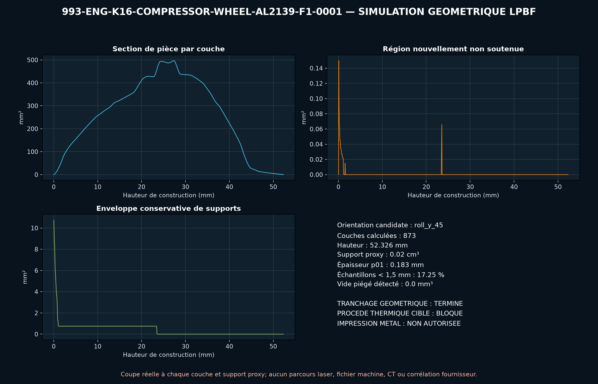

<!-- engendre par scripts/render_part_pages.py - ne pas editer a la main -->

# Roue de compresseur K16, itération Al2139 AM F1

**Statut : **interdit en l'état**. Aucune pièce n'est libérée ; voir [SAFETY.md](../../SAFETY.md).**

Itération du F0 AlSi10Mg rejeté, avec Al2139 AM et pales à épaisseur racine-pointe variable. Les diamètres 40,6/60,5 mm et le compte 6+6 restent les seuls faits géométriques publiés ; le F1 passe trois criblages algébriques ambiants sans devenir une roue fonctionnelle.

Fiche du catalogue : [`catalog/parts/993-eng-k16-compressor-wheel-al2139-f1-0001.json`](../../catalog/parts/993-eng-k16-compressor-wheel-al2139-f1-0001.json)

## Identité

| champ | valeur |
|---|---|
| identifiant | 993-ENG-K16-COMPRESSOR-WHEEL-AL2139-F1-0001 |
| génération | 993 |
| variantes | 993_Turbo, K16_right_research, M64_60_research |
| années | 1995 à 1998 |
| références Porsche | non renseigné |
| catégorie | turbocharger_compressor_wheel_iteration |
| classe de sécurité | prohibited_pending_engineering |
| usage prévu | Boucle F0-F1 de choix matière et épaisseur, CAO, thermodynamique, disque tournant, traction centrifuge, sur-vitesse, dilatation et balourd ; aucune fabrication, rotation, installation ou mise en route autorisée |

## Matière et fabrication

| champ | valeur |
|---|---|
| procédé préféré | LPBF |
| procédés candidats | LPBF, DMLS, CNC, casting |
| famille de matière | alliage aluminium haute résistance conçu pour fabrication additive |
| nuance | EOS Aluminium Al2139 AM, M290 60 µm, état traité thermiquement de comparaison |
| norme | composition modifiée de l'Aluminium Association Teal Sheet Al2139 ; spécification rotor propre au programme à contractualiser |
| exigences fournisseur | jeu matière Al2139AM_060_CoreM291_110, machine, logiciel, paramètres, poudre et lot traçables, coupons orientés avec traction, HCF, ténacité, propagation et défauts à la température rotor, témoins de distorsion et capabilité des pointes 0,8 mm après finition, CT intégral avant/après usinage avec critères de défauts par zone et métallographie, métrologie des profils, épaisseurs, congés, alésage, battements et masse polaire, équilibrage haute vitesse, spin proof, sur-vitesse, burst et confinement avant banc turbo |
| post-traitement | orientation, supports de pales et stratégie recoater à qualifier, traitement thermique mono-étape EOS à contractualiser avec machine, paramètres et coupons, HIP à décider sur défauts, ténacité, HCF et résultats de sur-vitesse, usinage de l'alésage, du dos, du nez, des faces et références d'équilibrage, profilage final et finition aérodynamique contrôlée de chaque pale et congé, équilibrage individuel puis ensemble rotor, spin proof et sur-vitesse confinée |

## Géométrie

| champ | valeur |
|---|---|
| type de source | mixed |
| format du maître | build123d |
| unités | mm |
| précision (mm) | non renseigné |

**Fichier maître**

- [`parts/993-eng-k16-compressor-wheel-al2139-f1-0001/source/compressor_wheel_f1.py`](../../parts/993-eng-k16-compressor-wheel-al2139-f1-0001/source/compressor_wheel_f1.py)

**Fichiers dérivés**

- [`parts/993-eng-k16-compressor-wheel-al2139-f1-0001/derived/compressor_wheel_al2139_f1.step`](../../parts/993-eng-k16-compressor-wheel-al2139-f1-0001/derived/compressor_wheel_al2139_f1.step)

## Images

*parts/993-eng-k16-compressor-wheel-al2139-f1-0001/evidence/lpbf-f0/993-eng-k16-compressor-wheel-al2139-f1-0001-lpbf-geometry-screen.png*

## Provenance et sources

| champ | valeur |
|---|---|
| licence de la fiche | MIT pour le concept, le script et les calculs ; aucune photographie, surface Porsche/BorgWarner/EOS ou géométrie commerciale redistribuée |

**Sources**

- [Invasion Auto Products - données internes déclarées du K16 993 Turbo droit](https://www.invasionautoproducts.com/94pocark16tu.html)
- [PorscheFanatics - contexte des turbocompresseurs et roues 993](https://porschefanatics.com/engine/993/)
- [EOS Aluminium Al2139 AM pour EOS M 290, 60 micromètres](https://www.eos.info/metal-solutions/data-sheets/aluminium/pds-eos-aluminium-al2139-am-eos-m-290-60um)
- [Roue K16 AlSi10Mg F0 du projet](https://github.com/cluster2600/porscheparts/blob/main/docs/993_K16_COMPRESSOR_WHEEL_ALSI10MG_F0.md)
- [TurboMaster - principes de lecture d'une carte compresseur](https://www.turbomaster.info/eng/turbocharger-map.php)

## Validation

| champ | valeur |
|---|---|
| statut | concept |
| essais véhicule | non renseigné |
| revu par |  |
| limites | non renseigné |

**Preuves**

- [`catalog/sources/src-invasionautoproducts-993-k16-internal-data.json`](../../catalog/sources/src-invasionautoproducts-993-k16-internal-data.json)
- [`catalog/sources/src-porschefanatics-993-k16-compressor-wheel-candidate.json`](../../catalog/sources/src-porschefanatics-993-k16-compressor-wheel-candidate.json)
- [`catalog/sources/src-eos-al2139-am-m290-60um.json`](../../catalog/sources/src-eos-al2139-am-m290-60um.json)
- [`catalog/sources/src-turbomap-compressor-map-methodology.json`](../../catalog/sources/src-turbomap-compressor-map-methodology.json)
- [`parts/993-eng-k16-compressor-wheel-alsi10mg-f0-0001/evidence/engineering-screen.json`](../../parts/993-eng-k16-compressor-wheel-alsi10mg-f0-0001/evidence/engineering-screen.json)
- [`parts/993-eng-k16-compressor-wheel-al2139-f1-0001/evidence/engineering-screen.json`](../../parts/993-eng-k16-compressor-wheel-al2139-f1-0001/evidence/engineering-screen.json)

## Dossiers de conception

- [993_K16_COMPRESSOR_WHEEL_AL2139_F1](../../docs/993/993_K16_COMPRESSOR_WHEEL_AL2139_F1.md)

---

*Page engendrée depuis la fiche du catalogue par `scripts/render_part_pages.py`, vérifiée par `make check`. Toute correction se fait dans la fiche, pas ici.*
