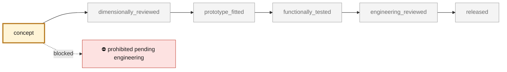
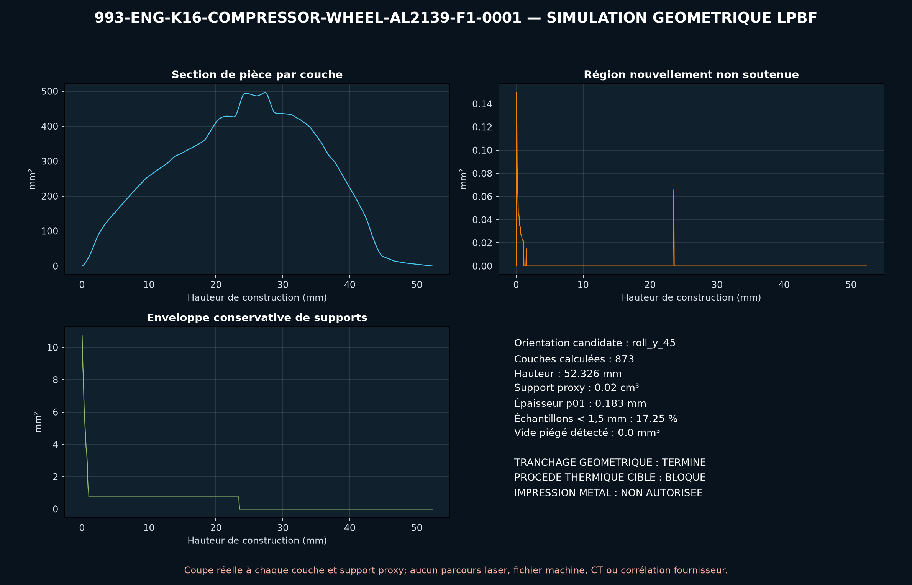
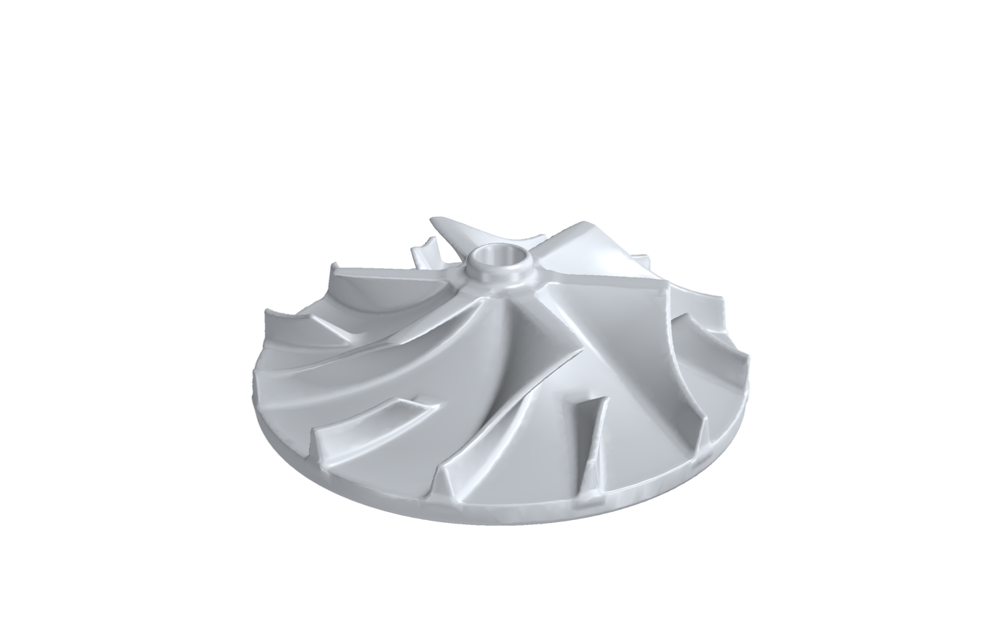
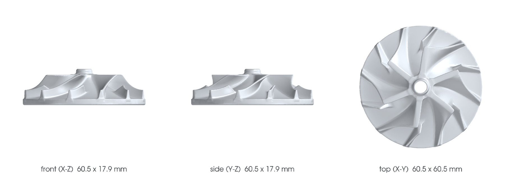

<!-- generated by scripts/render_part_pages.py - do not edit by hand -->

# K16 compressor wheel, Al2139 AM F1 iteration

**Status: **prohibited pending engineering**. No part is released; see [SAFETY.md](../../SAFETY.md).**

Iteration of the rejected AlSi10Mg F0, with Al2139 AM and blades of variable root-to-tip thickness. The 40.6/60.5 mm diameters and the 6+6 blade count remain the only published geometric facts; the F1 passes three ambient algebraic screens without becoming a functional wheel.

```mermaid
flowchart LR
    L0["concept"]
    L1["dimensionally_reviewed"]
    L2["prototype_fitted"]
    L3["functionally_tested"]
    L4["engineering_reviewed"]
    L5["released"]
    L0 --> L1 --> L2 --> L3 --> L4 --> L5
    X["⛔ prohibited pending engineering"]
    L0 -. blocked .-> X
    classDef here fill:#fff4d6,stroke:#b7791f,color:#1a1a1a,stroke-width:3px;
    classDef done fill:#e3f1e6,stroke:#2e7d32,color:#1a1a1a;
    classDef todo fill:#f4f4f4,stroke:#9e9e9e,color:#6b6b6b;
    classDef stop fill:#fde2e1,stroke:#c0392b,color:#1a1a1a;
    class L0 here
    class L1 todo
    class L2 todo
    class L3 todo
    class L4 todo
    class L5 todo
    class X stop
```

*Validation ladder of `catalog/schemas/part.schema.json`; this record is at `concept`.*

Catalogue record: [`catalog/parts/993-eng-k16-compressor-wheel-al2139-f1-0001.json`](../../catalog/parts/993-eng-k16-compressor-wheel-al2139-f1-0001.json)

## Identity

| field | value |
|---|---|
| identifier | 993-ENG-K16-COMPRESSOR-WHEEL-AL2139-F1-0001 |
| generation | 993 |
| variants | 993_Turbo, K16_right_research, M64_60_research |
| model years | 1995 to 1998 |
| Porsche part numbers | not recorded |
| category | turbocharger_compressor_wheel_iteration |
| safety class | prohibited_pending_engineering |
| intended use | F0-F1 loop for material and thickness choice, CAD, thermodynamics, rotating disk, centrifugal tension, overspeed, expansion and imbalance; no manufacturing, rotation, installation or start-up authorized |

## Material and manufacturing

| field | value |
|---|---|
| preferred process | LPBF |
| candidate processes | LPBF, DMLS, CNC, casting |
| material family | high-strength aluminum alloy designed for additive manufacturing |
| grade | EOS Aluminium Al2139 AM, M290 60 µm, heat-treated condition, for comparison |
| standard | modified composition of the Aluminum Association Teal Sheet Al2139; program-specific rotor specification to be contracted |
| supplier requirements | traceable material set Al2139AM_060_CoreM291_110, machine, software, parameters, powder and lot, oriented coupons with tensile, HCF, toughness, crack growth and defects at rotor temperature, distortion witnesses and capability of the 0.8 mm tips after finishing, full CT before/after machining with defect criteria by zone, and metallography, metrology of profiles, thicknesses, fillets, bore, runouts and polar mass, high-speed balancing, spin proof, overspeed, burst and containment before turbo rig testing |
| post-processing | orientation, blade supports and recoater strategy to be qualified, EOS single-step heat treatment to be contracted with machine, parameters and coupons, HIP to be decided on defects, toughness, HCF and overspeed results, machining of the bore, back face, nose, faces and balancing datums, final profiling and controlled aerodynamic finishing of each blade and fillet, individual balancing then rotor-assembly balancing, spin proof and contained overspeed |

## Geometry

| field | value |
|---|---|
| source type | mixed |
| master format | build123d |
| units | mm |
| accuracy (mm) | not recorded |

**Master file**

- [`parts/993-eng-k16-compressor-wheel-al2139-f1-0001/source/compressor_wheel_f1.py`](../../parts/993-eng-k16-compressor-wheel-al2139-f1-0001/source/compressor_wheel_f1.py)

**Derived files**

- [`parts/993-eng-k16-compressor-wheel-al2139-f1-0001/derived/compressor_wheel_al2139_f1.step`](../../parts/993-eng-k16-compressor-wheel-al2139-f1-0001/derived/compressor_wheel_al2139_f1.step)

## Images

*`parts/993-eng-k16-compressor-wheel-al2139-f1-0001/evidence/lpbf-f0/993-eng-k16-compressor-wheel-al2139-f1-0001-lpbf-geometry-screen.png` — a screening output, not a validation.*

*`parts/993-eng-k16-compressor-wheel-al2139-f1-0001/media/preview.png` — concept CAD block, **not** the original part, not a print file.*

*`parts/993-eng-k16-compressor-wheel-al2139-f1-0001/media/views.png` — concept CAD block, **not** the original part, not a print file.*

## Provenance and sources

| field | value |
|---|---|
| record license | All rights reserved (see LICENSE) for the concept, the script and the calculations; no Porsche/BorgWarner/EOS photograph, surface or commercial geometry redistributed |

**Sources**

- [Invasion Auto Products - declared internal data of the right-hand 993 Turbo K16](https://www.invasionautoproducts.com/94pocark16tu.html)
- [PorscheFanatics - context of 993 turbochargers and wheels](https://porschefanatics.com/engine/993/)
- [EOS Aluminium Al2139 AM for EOS M 290, 60 micrometers](https://www.eos.info/metal-solutions/data-sheets/aluminium/pds-eos-aluminium-al2139-am-eos-m-290-60um)
- [Project AlSi10Mg K16 wheel F0](https://github.com/cluster2600/porscheparts/blob/main/docs/993_K16_COMPRESSOR_WHEEL_ALSI10MG_F0.md)
- [TurboMaster - principles for reading a compressor map](https://www.turbomaster.info/eng/turbocharger-map.php)

## Validation

| field | value |
|---|---|
| status | concept |
| vehicle tested | not recorded |
| reviewed by |  |
| limitations | not recorded |

**Evidence**

- [`catalog/sources/src-invasionautoproducts-993-k16-internal-data.json`](../../catalog/sources/src-invasionautoproducts-993-k16-internal-data.json)
- [`catalog/sources/src-porschefanatics-993-k16-compressor-wheel-candidate.json`](../../catalog/sources/src-porschefanatics-993-k16-compressor-wheel-candidate.json)
- [`catalog/sources/src-eos-al2139-am-m290-60um.json`](../../catalog/sources/src-eos-al2139-am-m290-60um.json)
- [`catalog/sources/src-turbomap-compressor-map-methodology.json`](../../catalog/sources/src-turbomap-compressor-map-methodology.json)
- [`parts/993-eng-k16-compressor-wheel-alsi10mg-f0-0001/evidence/engineering-screen.json`](../../parts/993-eng-k16-compressor-wheel-alsi10mg-f0-0001/evidence/engineering-screen.json)
- [`parts/993-eng-k16-compressor-wheel-al2139-f1-0001/evidence/engineering-screen.json`](../../parts/993-eng-k16-compressor-wheel-al2139-f1-0001/evidence/engineering-screen.json)

## Design dossiers

- [993_K16_COMPRESSOR_WHEEL_AL2139_F1](../../docs/993/993_K16_COMPRESSOR_WHEEL_AL2139_F1.md)

---

*Page generated from the catalogue record by `scripts/render_part_pages.py`, checked by `make check`. Corrections go in the record, not here.*
