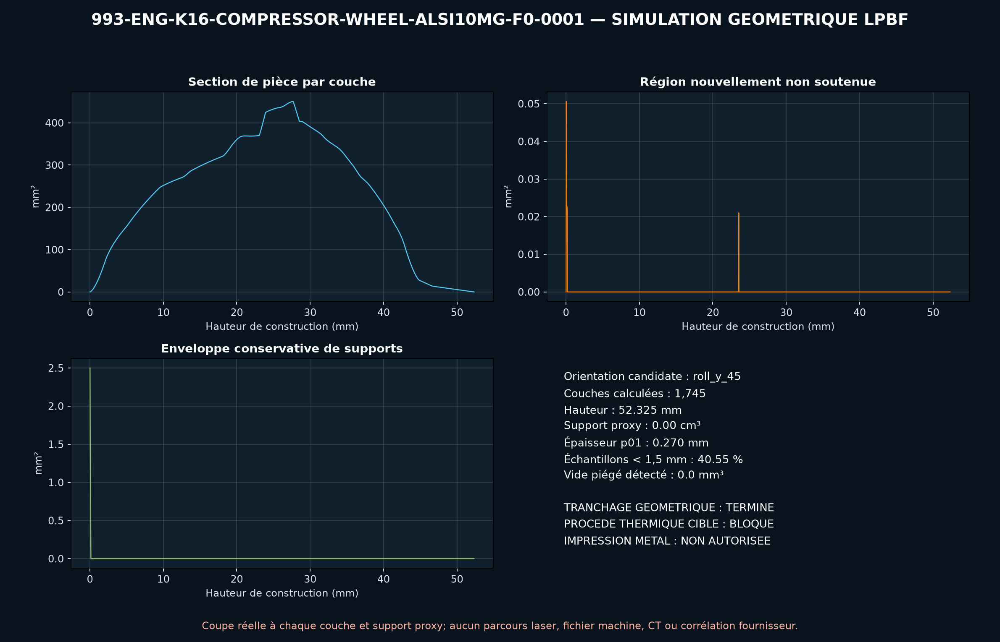

<!-- engendre par scripts/render_part_pages.py - ne pas editer a la main -->

# Roue de compresseur K16 993, concept AlSi10Mg LPBF F0

**Statut : **interdit en l'état**. Aucune pièce n'est libérée ; voir [SAFETY.md](../../SAFETY.md).**

Concept indépendant de roue de compresseur AlSi10Mg à six pales principales et six séparatrices droites. Seuls les diamètres inducer/exducer, le compte 6+6 et les références fournisseur sont publiés ; le moyeu, l'alésage et toutes les surfaces aérodynamiques restent des hypothèses F0.

Fiche du catalogue : [`catalog/parts/993-eng-k16-compressor-wheel-alsi10mg-f0-0001.json`](../../catalog/parts/993-eng-k16-compressor-wheel-alsi10mg-f0-0001.json)

## Identité

| champ | valeur |
|---|---|
| identifiant | 993-ENG-K16-COMPRESSOR-WHEEL-ALSI10MG-F0-0001 |
| génération | 993 |
| variantes | 993_Turbo, K16_right_research, M64_60_research |
| années | 1995 à 1998 |
| références Porsche | non renseigné |
| catégorie | turbocharger_compressor_wheel |
| classe de sécurité | prohibited_pending_engineering |
| usage prévu | Criblage CAO, DfAM, continuité, thermodynamique compresseur, disque tournant, traction de pale, dilatation, balourd et énergie ; aucune fabrication, rotation, installation ou mise en route autorisée |

## Matière et fabrication

| champ | valeur |
|---|---|
| procédé préféré | LPBF |
| procédés candidats | LPBF, DMLS, CNC, casting |
| famille de matière | alliage aluminium LPBF candidat |
| nuance | EOS AlSi10Mg de criblage ; alliage et procédé de la roue BorgWarner non publiés |
| norme | DIN EN 1706 / ASTM F3318 pour la poudre et spécification rotor propre au programme à contractualiser |
| exigences fournisseur | poudre, machine, paramètres, orientation, lot et recyclage traçables, coupons orientés avec traction, HCF, ténacité, propagation et défauts à température, simulation et témoins de distorsion pour pales, exducer, moyeu et alésage, CT intégral avant et après usinage, critères de défaut par zone et métallographie, métrologie des profils, épaisseurs, congés, alésage, battements et masse polaire, équilibrage haute vitesse, spin proof, sur-vitesse, burst et validation de confinement avant banc turbo |
| post-traitement | orientation, supports de pales et stratégie recoater à qualifier, détensionnement et traitement thermique qualifiés pour machine, paramètres et fatigue rotor, HIP à décider sur défauts, ténacité et résultats de sur-vitesse, usinage de l'alésage, du dos, du nez, des faces et des références d'équilibrage, ébavurage et finition aérodynamique contrôlée de chaque pale et congé, équilibrage individuel puis ensemble rotor, preuve de rotation et sur-vitesse confinée |

## Géométrie

| champ | valeur |
|---|---|
| type de source | mixed |
| format du maître | build123d |
| unités | mm |
| précision (mm) | non renseigné |

**Fichier maître**

- [`parts/993-eng-k16-compressor-wheel-alsi10mg-f0-0001/source/compressor_wheel.py`](../../parts/993-eng-k16-compressor-wheel-alsi10mg-f0-0001/source/compressor_wheel.py)

**Fichiers dérivés**

- [`parts/993-eng-k16-compressor-wheel-alsi10mg-f0-0001/derived/compressor_wheel_alsi10mg_f0.step`](../../parts/993-eng-k16-compressor-wheel-alsi10mg-f0-0001/derived/compressor_wheel_alsi10mg_f0.step)

## Images

*parts/993-eng-k16-compressor-wheel-alsi10mg-f0-0001/evidence/lpbf-f0/993-eng-k16-compressor-wheel-alsi10mg-f0-0001-lpbf-geometry-screen.png*

## Provenance et sources

| champ | valeur |
|---|---|
| licence de la fiche | MIT pour le concept, le script et les calculs ; aucune photographie, surface Porsche/BorgWarner/fournisseur ou géométrie commerciale redistribuée |

**Sources**

- [Invasion Auto Products - données internes déclarées du K16 993 Turbo droit](https://www.invasionautoproducts.com/94pocark16tu.html)
- [PorscheFanatics - contexte des turbocompresseurs 993](https://porschefanatics.com/engine/993/)
- [EOS Aluminium AlSi10Mg](https://www.eos.info/metal-solutions/metal-materials/data-sheets/mds-eos-aluminium-alsi10mg)
- [TurboMaster - principes de lecture d'une carte compresseur](https://www.turbomaster.info/eng/turbocharger-map.php)
- [elferclassic - données techniques du 993 Turbo](https://www.elferclassic.de/technik/techdaten/993-turbo-95-98-techdat.php)

## Validation

| champ | valeur |
|---|---|
| statut | concept |
| essais véhicule | non renseigné |
| revu par |  |
| limites | non renseigné |

**Preuves**

- [`catalog/sources/src-invasionautoproducts-993-k16-internal-data.json`](../../catalog/sources/src-invasionautoproducts-993-k16-internal-data.json)
- [`catalog/sources/src-porschefanatics-993-k16-compressor-wheel-candidate.json`](../../catalog/sources/src-porschefanatics-993-k16-compressor-wheel-candidate.json)
- [`catalog/sources/src-eos-alsi10mg-current-page.json`](../../catalog/sources/src-eos-alsi10mg-current-page.json)
- [`catalog/sources/src-turbomap-compressor-map-methodology.json`](../../catalog/sources/src-turbomap-compressor-map-methodology.json)
- [`catalog/sources/src-elferclassic-993-turbo-technical-data.json`](../../catalog/sources/src-elferclassic-993-turbo-technical-data.json)
- [`parts/993-eng-k16-compressor-wheel-alsi10mg-f0-0001/evidence/engineering-screen.json`](../../parts/993-eng-k16-compressor-wheel-alsi10mg-f0-0001/evidence/engineering-screen.json)

## Dossiers de conception

- [993_K16_COMPRESSOR_WHEEL_ALSI10MG_F0](../../docs/993/993_K16_COMPRESSOR_WHEEL_ALSI10MG_F0.md)

---

*Page engendrée depuis la fiche du catalogue par `scripts/render_part_pages.py`, vérifiée par `make check`. Toute correction se fait dans la fiche, pas ici.*
