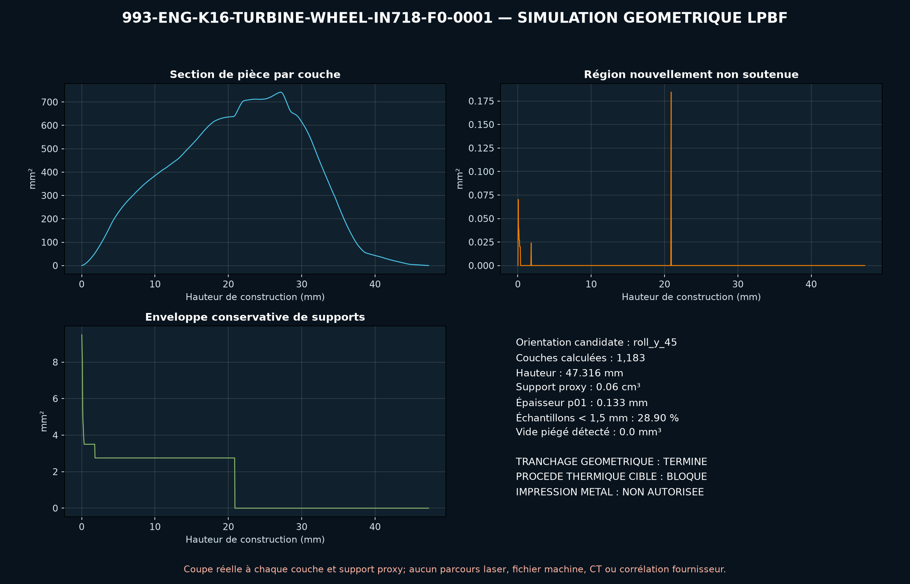

<!-- engendre par scripts/render_part_pages.py - ne pas editer a la main -->

# Roue de turbine K16, concept IN718 F0

**Statut : **interdit en l'état**. Aucune pièce n'est libérée ; voir [SAFETY.md](../../SAFETY.md).**

Concept propre de rotor chaud K16 à douze pales pour cribler l'intérêt et les limites d'une route LPBF IN718. Les diamètres, le compte de pales et la référence viennent de catalogues fournisseurs ; tous les profils et interfaces restent hypothétiques.

Fiche du catalogue : [`catalog/parts/993-eng-k16-turbine-wheel-in718-f0-0001.json`](../../catalog/parts/993-eng-k16-turbine-wheel-in718-f0-0001.json)

## Identité

| champ | valeur |
|---|---|
| identifiant | 993-ENG-K16-TURBINE-WHEEL-IN718-F0-0001 |
| génération | 993 |
| variantes | 993_Turbo |
| années | 1995 à 1998 |
| références Porsche | non renseigné |
| catégorie | turbocharger_turbine_wheel |
| classe de sécurité | prohibited_pending_engineering |
| usage prévu | Criblage F0 de CAO, rotation, sur-vitesse, thermique, puissance turbine, dilatation, balourd et cycles ; aucune fabrication, rotation, installation ou mise en route autorisée |

## Matière et fabrication

| champ | valeur |
|---|---|
| procédé préféré | à décider |
| procédés candidats | LPBF, DMLS, casting, CNC |
| famille de matière | superalliage nickel durcissable par précipitation, candidat LPBF |
| nuance | EOS NickelAlloy IN718 API, M290 40 µm, traité thermiquement pour comparaison |
| norme | UNS N07718 ; spécification rotor, procédé, traitement et admissibles propres au programme à contractualiser |
| exigences fournisseur | machine EOS M290, jeu IN718 API, logiciel, paramètres, poudre et lot traçables, coupons orientés avec traction, HCF, LCF, fluage, rupture, ténacité et propagation à température, témoins de distorsion et capabilité après finition des pointes 0,8 mm, CT intégral avant et après usinage avec critères de défauts zonés, FPI, métallographie, microstructure, dureté, rugosité et contraintes résiduelles, métrologie des profils, congés, interface, battements et inertie polaire, équilibrage haute vitesse, sur-vitesse, éclatement et confinement avant banc turbo |
| post-traitement | orientation et supports de pales à qualifier face au recoater, détensionnement, mise en solution, trempe gaz et vieillissement tracés, HIP à décider sur défauts, fluage, ténacité, HCF et éclatement, usinage de l'interface arbre, du dos, des références et surépaisseurs, profilage et polissage contrôlé des pales et congés, procédé de liaison roue-arbre ou arbre monobloc à qualifier, équilibrage individuel puis rotor, spin proof et sur-vitesse confinée |

## Géométrie

| champ | valeur |
|---|---|
| type de source | mixed |
| format du maître | build123d |
| unités | mm |
| précision (mm) | non renseigné |

**Fichier maître**

- [`parts/993-eng-k16-turbine-wheel-in718-f0-0001/source/turbine_wheel.py`](../../parts/993-eng-k16-turbine-wheel-in718-f0-0001/source/turbine_wheel.py)

**Fichiers dérivés**

- [`parts/993-eng-k16-turbine-wheel-in718-f0-0001/derived/turbine_wheel_in718_f0.step`](../../parts/993-eng-k16-turbine-wheel-in718-f0-0001/derived/turbine_wheel_in718_f0.step)

## Images

*parts/993-eng-k16-turbine-wheel-in718-f0-0001/evidence/lpbf-f0/993-eng-k16-turbine-wheel-in718-f0-0001-lpbf-geometry-screen.png*

## Provenance et sources

| champ | valeur |
|---|---|
| licence de la fiche | MIT pour le concept, le script et les calculs ; aucune photographie, illustration Porsche, surface BorgWarner/Kinugawa ou géométrie commerciale redistribuée |

**Sources**

- [PorscheFanatics - contexte des turbocompresseurs 993](https://porschefanatics.com/engine/993/)
- [TurboMaster - K16 5316-988-6735](https://www.turbomaster.com/eng/turbo/borgwarner/5316-988-6735/)
- [Invasion Auto Products - données internes déclarées du K16 droit](https://www.invasionautoproducts.com/94pocark16tu.html)
- [Kinugawa - roue K16 de remplacement](https://www.kinugawaturbo.com/products/kinugawa-turbo-turbine-wheel-for-posche-911-996-kkk-k16-49mm-55-mm-12-blades)
- [EOS NickelAlloy IN718 API pour EOS M 290, 40 micromètres](https://www.eos.info/metal-solutions/data-sheets/nickel-alloys/pds-eos-nickelalloy-in718-api-eos-m-290-40um)
- [BorgWarner - Performance Turbocharger Catalog](https://www.borgwarner.com/docs/default-source/iam/boosting-technologies/bw_turbo-performance-catalog.pdf)

## Validation

| champ | valeur |
|---|---|
| statut | concept |
| essais véhicule | non renseigné |
| revu par |  |
| limites | non renseigné |

**Preuves**

- [`catalog/sources/src-porschefanatics-993-k16-compressor-wheel-candidate.json`](../../catalog/sources/src-porschefanatics-993-k16-compressor-wheel-candidate.json)
- [`catalog/sources/src-turbomaster-993-k16-6735-parts.json`](../../catalog/sources/src-turbomaster-993-k16-6735-parts.json)
- [`catalog/sources/src-invasionautoproducts-993-k16-internal-data.json`](../../catalog/sources/src-invasionautoproducts-993-k16-internal-data.json)
- [`catalog/sources/src-kinugawa-k16-turbine-wheel-53161205000.json`](../../catalog/sources/src-kinugawa-k16-turbine-wheel-53161205000.json)
- [`catalog/sources/src-eos-in718-api-m290-40um.json`](../../catalog/sources/src-eos-in718-api-m290-40um.json)
- [`catalog/sources/src-borgwarner-993-k16-performance-catalog.json`](../../catalog/sources/src-borgwarner-993-k16-performance-catalog.json)
- [`parts/993-eng-k16-turbine-wheel-in718-f0-0001/evidence/engineering-screen.json`](../../parts/993-eng-k16-turbine-wheel-in718-f0-0001/evidence/engineering-screen.json)

## Dossiers de conception

- [993_K16_TURBINE_WHEEL_IN718_F0](../../docs/993/993_K16_TURBINE_WHEEL_IN718_F0.md)

---

*Page engendrée depuis la fiche du catalogue par `scripts/render_part_pages.py`, vérifiée par `make check`. Toute correction se fait dans la fiche, pas ici.*
