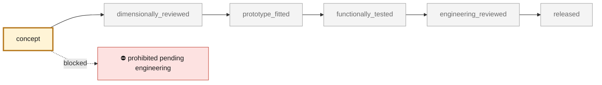
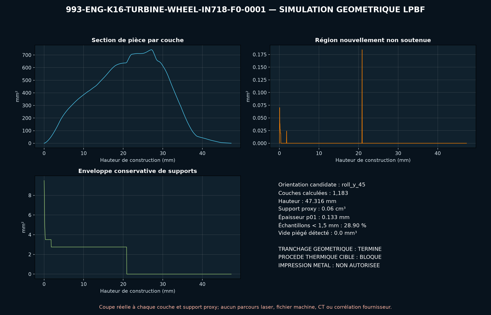
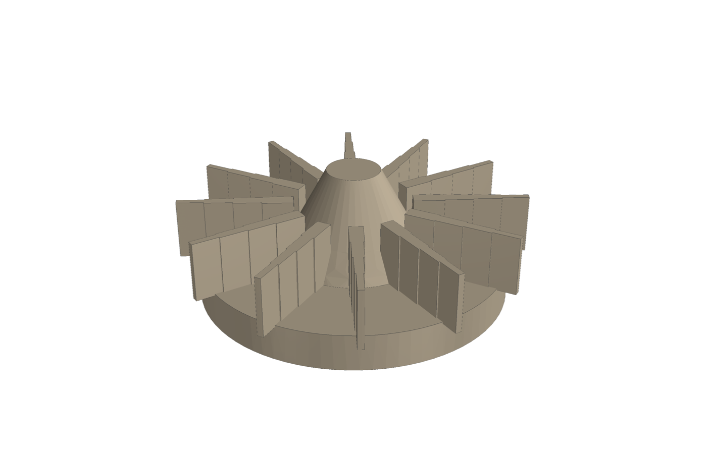
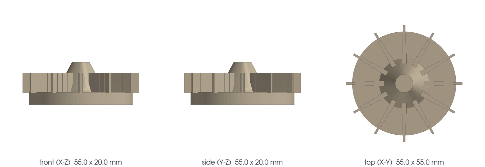
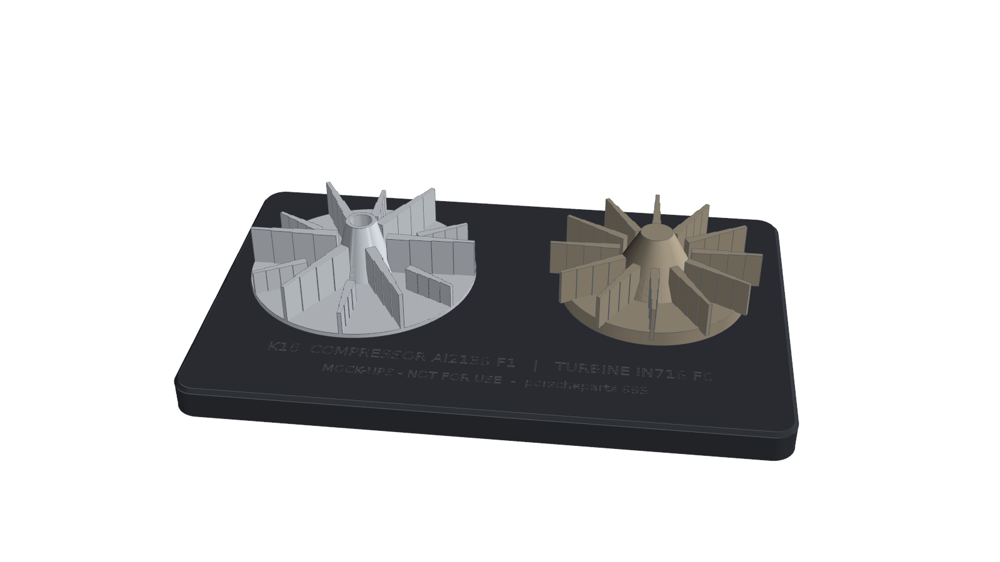

<!-- generated by scripts/render_part_pages.py - do not edit by hand -->

# K16 turbine wheel, IN718 F0 concept

**Status: **prohibited pending engineering**. No part is released; see [SAFETY.md](../../SAFETY.md).**

Clean-sheet concept of a twelve-blade K16 hot rotor to screen the value and limits of an IN718 LPBF route. The diameters, blade count and part reference come from supplier catalogues; all profiles and interfaces remain hypothetical.

```mermaid
flowchart LR
    L0["concept"]
    L1["dimensionally_reviewed"]
    L2["prototype_fitted"]
    L3["functionally_tested"]
    L4["engineering_reviewed"]
    L5["released"]
    L0 --> L1 --> L2 --> L3 --> L4 --> L5
    X["⛔ prohibited pending engineering"]
    L0 -. blocked .-> X
    classDef here fill:#fff4d6,stroke:#b7791f,color:#1a1a1a,stroke-width:3px;
    classDef done fill:#e3f1e6,stroke:#2e7d32,color:#1a1a1a;
    classDef todo fill:#f4f4f4,stroke:#9e9e9e,color:#6b6b6b;
    classDef stop fill:#fde2e1,stroke:#c0392b,color:#1a1a1a;
    class L0 here
    class L1 todo
    class L2 todo
    class L3 todo
    class L4 todo
    class L5 todo
    class X stop
```

*Validation ladder of `catalog/schemas/part.schema.json`; this record is at `concept`.*

Catalogue record: [`catalog/parts/993-eng-k16-turbine-wheel-in718-f0-0001.json`](../../catalog/parts/993-eng-k16-turbine-wheel-in718-f0-0001.json)

## Identity

| field | value |
|---|---|
| identifier | 993-ENG-K16-TURBINE-WHEEL-IN718-F0-0001 |
| generation | 993 |
| variants | 993_Turbo |
| model years | 1995 to 1998 |
| Porsche part numbers | not recorded |
| category | turbocharger_turbine_wheel |
| safety class | prohibited_pending_engineering |
| intended use | F0 screening of CAD, rotation, overspeed, thermal, turbine power, expansion, imbalance and cycles; no manufacturing, rotation, installation or engine start authorized |

## Material and manufacturing

| field | value |
|---|---|
| preferred process | undecided |
| candidate processes | LPBF, DMLS, casting, CNC |
| material family | precipitation-hardenable nickel superalloy, LPBF candidate |
| grade | EOS NickelAlloy IN718 API, M290 40 µm, heat treated for comparison |
| standard | UNS N07718; program-specific rotor, process, heat treatment and allowables specification to be contracted |
| supplier requirements | traceable EOS M290 machine, IN718 API parameter set, software, parameters, powder and lot, oriented coupons with tensile, HCF, LCF, creep, rupture, toughness and crack growth at temperature, distortion witnesses and capability after finishing of the 0.8 mm tips, full CT before and after machining with zoned defect criteria, FPI, metallography, microstructure, hardness, roughness and residual stresses, metrology of profiles, fillets, interface, runout and polar inertia, high-speed balancing, overspeed, burst and containment before turbo bench testing |
| post-processing | blade orientation and supports to be qualified against the recoater, traced stress relief, solution treatment, gas quench and aging, HIP to be decided on defects, creep, toughness, HCF and burst, machining of the shaft interface, back face, datums and allowances, controlled profiling and polishing of blades and fillets, wheel-to-shaft joining process or one-piece shaft to be qualified, individual then rotor balancing, spin proof and contained overspeed |

## Geometry

| field | value |
|---|---|
| source type | mixed |
| master format | build123d |
| units | mm |
| accuracy (mm) | not recorded |

**Master file**

- [`parts/993-eng-k16-turbine-wheel-in718-f0-0001/source/turbine_wheel.py`](../../parts/993-eng-k16-turbine-wheel-in718-f0-0001/source/turbine_wheel.py)

**Derived files**

- [`parts/993-eng-k16-turbine-wheel-in718-f0-0001/derived/turbine_wheel_in718_f0.step`](../../parts/993-eng-k16-turbine-wheel-in718-f0-0001/derived/turbine_wheel_in718_f0.step)

## Images

*`parts/993-eng-k16-turbine-wheel-in718-f0-0001/evidence/lpbf-f0/993-eng-k16-turbine-wheel-in718-f0-0001-lpbf-geometry-screen.png` — a screening output, not a validation.*

*`parts/993-eng-k16-turbine-wheel-in718-f0-0001/media/preview.png` — concept CAD block, **not** the original part, not a print file.*

*`parts/993-eng-k16-turbine-wheel-in718-f0-0001/media/views.png` — concept CAD block, **not** the original part, not a print file.*

*`parts/993-eng-k16-turbine-wheel-in718-f0-0001/print/mockup.png` — a screening output, not a validation.*

## Provenance and sources

| field | value |
|---|---|
| record license | All rights reserved (see LICENSE) for the concept, the script and the calculations; no photograph, Porsche illustration, BorgWarner/Kinugawa surface or commercial geometry redistributed |

**Sources**

- [PorscheFanatics - 993 turbocharger context](https://porschefanatics.com/engine/993/)
- [TurboMaster - K16 5316-988-6735](https://www.turbomaster.com/eng/turbo/borgwarner/5316-988-6735/)
- [Invasion Auto Products - stated internal data of the right K16](https://www.invasionautoproducts.com/94pocark16tu.html)
- [Kinugawa - replacement K16 wheel](https://www.kinugawaturbo.com/products/kinugawa-turbo-turbine-wheel-for-posche-911-996-kkk-k16-49mm-55-mm-12-blades)
- [EOS NickelAlloy IN718 API for EOS M 290, 40 micrometers](https://www.eos.info/metal-solutions/data-sheets/nickel-alloys/pds-eos-nickelalloy-in718-api-eos-m-290-40um)
- [BorgWarner - Performance Turbocharger Catalog](https://www.borgwarner.com/docs/default-source/iam/boosting-technologies/bw_turbo-performance-catalog.pdf)

## Validation

| field | value |
|---|---|
| status | concept |
| vehicle tested | not recorded |
| reviewed by |  |
| limitations | not recorded |

**Evidence**

- [`catalog/sources/src-porschefanatics-993-k16-compressor-wheel-candidate.json`](../../catalog/sources/src-porschefanatics-993-k16-compressor-wheel-candidate.json)
- [`catalog/sources/src-turbomaster-993-k16-6735-parts.json`](../../catalog/sources/src-turbomaster-993-k16-6735-parts.json)
- [`catalog/sources/src-invasionautoproducts-993-k16-internal-data.json`](../../catalog/sources/src-invasionautoproducts-993-k16-internal-data.json)
- [`catalog/sources/src-kinugawa-k16-turbine-wheel-53161205000.json`](../../catalog/sources/src-kinugawa-k16-turbine-wheel-53161205000.json)
- [`catalog/sources/src-eos-in718-api-m290-40um.json`](../../catalog/sources/src-eos-in718-api-m290-40um.json)
- [`catalog/sources/src-borgwarner-993-k16-performance-catalog.json`](../../catalog/sources/src-borgwarner-993-k16-performance-catalog.json)
- [`parts/993-eng-k16-turbine-wheel-in718-f0-0001/evidence/engineering-screen.json`](../../parts/993-eng-k16-turbine-wheel-in718-f0-0001/evidence/engineering-screen.json)

## Design dossiers

- [993_K16_TURBINE_WHEEL_IN718_F0](../../docs/993/993_K16_TURBINE_WHEEL_IN718_F0.md)

---

*Page generated from the catalogue record by `scripts/render_part_pages.py`, checked by `make check`. Corrections go in the record, not here.*
