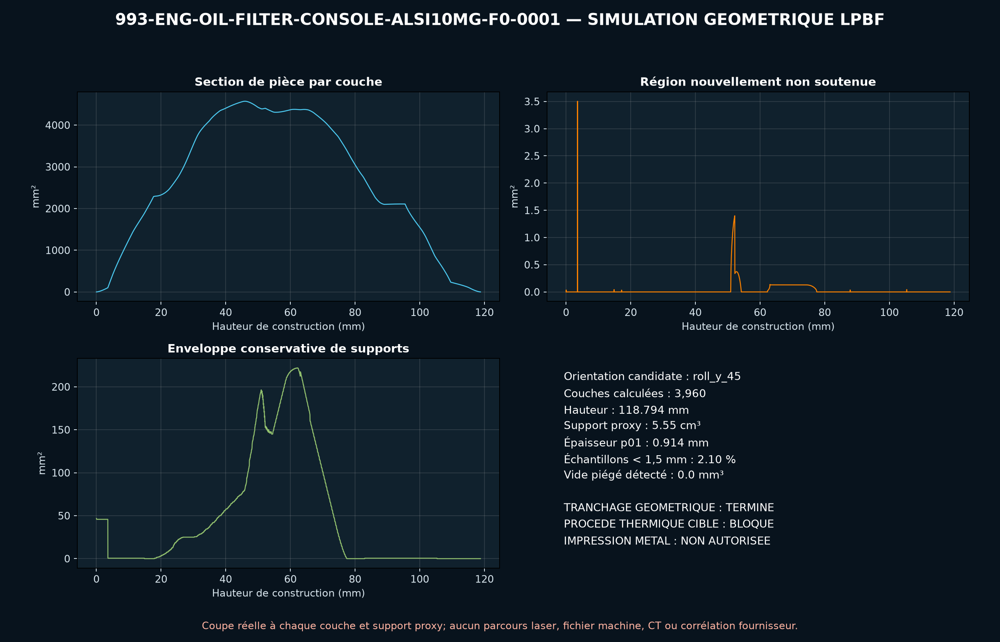

<!-- engendre par scripts/render_part_pages.py - ne pas editer a la main -->

# Console de filtre à huile moteur à galeries intégrées, concept AlSi10Mg F0

**Statut : **interdit en l'état**. Aucune pièce n'est libérée ; voir [SAFETY.md](../../SAFETY.md).**

Concept indépendant d'une console 993 réunissant socle de filtre, deux galeries non colinéaires et deux ports dans un seul corps. Les sources établissent les références, une masse commerciale et l'interface du filtre MAHLE OC 229, mais aucune géométrie OEM ; toutes les interfaces du F0 restent synthétiques.

Fiche du catalogue : [`catalog/parts/993-eng-oil-filter-console-alsi10mg-f0-0001.json`](../../catalog/parts/993-eng-oil-filter-console-alsi10mg-f0-0001.json)

## Identité

| champ | valeur |
|---|---|
| identifiant | 993-ENG-OIL-FILTER-CONSOLE-ALSI10MG-F0-0001 |
| génération | 993 |
| variantes | 993_M64_fitment_to_confirm |
| années | 1994 à 1998 |
| références Porsche | 99310705700, 99310705701 |
| catégorie | engine_oil_filter_console |
| classe de sécurité | prohibited_pending_engineering |
| usage prévu | Criblage F0 de CAO ouverte, valeur DfAM, perte de charge chaud/froid, pression, filetage, thermique, masse et propreté ; aucune fabrication, étanchéité, installation, circulation d'huile ou mise en route autorisée |

## Matière et fabrication

| champ | valeur |
|---|---|
| procédé préféré | à décider |
| procédés candidats | LPBF, DMLS, CNC, casting |
| famille de matière | alliage aluminium-silicium-magnésium candidat LPBF |
| nuance | EOS Aluminium AlSi10Mg T6 de comparaison ; architecture commerciale analogue en billet 6061-T6 |
| norme | DIN EN 1706 EN AC-43000 et ASTM F3318 pour le candidat ; spécification huile, étanchéité et propreté propre au programme à contractualiser |
| exigences fournisseur | machine, paramètres, orientation, supports, poudre et lot traçables, coupons orientés avec traction, fatigue, corrosion huile et pression à chaud, témoins de galeries pour rugosité, dépoudrage et propreté résiduelle, CT intégral, FPI et métallographie avec critères de défauts zonés, métrologie des datums, ports, face carter, filetage, portée filtre et perçages, preuve pression, éclatement, fuite, débit, cyclage thermique, vibration et endurance moteur |
| post-traitement | orientation et supports assurant l'ouverture de toutes les galeries à qualifier, détensionnement puis T6 avec distorsion et porosité suivies, HIP à décider sur fatigue, étanchéité et résultats de tomographie, usinage du plan de carter, des ports, perçages, bossages, portée filtre et filetage M20x1,5, ébavurage interne, dépoudrage, rinçage et extraction particulaire validés, traitement de surface compatible huile, joints, filets et température, conditionnement final en propreté moteur |

## Géométrie

| champ | valeur |
|---|---|
| type de source | mixed |
| format du maître | build123d |
| unités | mm |
| précision (mm) | non renseigné |

**Fichier maître**

- [`parts/993-eng-oil-filter-console-alsi10mg-f0-0001/source/oil_filter_console.py`](../../parts/993-eng-oil-filter-console-alsi10mg-f0-0001/source/oil_filter_console.py)

**Fichiers dérivés**

- [`parts/993-eng-oil-filter-console-alsi10mg-f0-0001/derived/oil_filter_console_alsi10mg_f0.step`](../../parts/993-eng-oil-filter-console-alsi10mg-f0-0001/derived/oil_filter_console_alsi10mg_f0.step)

## Images

*parts/993-eng-oil-filter-console-alsi10mg-f0-0001/evidence/lpbf-f0/993-eng-oil-filter-console-alsi10mg-f0-0001-lpbf-geometry-screen.png*

## Provenance et sources

| champ | valeur |
|---|---|
| licence de la fiche | MIT pour le concept, le script et les calculs ; aucune photographie, surface Porsche/PorscheFanatics/OEMVWShop/MAHLE/Islandworks/EOS ou géométrie commerciale redistribuée |

**Sources**

- [PorscheFanatics - console et filtre à huile moteur 993](https://porschefanatics.com/oem/993/101-10/)
- [OEMVWShop - console Porsche 993 107 057 01](https://www.oemvwshop.fr/99310705701-pieces-d-origine-porsche-p2689124/)
- [MHTeile - filtre MAHLE OC 229 pour Porsche 993](https://www.mhteile.com/en/p/1100-crankcase-mahle-oil-filter-for-porsche-993-1993-97-oc-229-99310720303-993170101)
- [Islandworks - console thermostat/filtre intégrée 6061-T6](https://islandworks.se/products/integrated-thermostat-filter-console-with-dual-cooler-output)
- [PorscheFanatics - données du manuel 993](https://porschefanatics.com/993/manual/)
- [EOS Aluminium AlSi10Mg material data sheet](https://www.eos.info/metal-solutions/metal-materials/data-sheets/mds-eos-aluminium-alsi10mg)

## Validation

| champ | valeur |
|---|---|
| statut | concept |
| essais véhicule | non renseigné |
| revu par |  |
| limites | non renseigné |

**Preuves**

- [`catalog/sources/src-porschefanatics-993-oil-filter-console-candidate.json`](../../catalog/sources/src-porschefanatics-993-oil-filter-console-candidate.json)
- [`catalog/sources/src-oemvwshop-993-oil-filter-console-mass.json`](../../catalog/sources/src-oemvwshop-993-oil-filter-console-mass.json)
- [`catalog/sources/src-mahleretail-oc229-993-filter-interface.json`](../../catalog/sources/src-mahleretail-oc229-993-filter-interface.json)
- [`catalog/sources/src-islandworks-integrated-oil-console-6061.json`](../../catalog/sources/src-islandworks-integrated-oil-console-6061.json)
- [`catalog/sources/src-porschefanatics-993-manual-data.json`](../../catalog/sources/src-porschefanatics-993-manual-data.json)
- [`catalog/sources/src-eos-alsi10mg-current-page.json`](../../catalog/sources/src-eos-alsi10mg-current-page.json)
- [`parts/993-eng-oil-filter-console-alsi10mg-f0-0001/evidence/engineering-screen.json`](../../parts/993-eng-oil-filter-console-alsi10mg-f0-0001/evidence/engineering-screen.json)

## Dossiers de conception

- [993_OIL_FILTER_CONSOLE_ALSI10MG_F0](../../docs/993/993_OIL_FILTER_CONSOLE_ALSI10MG_F0.md)

---

*Page engendrée depuis la fiche du catalogue par `scripts/render_part_pages.py`, vérifiée par `make check`. Toute correction se fait dans la fiche, pas ici.*
