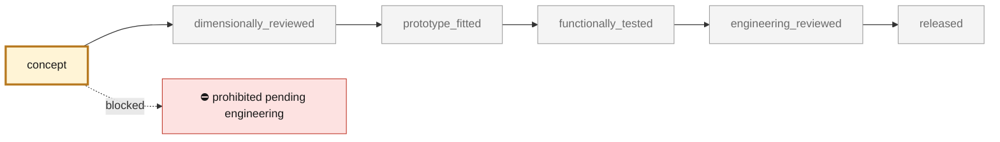
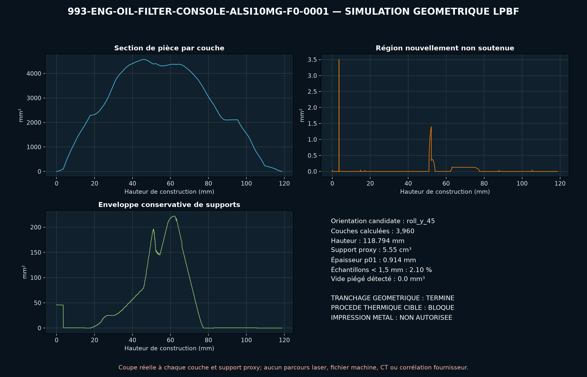
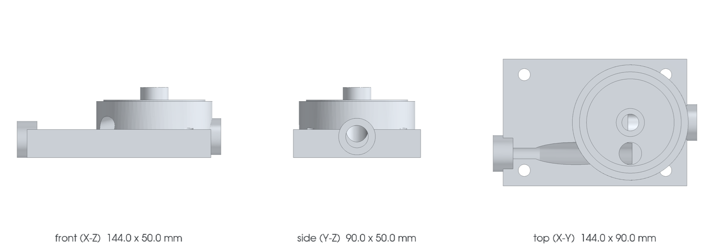

<!-- generated by scripts/render_part_pages.py - do not edit by hand -->

# Engine oil filter console with integrated galleries, AlSi10Mg concept F0

**Status: **prohibited pending engineering**. No part is released; see [SAFETY.md](../../SAFETY.md).**

Independent concept of a 993 console combining filter seat, two non-collinear galleries and two ports in a single body. The sources establish the part numbers, a commercial mass and the MAHLE OC 229 filter interface, but no OEM geometry; all F0 interfaces remain synthetic.

```mermaid
flowchart LR
    L0["concept"]
    L1["dimensionally_reviewed"]
    L2["prototype_fitted"]
    L3["functionally_tested"]
    L4["engineering_reviewed"]
    L5["released"]
    L0 --> L1 --> L2 --> L3 --> L4 --> L5
    X["⛔ prohibited pending engineering"]
    L0 -. blocked .-> X
    classDef here fill:#fff4d6,stroke:#b7791f,color:#1a1a1a,stroke-width:3px;
    classDef done fill:#e3f1e6,stroke:#2e7d32,color:#1a1a1a;
    classDef todo fill:#f4f4f4,stroke:#9e9e9e,color:#6b6b6b;
    classDef stop fill:#fde2e1,stroke:#c0392b,color:#1a1a1a;
    class L0 here
    class L1 todo
    class L2 todo
    class L3 todo
    class L4 todo
    class L5 todo
    class X stop
```

*Validation ladder of `catalog/schemas/part.schema.json`; this record is at `concept`.*

Catalogue record: [`catalog/parts/993-eng-oil-filter-console-alsi10mg-f0-0001.json`](../../catalog/parts/993-eng-oil-filter-console-alsi10mg-f0-0001.json)

## Identity

| field | value |
|---|---|
| identifier | 993-ENG-OIL-FILTER-CONSOLE-ALSI10MG-F0-0001 |
| generation | 993 |
| variants | 993_M64_fitment_to_confirm |
| model years | 1994 to 1998 |
| Porsche part numbers | 99310705700, 99310705701 |
| category | engine_oil_filter_console |
| safety class | prohibited_pending_engineering |
| intended use | F0 screening of open CAD, DfAM value, hot/cold pressure loss, pressure, threads, thermal, mass and cleanliness; no manufacture, sealing, installation, oil circulation or start-up authorized |

## Material and manufacturing

| field | value |
|---|---|
| preferred process | undecided |
| candidate processes | LPBF, DMLS, CNC, casting |
| material family | candidate LPBF aluminum-silicon-magnesium alloy |
| grade | EOS Aluminium AlSi10Mg T6 for comparison; analogous commercial architecture in 6061-T6 billet |
| standard | DIN EN 1706 EN AC-43000 and ASTM F3318 for the candidate; program-specific oil, sealing and cleanliness specification to be contracted |
| supplier requirements | traceable machine, parameters, orientation, supports, powder and batch, oriented coupons with tensile, fatigue, oil corrosion and hot pressure tests, gallery witnesses for roughness, powder removal and residual cleanliness, full CT, FPI and metallography with zoned defect criteria, metrology of the datums, ports, case face, thread, filter seat and drillings, proof of pressure, burst, leakage, flow, thermal cycling, vibration and engine endurance |
| post-processing | orientation and supports ensuring all galleries are open, to be qualified, stress relief then T6 with distortion and porosity monitored, HIP to be decided on fatigue, sealing and tomography results, machining of the case face, ports, drillings, bosses, filter seat and M20x1.5 thread, validated internal deburring, powder removal, flushing and particle extraction, surface treatment compatible with oil, seals, threads and temperature, final packaging to engine cleanliness standards |

## Geometry

| field | value |
|---|---|
| source type | mixed |
| master format | build123d |
| units | mm |
| accuracy (mm) | not recorded |

**Master file**

- [`parts/993-eng-oil-filter-console-alsi10mg-f0-0001/source/oil_filter_console.py`](../../parts/993-eng-oil-filter-console-alsi10mg-f0-0001/source/oil_filter_console.py)

**Derived files**

- [`parts/993-eng-oil-filter-console-alsi10mg-f0-0001/derived/oil_filter_console_alsi10mg_f0.step`](../../parts/993-eng-oil-filter-console-alsi10mg-f0-0001/derived/oil_filter_console_alsi10mg_f0.step)

## Images

*`parts/993-eng-oil-filter-console-alsi10mg-f0-0001/evidence/lpbf-f0/993-eng-oil-filter-console-alsi10mg-f0-0001-lpbf-geometry-screen.png` — a screening output, not a validation.*

*`parts/993-eng-oil-filter-console-alsi10mg-f0-0001/media/preview.png` — concept CAD block, **not** the original part, not a print file.*

*`parts/993-eng-oil-filter-console-alsi10mg-f0-0001/media/views.png` — concept CAD block, **not** the original part, not a print file.*

## Provenance and sources

| field | value |
|---|---|
| record license | All rights reserved (see LICENSE) for the concept, the script and the calculations; no photograph, Porsche/PorscheFanatics/OEMVWShop/MAHLE/Islandworks/EOS surface or commercial geometry redistributed |

**Sources**

- [PorscheFanatics - 993 engine oil filter console and filter](https://porschefanatics.com/oem/993/101-10/)
- [OEMVWShop - Porsche console 993 107 057 01](https://www.oemvwshop.fr/99310705701-pieces-d-origine-porsche-p2689124/)
- [MHTeile - MAHLE OC 229 filter for Porsche 993](https://www.mhteile.com/en/p/1100-crankcase-mahle-oil-filter-for-porsche-993-1993-97-oc-229-99310720303-993170101)
- [Islandworks - integrated thermostat/filter console, 6061-T6](https://islandworks.se/products/integrated-thermostat-filter-console-with-dual-cooler-output)
- [PorscheFanatics - 993 manual data](https://porschefanatics.com/993/manual/)
- [EOS Aluminium AlSi10Mg material data sheet](https://www.eos.info/metal-solutions/metal-materials/data-sheets/mds-eos-aluminium-alsi10mg)

## Validation

| field | value |
|---|---|
| status | concept |
| vehicle tested | not recorded |
| reviewed by |  |
| limitations | not recorded |

**Evidence**

- [`catalog/sources/src-porschefanatics-993-oil-filter-console-candidate.json`](../../catalog/sources/src-porschefanatics-993-oil-filter-console-candidate.json)
- [`catalog/sources/src-oemvwshop-993-oil-filter-console-mass.json`](../../catalog/sources/src-oemvwshop-993-oil-filter-console-mass.json)
- [`catalog/sources/src-mahleretail-oc229-993-filter-interface.json`](../../catalog/sources/src-mahleretail-oc229-993-filter-interface.json)
- [`catalog/sources/src-islandworks-integrated-oil-console-6061.json`](../../catalog/sources/src-islandworks-integrated-oil-console-6061.json)
- [`catalog/sources/src-porschefanatics-993-manual-data.json`](../../catalog/sources/src-porschefanatics-993-manual-data.json)
- [`catalog/sources/src-eos-alsi10mg-current-page.json`](../../catalog/sources/src-eos-alsi10mg-current-page.json)
- [`parts/993-eng-oil-filter-console-alsi10mg-f0-0001/evidence/engineering-screen.json`](../../parts/993-eng-oil-filter-console-alsi10mg-f0-0001/evidence/engineering-screen.json)

## Design dossiers

- [993_OIL_FILTER_CONSOLE_ALSI10MG_F0](../../docs/993/993_OIL_FILTER_CONSOLE_ALSI10MG_F0.md)

---

*Page generated from the catalogue record by `scripts/render_part_pages.py`, checked by `make check`. Corrections go in the record, not here.*
