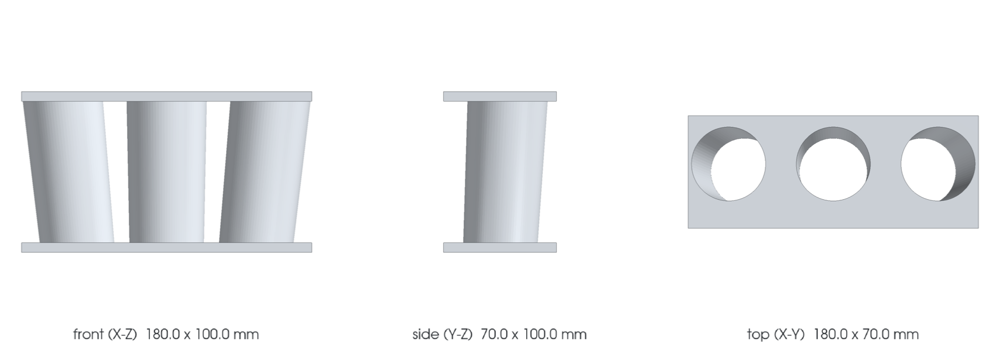

<!-- generated by scripts/render_part_pages.py - do not edit by hand -->

# 993 three-runner intake manifold, AlSi10Mg F0 concept

**Status: functional. No part is released; see [SAFETY.md](../../SAFETY.md).**

Independent concept of a manifold with three offset conical runners and two common flanges to screen AlSi10Mg LPBF. PorscheFanatics and Patrick Motorsports cross-check the PMO FUE PMO 9150 kit, stated as 46 x 42 x 100 mm, three bolts, two parts and a raw aluminum finish; no interface geometry is published.

*Validation ladder of `catalog/schemas/part.schema.json`; this record is at `concept`.*

Catalogue record: [`catalog/parts/993-eng-three-runner-intake-alsi10mg-f0-0001.json`](../../catalog/parts/993-eng-three-runner-intake-alsi10mg-f0-0001.json)

## Identity

| field | value |
|---|---|
| identifier | 993-ENG-THREE-RUNNER-INTAKE-ALSI10MG-F0-0001 |
| generation | 993 |
| variants | 993_3.6L_conversion, 993_3.8L_conversion, 964_shared_engine_conversion |
| model years | 1994 to 1998 |
| Porsche part numbers | not recorded |
| category | three_runner_intake_manifold |
| safety class | functional |
| intended use | CAD, DfAM, flow, acoustic, pressure and thermal screening; no manufacturing, installation or engine start authorized |

## Material and manufacturing

| field | value |
|---|---|
| preferred process | undecided |
| candidate processes | LPBF, DMLS, CNC, casting |
| material family | candidate LPBF aluminum alloy |
| grade | generic AlSi10Mg for screening; alloy and temper of the PMO product unknown |
| standard | ASTM F3318 and a program-specific engine specification to be contracted if LPBF is retained |
| supplier requirements | traceable powder, machine, parameters, orientation, lot and recycling, capability on 2 mm walls, inclined runners and 6 mm flanges, support, recoater and distortion simulation before build, CT of the runners and metrology of ports, flanges and future fastenings, porosity, roughness, flatness, leak-tightness and cleanliness contracted, flow, pressure, vibration, thermal cycling and engine dyno tests before vehicle |
| post-processing | complete powder removal through the three open runners, stress relief and heat treatment qualified on representative coupons, build plate cut-off with flange flatness check, machining of both flanges, ports and holes after adding measured machining allowances, deburring, polishing or abrasive finishing of the gas path with verified roughness, particulate cleaning and leak test before any flow test |

## Geometry

| field | value |
|---|---|
| source type | mixed |
| master format | build123d |
| units | mm |
| accuracy (mm) | not recorded |

**Master file**

- [`parts/993-eng-three-runner-intake-alsi10mg-f0-0001/source/three_runner_intake.py`](../../parts/993-eng-three-runner-intake-alsi10mg-f0-0001/source/three_runner_intake.py)

**Derived files**

- [`parts/993-eng-three-runner-intake-alsi10mg-f0-0001/derived/three_runner_intake_alsi10mg_f0.step`](../../parts/993-eng-three-runner-intake-alsi10mg-f0-0001/derived/three_runner_intake_alsi10mg_f0.step)

## Images

*parts/993-eng-three-runner-intake-alsi10mg-f0-0001/media/preview.png*

*parts/993-eng-three-runner-intake-alsi10mg-f0-0001/media/views.png*

## Provenance and sources

| field | value |
|---|---|
| record license | MIT for the concept, the script and the calculations; no photograph, trademark, illustration or PMO/Porsche geometry redistributed |

**Sources**

- [PorscheFanatics - PMO 46 mm manifold for 964/993 engine](https://porschefanatics.com/parts/g/964/)
- [Patrick Motorsports - PMO FUE PMO 9150](https://patrickmotorsports.com/collections/all-engine/products/fuepmo9150)
- [EOS Aluminium AlSi10Mg material page](https://www.eos.info/metal-solutions/metal-materials/data-sheets/mds-eos-aluminium-alsi10mg)

## Validation

| field | value |
|---|---|
| status | concept |
| vehicle tested | not recorded |
| reviewed by |  |
| limitations | not recorded |

**Evidence**

- [`catalog/sources/src-porschefanatics-pmo-964-993-46mm-intake-manifold.json`](../../catalog/sources/src-porschefanatics-pmo-964-993-46mm-intake-manifold.json)
- [`catalog/sources/src-patrick-pmo-964-993-46mm-intake-manifold.json`](../../catalog/sources/src-patrick-pmo-964-993-46mm-intake-manifold.json)
- [`catalog/sources/src-eos-alsi10mg-current-page.json`](../../catalog/sources/src-eos-alsi10mg-current-page.json)
- [`parts/993-eng-three-runner-intake-alsi10mg-f0-0001/evidence/engineering-screen.json`](../../parts/993-eng-three-runner-intake-alsi10mg-f0-0001/evidence/engineering-screen.json)

---

*Page generated from the catalogue record by `scripts/render_part_pages.py`, checked by `make check`. Corrections go in the record, not here.*
