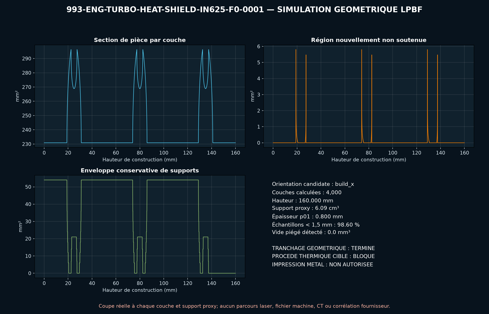
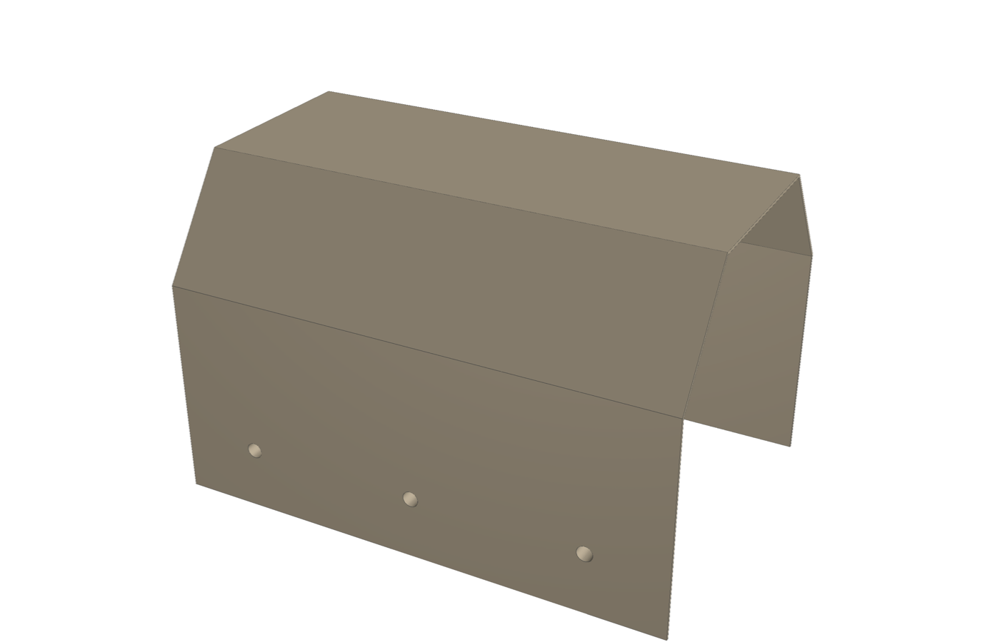
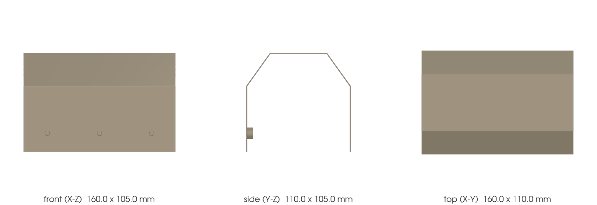

<!-- generated by scripts/render_part_pages.py - do not edit by hand -->

# 993 left turbo heat shield cover, F0 IN625 concept

**Status: functional. No part is released; see [SAFETY.md](../../SAFETY.md).**

Independent concept of an open shell with integrated bosses for screening an LPBF remanufacture in IN625. PorscheFanatics confirms the PET identity; FVD publishes only the envelope and mass of the left-hand cover 993 123 113 51.

*Validation ladder of `catalog/schemas/part.schema.json`; this record is at `concept`.*

Catalogue record: [`catalog/parts/993-eng-turbo-heat-shield-in625-f0-0001.json`](../../catalog/parts/993-eng-turbo-heat-shield-in625-f0-0001.json)

## Identity

| field | value |
|---|---|
| identifier | 993-ENG-TURBO-HEAT-SHIELD-IN625-F0-0001 |
| generation | 993 |
| variants | 993_Turbo, 993_GT2 |
| model years | 1995 to 1998 |
| Porsche part numbers | 99312311351 |
| category | turbocharger_heat_protection |
| safety class | functional |
| intended use | CAD, thermal, mechanical and DfAM screening; no manufacturing for fitment and no vehicle installation authorized |

## Material and manufacturing

| field | value |
|---|---|
| preferred process | undecided |
| candidate processes | LPBF, DMLS, sheet_metal |
| material family | candidate LPBF nickel superalloy |
| grade | EOS NickelAlloy IN625 / UNS N06625, screening; OEM material unknown |
| standard | ASTM F3055, AMS 7000 or AMS 7001 to be contracted according to the selected process |
| supplier requirements | traceable powder, machine, parameters, orientation, lot and recycling, demonstrated capability on a 0.8 mm wall and representative coupons, dimensional inspection of the envelope, edges and interfaces, CT or radiography of the bosses and penetrant testing after finishing, roughness, porosity, residual stresses and distortion specified by contract, thermal, vibration and cyclic tests before fitment |
| post-processing | support removal with full opening of the shell, stress relief qualified for the machine and parameters, removal from the build plate and controlled straightening of the thin wall, machining or boring of the interfaces after adding machining allowances, deburring and edge finishing, thermal coating to be decided after testing |

## Geometry

| field | value |
|---|---|
| source type | mixed |
| master format | build123d |
| units | mm |
| accuracy (mm) | not recorded |

**Master file**

- [`parts/993-eng-turbo-heat-shield-in625-f0-0001/source/turbo_heat_shield.py`](../../parts/993-eng-turbo-heat-shield-in625-f0-0001/source/turbo_heat_shield.py)

**Derived files**

- [`parts/993-eng-turbo-heat-shield-in625-f0-0001/derived/turbo_heat_shield_in625_f0.step`](../../parts/993-eng-turbo-heat-shield-in625-f0-0001/derived/turbo_heat_shield_in625_f0.step)

## Images

*parts/993-eng-turbo-heat-shield-in625-f0-0001/evidence/lpbf-f0/993-eng-turbo-heat-shield-in625-f0-0001-lpbf-geometry-screen.png*

*parts/993-eng-turbo-heat-shield-in625-f0-0001/media/preview.png*

*parts/993-eng-turbo-heat-shield-in625-f0-0001/media/views.png*

## Provenance and sources

| field | value |
|---|---|
| record license | MIT for the concept, the script and the calculations; no photograph, PET illustration or commercial geometry redistributed |

**Sources**

- [PorscheFanatics - PET transcription of the 993 Turbo groups](https://porschefanatics.com/oem/993/202-16/)
- [FVD - left heat shield cover 99312311351](https://www.fvd.net/en-ch/shop/cover-heat-protection-turbo-loader-left-99312311351~p248974)
- [EOS NickelAlloy IN625 material data sheet](https://www.eos.info/05-datasheet-images/Assets_MDS_Metal/EOS_NickelAlloy_IN625/Material_DataSheet_EOS_NickelAlloy_IN625_en.pdf)
- [Special Metals - INCONEL alloy 625](https://www.specialmetals.com/documents/technical-bulletins/inconel/inconel-alloy-625.pdf)

## Validation

| field | value |
|---|---|
| status | concept |
| vehicle tested | not recorded |
| reviewed by |  |
| limitations | not recorded |

**Evidence**

- [`catalog/sources/src-porschefanatics-993-turbo-pet.json`](../../catalog/sources/src-porschefanatics-993-turbo-pet.json)
- [`catalog/sources/src-fvd-993-turbo-heat-shield-dimensions.json`](../../catalog/sources/src-fvd-993-turbo-heat-shield-dimensions.json)
- [`catalog/sources/src-eos-in625-material-data.json`](../../catalog/sources/src-eos-in625-material-data.json)
- [`catalog/sources/src-special-metals-inconel-625.json`](../../catalog/sources/src-special-metals-inconel-625.json)
- [`parts/993-eng-turbo-heat-shield-in625-f0-0001/evidence/engineering-screen.json`](../../parts/993-eng-turbo-heat-shield-in625-f0-0001/evidence/engineering-screen.json)

## Design dossiers

- [993_TURBO_HEAT_SHIELD_IN625_F0](../../docs/993/993_TURBO_HEAT_SHIELD_IN625_F0.md)

---

*Page generated from the catalogue record by `scripts/render_part_pages.py`, checked by `make check`. Corrections go in the record, not here.*
