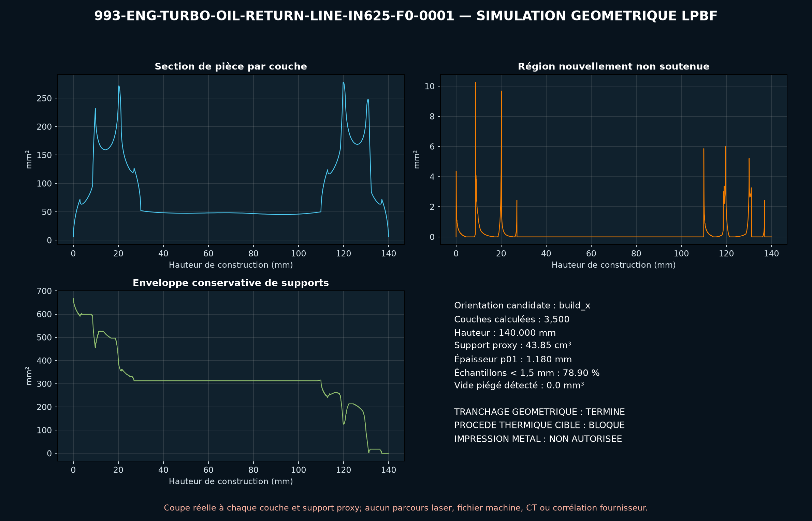

<!-- engendre par scripts/render_part_pages.py - ne pas editer a la main -->

# Conduite de retour d'huile turbo, concept IN625 F0

**Statut : **interdit en l'état**. Aucune pièce n'est libérée ; voir [SAFETY.md](../../SAFETY.md).**

Concept propre d'une conduite gauche à passage interne ouvert et deux brides intégrées. PorscheFanatics et Patrick Motorsports confirment le besoin fonctionnel 993 Turbo, mais aucune dimension ni matière ; toute la route F0 reste synthétique.

Fiche du catalogue : [`catalog/parts/993-eng-turbo-oil-return-line-in625-f0-0001.json`](../../catalog/parts/993-eng-turbo-oil-return-line-in625-f0-0001.json)

## Identité

| champ | valeur |
|---|---|
| identifiant | 993-ENG-TURBO-OIL-RETURN-LINE-IN625-F0-0001 |
| génération | 993 |
| variantes | 993_Turbo |
| années | 1996 à 1997 |
| références Porsche | 993 107 125 53, 993 107 126 53, 993 107 338 53, 993 107 339 53 |
| catégorie | turbocharger_oil_return_line |
| classe de sécurité | prohibited_pending_engineering |
| usage prévu | Criblage F0 de CAO creuse, hydraulique, pression, flexion, dilatation, thermique et DfAM ; aucune fabrication, installation, circulation d'huile ou mise en route autorisée |

## Matière et fabrication

| champ | valeur |
|---|---|
| procédé préféré | à décider |
| procédés candidats | LPBF, DMLS, sheet_metal, CNC |
| famille de matière | superalliage nickel résistant à la chaleur et à la corrosion, candidat LPBF |
| nuance | EOS NickelAlloy IN625 / UNS N06625 de comparaison ; matière commerciale inconnue |
| norme | ASTM F3055, AMS 7000 ou AMS 7001 et spécification de conduite propres au programme à contractualiser |
| exigences fournisseur | poudre, machine, paramètres, orientation, supports, lot et recyclage traçables, coupons minces orientés avec traction, fatigue, oxydation et compatibilité huile à chaud, capabilité démontrée sur paroi 1,2 mm et passage 10,3 mm sans support interne, CT intégral et borescope avec critères de défauts, obstruction et poudre résiduelle, métrologie des deux routes, brides, faces, entraxes, clocking et jeux véhicule, preuve pression, fuite, éclatement, débit, retour, cyclage thermique et vibration |
| post-traitement | orientation sans support interne et stratégie recoater à qualifier, retrait complet des supports externes et preuve de dé-poudrage, détensionnement et traitement thermique qualifiés pour la paroi mince, HIP à décider sur défauts, fatigue, étanchéité et résultats de pression, usinage des faces, alésages, portées et références après compensation, finition interne contrôlée sans rétention de média ou débris, nettoyage huile moteur, passivation et conditionnement de propreté |

## Géométrie

| champ | valeur |
|---|---|
| type de source | estimated |
| format du maître | build123d |
| unités | mm |
| précision (mm) | non renseigné |

**Fichier maître**

- [`parts/993-eng-turbo-oil-return-line-in625-f0-0001/source/turbo_oil_return_line.py`](../../parts/993-eng-turbo-oil-return-line-in625-f0-0001/source/turbo_oil_return_line.py)

**Fichiers dérivés**

- [`parts/993-eng-turbo-oil-return-line-in625-f0-0001/derived/turbo_oil_return_line_in625_f0.step`](../../parts/993-eng-turbo-oil-return-line-in625-f0-0001/derived/turbo_oil_return_line_in625_f0.step)

## Images

*parts/993-eng-turbo-oil-return-line-in625-f0-0001/evidence/lpbf-f0/993-eng-turbo-oil-return-line-in625-f0-0001-lpbf-geometry-screen.png*

## Provenance et sources

| champ | valeur |
|---|---|
| licence de la fiche | MIT pour le concept, le script et les calculs ; aucune photographie, surface Porsche/Patrick Motorsports/EOS ou géométrie commerciale redistribuée |

**Sources**

- [PorscheFanatics - conduite de retour d'huile turbo candidate](https://porschefanatics.com/engine/993/)
- [Patrick Motorsports - jeu de conduites de retour d'huile turbo 993](https://patrickmotorsports.com/products/tur99310733853pms)
- [EOS NickelAlloy IN625 material data sheet](https://www.eos.info/05-datasheet-images/Assets_MDS_Metal/EOS_NickelAlloy_IN625/Material_DataSheet_EOS_NickelAlloy_IN625_en.pdf)
- [Special Metals - INCONEL alloy 625](https://www.specialmetals.com/documents/technical-bulletins/inconel/inconel-alloy-625.pdf)
- [Catalogue d'usine 993, planche 202-16 Turbocharger](https://porschefanatics.com/oem/993/202-16/)

## Validation

| champ | valeur |
|---|---|
| statut | concept |
| essais véhicule | non renseigné |
| revu par |  |
| limites | non renseigné |

**Preuves**

- [`catalog/sources/src-porschefanatics-993-turbo-oil-return-candidate.json`](../../catalog/sources/src-porschefanatics-993-turbo-oil-return-candidate.json)
- [`catalog/sources/src-patrickmotorsports-993-turbo-oil-return-pipes.json`](../../catalog/sources/src-patrickmotorsports-993-turbo-oil-return-pipes.json)
- [`catalog/sources/src-eos-in625-material-data.json`](../../catalog/sources/src-eos-in625-material-data.json)
- [`catalog/sources/src-special-metals-inconel-625.json`](../../catalog/sources/src-special-metals-inconel-625.json)
- [`parts/993-eng-turbo-oil-return-line-in625-f0-0001/evidence/engineering-screen.json`](../../parts/993-eng-turbo-oil-return-line-in625-f0-0001/evidence/engineering-screen.json)

## Dossiers de conception

- [993_CIRCUIT_HUILE_TURBO_202-16](../../docs/993/993_CIRCUIT_HUILE_TURBO_202-16.md)
- [993_TURBO_OIL_RETURN_LINE_IN625_F0](../../docs/993/993_TURBO_OIL_RETURN_LINE_IN625_F0.md)

---

*Page engendrée depuis la fiche du catalogue par `scripts/render_part_pages.py`, vérifiée par `make check`. Toute correction se fait dans la fiche, pas ici.*
