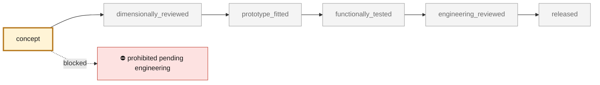
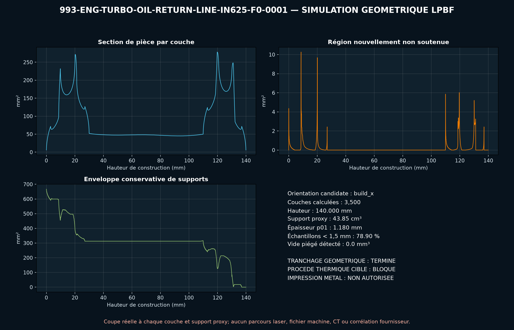
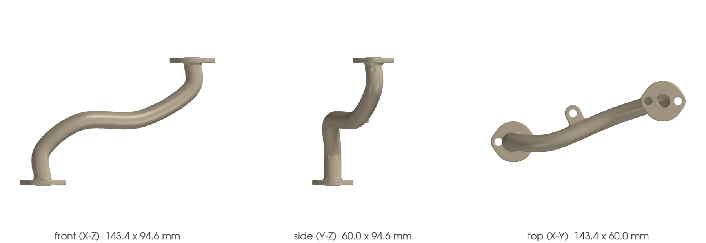

<!-- generated by scripts/render_part_pages.py - do not edit by hand -->

# Turbo oil return line, IN625 F0 concept

**Status: **prohibited pending engineering**. No part is released; see [SAFETY.md](../../SAFETY.md).**

Clean-sheet concept of a left line with an open internal passage and two integrated flanges. PorscheFanatics and Patrick Motorsports confirm the 993 Turbo functional need, but no dimension or material; the entire F0 route remains synthetic.

```mermaid
flowchart LR
    L0["concept"]
    L1["dimensionally_reviewed"]
    L2["prototype_fitted"]
    L3["functionally_tested"]
    L4["engineering_reviewed"]
    L5["released"]
    L0 --> L1 --> L2 --> L3 --> L4 --> L5
    X["⛔ prohibited pending engineering"]
    L0 -. blocked .-> X
    classDef here fill:#fff4d6,stroke:#b7791f,color:#1a1a1a,stroke-width:3px;
    classDef done fill:#e3f1e6,stroke:#2e7d32,color:#1a1a1a;
    classDef todo fill:#f4f4f4,stroke:#9e9e9e,color:#6b6b6b;
    classDef stop fill:#fde2e1,stroke:#c0392b,color:#1a1a1a;
    class L0 here
    class L1 todo
    class L2 todo
    class L3 todo
    class L4 todo
    class L5 todo
    class X stop
```

*Validation ladder of `catalog/schemas/part.schema.json`; this record is at `concept`.*

Catalogue record: [`catalog/parts/993-eng-turbo-oil-return-line-in625-f0-0001.json`](../../catalog/parts/993-eng-turbo-oil-return-line-in625-f0-0001.json)

## Identity

| field | value |
|---|---|
| identifier | 993-ENG-TURBO-OIL-RETURN-LINE-IN625-F0-0001 |
| generation | 993 |
| variants | 993_Turbo |
| model years | 1996 to 1997 |
| Porsche part numbers | 993 107 125 53, 993 107 126 53, 993 107 338 53, 993 107 339 53 |
| category | turbocharger_oil_return_line |
| safety class | prohibited_pending_engineering |
| intended use | F0 screening of hollow CAD, hydraulics, pressure, bending, expansion, thermal and DfAM; no manufacturing, installation, oil circulation or engine start authorized |

## Material and manufacturing

| field | value |
|---|---|
| preferred process | undecided |
| candidate processes | LPBF, DMLS, sheet_metal, CNC |
| material family | heat- and corrosion-resistant nickel superalloy, LPBF candidate |
| grade | EOS NickelAlloy IN625 / UNS N06625 for comparison; commercial material unknown |
| standard | ASTM F3055, AMS 7000 or AMS 7001 and a program-specific line specification to be contracted |
| supplier requirements | traceable powder, machine, parameters, orientation, supports, lot and recycling, oriented thin coupons with tensile, fatigue, oxidation and hot oil compatibility, demonstrated capability on a 1.2 mm wall and a 10.3 mm passage with no internal support, full CT and borescope with criteria for defects, obstruction and residual powder, metrology of both routes, flanges, faces, spacings, clocking and vehicle clearances, proof of pressure, leakage, burst, flow, return, thermal cycling and vibration |
| post-processing | orientation with no internal support and recoater strategy to be qualified, complete removal of external supports and proof of depowdering, stress relief and heat treatment qualified for the thin wall, HIP to be decided on defects, fatigue, leak-tightness and pressure results, machining of faces, bores, seats and datums after compensation, controlled internal finishing with no media or debris retention, engine-oil cleaning, passivation and cleanliness packaging |

## Geometry

| field | value |
|---|---|
| source type | estimated |
| master format | build123d |
| units | mm |
| accuracy (mm) | not recorded |

**Master file**

- [`parts/993-eng-turbo-oil-return-line-in625-f0-0001/source/turbo_oil_return_line.py`](../../parts/993-eng-turbo-oil-return-line-in625-f0-0001/source/turbo_oil_return_line.py)

**Derived files**

- [`parts/993-eng-turbo-oil-return-line-in625-f0-0001/derived/turbo_oil_return_line_in625_f0.step`](../../parts/993-eng-turbo-oil-return-line-in625-f0-0001/derived/turbo_oil_return_line_in625_f0.step)

## Images

*`parts/993-eng-turbo-oil-return-line-in625-f0-0001/evidence/lpbf-f0/993-eng-turbo-oil-return-line-in625-f0-0001-lpbf-geometry-screen.png` — a screening output, not a validation.*

*`parts/993-eng-turbo-oil-return-line-in625-f0-0001/media/preview.png` — concept CAD block, **not** the original part, not a print file.*

*`parts/993-eng-turbo-oil-return-line-in625-f0-0001/media/views.png` — concept CAD block, **not** the original part, not a print file.*

## Provenance and sources

| field | value |
|---|---|
| record license | All rights reserved (see LICENSE) for the concept, the script and the calculations; no photograph, Porsche/Patrick Motorsports/EOS surface or commercial geometry redistributed |

**Sources**

- [PorscheFanatics - candidate turbo oil return line](https://porschefanatics.com/engine/993/)
- [Patrick Motorsports - 993 turbo oil return line set](https://patrickmotorsports.com/products/tur99310733853pms)
- [EOS NickelAlloy IN625 material data sheet](https://www.eos.info/05-datasheet-images/Assets_MDS_Metal/EOS_NickelAlloy_IN625/Material_DataSheet_EOS_NickelAlloy_IN625_en.pdf)
- [Special Metals - INCONEL alloy 625](https://www.specialmetals.com/documents/technical-bulletins/inconel/inconel-alloy-625.pdf)
- [993 factory catalogue, plate 202-16 Turbocharger](https://porschefanatics.com/oem/993/202-16/)

## Validation

| field | value |
|---|---|
| status | concept |
| vehicle tested | not recorded |
| reviewed by |  |
| limitations | not recorded |

**Evidence**

- [`catalog/sources/src-porschefanatics-993-turbo-oil-return-candidate.json`](../../catalog/sources/src-porschefanatics-993-turbo-oil-return-candidate.json)
- [`catalog/sources/src-patrickmotorsports-993-turbo-oil-return-pipes.json`](../../catalog/sources/src-patrickmotorsports-993-turbo-oil-return-pipes.json)
- [`catalog/sources/src-eos-in625-material-data.json`](../../catalog/sources/src-eos-in625-material-data.json)
- [`catalog/sources/src-special-metals-inconel-625.json`](../../catalog/sources/src-special-metals-inconel-625.json)
- [`parts/993-eng-turbo-oil-return-line-in625-f0-0001/evidence/engineering-screen.json`](../../parts/993-eng-turbo-oil-return-line-in625-f0-0001/evidence/engineering-screen.json)

## Design dossiers

- [993_CIRCUIT_HUILE_TURBO_202-16](../../docs/993/993_CIRCUIT_HUILE_TURBO_202-16.md)
- [993_TURBO_OIL_RETURN_LINE_IN625_F0](../../docs/993/993_TURBO_OIL_RETURN_LINE_IN625_F0.md)

---

*Page generated from the catalogue record by `scripts/render_part_pages.py`, checked by `make check`. Corrections go in the record, not here.*
