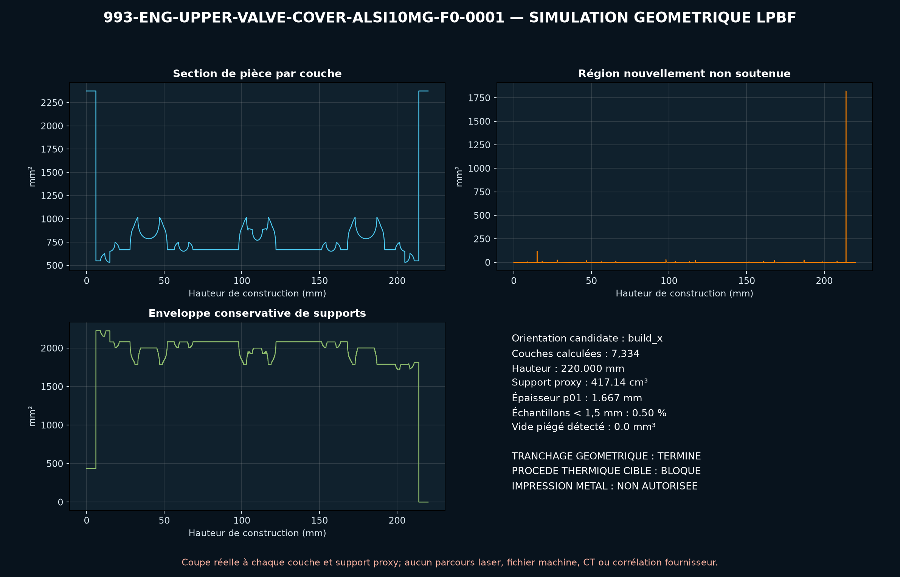

<!-- engendre par scripts/render_part_pages.py - ne pas editer a la main -->

# Couvre-culasse supérieur avec tours COP, concept AlSi10Mg F0

**Statut : **interdit en l'état**. Aucune pièce n'est libérée ; voir [SAFETY.md](../../SAFETY.md).**

Concept indépendant d'un couvre-culasse supérieur 993 ouvert côté huile, avec six ailettes et trois tours coil-on-plug intégrées. Les sources confirment des alternatives billet et l'intérêt COP, mais aucune géométrie individuelle ; toutes les interfaces F0 sont synthétiques.

Fiche du catalogue : [`catalog/parts/993-eng-upper-valve-cover-alsi10mg-f0-0001.json`](../../catalog/parts/993-eng-upper-valve-cover-alsi10mg-f0-0001.json)

## Identité

| champ | valeur |
|---|---|
| identifiant | 993-ENG-UPPER-VALVE-COVER-ALSI10MG-F0-0001 |
| génération | 993 |
| variantes | 993_Carrera, 993_Turbo |
| années | 1994 à 1998 |
| références Porsche | non renseigné |
| catégorie | upper_valve_cover_with_ignition_mounting |
| classe de sécurité | prohibited_pending_engineering |
| usage prévu | Criblage F0 de CAO ouverte, consolidation COP, pression carter, serrage, planéité, thermique, convection et masse ; aucune fabrication, étanchéité, installation ou mise en route autorisée |

## Matière et fabrication

| champ | valeur |
|---|---|
| procédé préféré | à décider |
| procédés candidats | LPBF, DMLS, CNC, casting |
| famille de matière | alliage aluminium-silicium-magnésium candidat LPBF |
| nuance | EOS Aluminium AlSi10Mg T6 de comparaison ; produits commerciaux en aluminium billet/6061-T6 |
| norme | DIN EN 1706 EN AC-43000 et ASTM F3318 pour le candidat ; spécification étanchéité/planéité propre au programme à contractualiser |
| exigences fournisseur | machine, paramètres, orientation, supports, poudre et lot traçables, coupons orientés avec traction, fatigue, fluage, huile et corrosion à chaud, témoins de planéité et distorsion après T6 et usinage, CT intégral, FPI et métallographie avec critères de défauts zonés, métrologie face joint, bolt pattern, tours COP, évents et jeux, preuve pression, fuite, cyclage thermique, vibration et endurance moteur |
| post-traitement | orientation ouverte, supports et stratégie recoater à qualifier, détensionnement puis T6 avec trempe et distorsion contrôlées, HIP à décider sur porosité, étanchéité, fatigue et résultats de fuite, usinage de la face joint, des perçages, tours COP, évents et datums, ébavurage et finition côté huile sans rétention de poudre ou média, anodisation compatible huile, température, joints et bobines, nettoyage moteur et conditionnement de propreté |

## Géométrie

| champ | valeur |
|---|---|
| type de source | estimated |
| format du maître | build123d |
| unités | mm |
| précision (mm) | non renseigné |

**Fichier maître**

- [`parts/993-eng-upper-valve-cover-alsi10mg-f0-0001/source/upper_valve_cover.py`](../../parts/993-eng-upper-valve-cover-alsi10mg-f0-0001/source/upper_valve_cover.py)

**Fichiers dérivés**

- [`parts/993-eng-upper-valve-cover-alsi10mg-f0-0001/derived/upper_valve_cover_alsi10mg_f0.step`](../../parts/993-eng-upper-valve-cover-alsi10mg-f0-0001/derived/upper_valve_cover_alsi10mg_f0.step)

## Images

*parts/993-eng-upper-valve-cover-alsi10mg-f0-0001/evidence/lpbf-f0/993-eng-upper-valve-cover-alsi10mg-f0-0001-lpbf-geometry-screen.png*

## Provenance et sources

| champ | valeur |
|---|---|
| licence de la fiche | MIT pour le concept, le script et les calculs ; aucune photographie, surface Porsche/FVD/Protomotive/BBi/EOS ou géométrie commerciale redistribuée |

**Sources**

- [PorscheFanatics - couvre-culasses et intégration coil-on-plug 993](https://porschefanatics.com/engine/993/)
- [FVD - jeu complet de couvre-culasses billet 993](https://www.fvd.net/en-us/shop/complete-upper-and-lower-valve-cover-set-993-carrera-rs-billet-aluminum-made-in-germany-fvd105993cset~p312212)
- [Protomotive - couvre-culasses supérieurs 993 6061-T6](https://www.protomotive.com/wp422/product/993-turbo-and-carrera-upper-valve-covers/)
- [PorscheFanatics - couples de serrage 993](https://porschefanatics.com/993/torques/)
- [EOS Aluminium AlSi10Mg material data sheet](https://www.eos.info/metal-solutions/metal-materials/data-sheets/mds-eos-aluminium-alsi10mg)

## Validation

| champ | valeur |
|---|---|
| statut | concept |
| essais véhicule | non renseigné |
| revu par |  |
| limites | non renseigné |

**Preuves**

- [`catalog/sources/src-porschefanatics-993-valve-cover-candidate.json`](../../catalog/sources/src-porschefanatics-993-valve-cover-candidate.json)
- [`catalog/sources/src-fvd-993-billet-valve-cover-set.json`](../../catalog/sources/src-fvd-993-billet-valve-cover-set.json)
- [`catalog/sources/src-protomotive-993-upper-valve-cover-6061.json`](../../catalog/sources/src-protomotive-993-upper-valve-cover-6061.json)
- [`catalog/sources/src-porschefanatics-993-torques.json`](../../catalog/sources/src-porschefanatics-993-torques.json)
- [`catalog/sources/src-eos-alsi10mg-current-page.json`](../../catalog/sources/src-eos-alsi10mg-current-page.json)
- [`parts/993-eng-upper-valve-cover-alsi10mg-f0-0001/evidence/engineering-screen.json`](../../parts/993-eng-upper-valve-cover-alsi10mg-f0-0001/evidence/engineering-screen.json)

## Dossiers de conception

- [993_UPPER_VALVE_COVER_ALSI10MG_F0](../../docs/993/993_UPPER_VALVE_COVER_ALSI10MG_F0.md)

---

*Page engendrée depuis la fiche du catalogue par `scripts/render_part_pages.py`, vérifiée par `make check`. Toute correction se fait dans la fiche, pas ici.*
