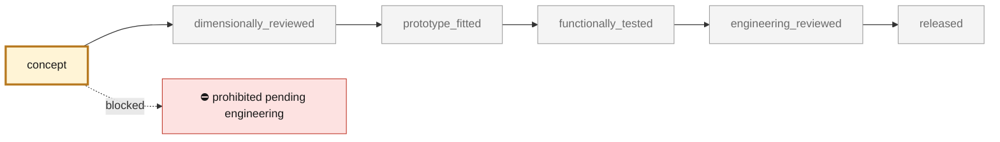
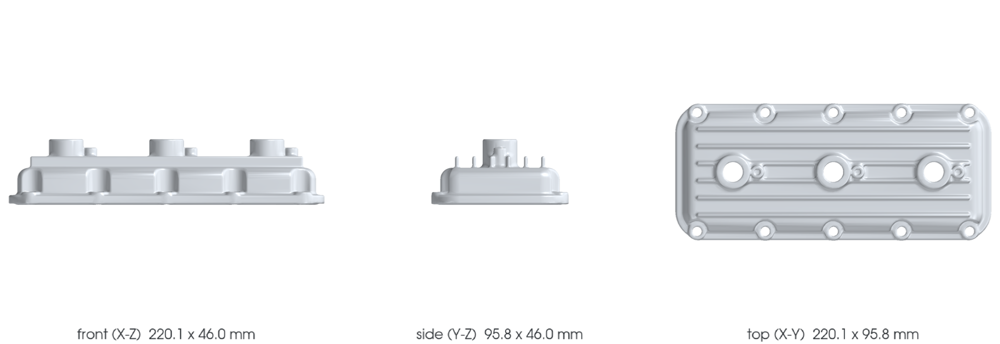

<!-- generated by scripts/render_part_pages.py - do not edit by hand -->

# Upper valve cover with COP towers, F0 AlSi10Mg concept

**Status: **prohibited pending engineering**. No part is released; see [SAFETY.md](../../SAFETY.md).**

Independent concept of a 993 upper valve cover, open on the oil side, with six fins and three integrated coil-on-plug towers. The sources confirm billet alternatives and interest in COP, but no individual geometry; all F0 interfaces are synthetic.

```mermaid
flowchart LR
    L0["concept"]
    L1["dimensionally_reviewed"]
    L2["prototype_fitted"]
    L3["functionally_tested"]
    L4["engineering_reviewed"]
    L5["released"]
    L0 --> L1 --> L2 --> L3 --> L4 --> L5
    X["⛔ prohibited pending engineering"]
    L0 -. blocked .-> X
    classDef here fill:#fff4d6,stroke:#b7791f,color:#1a1a1a,stroke-width:3px;
    classDef done fill:#e3f1e6,stroke:#2e7d32,color:#1a1a1a;
    classDef todo fill:#f4f4f4,stroke:#9e9e9e,color:#6b6b6b;
    classDef stop fill:#fde2e1,stroke:#c0392b,color:#1a1a1a;
    class L0 here
    class L1 todo
    class L2 todo
    class L3 todo
    class L4 todo
    class L5 todo
    class X stop
```

*Validation ladder of `catalog/schemas/part.schema.json`; this record is at `concept`.*

Catalogue record: [`catalog/parts/993-eng-upper-valve-cover-alsi10mg-f0-0001.json`](../../catalog/parts/993-eng-upper-valve-cover-alsi10mg-f0-0001.json)

## Identity

| field | value |
|---|---|
| identifier | 993-ENG-UPPER-VALVE-COVER-ALSI10MG-F0-0001 |
| generation | 993 |
| variants | 993_Carrera, 993_Turbo |
| model years | 1994 to 1998 |
| Porsche part numbers | not recorded |
| category | upper_valve_cover_with_ignition_mounting |
| safety class | prohibited_pending_engineering |
| intended use | F0 screening of open CAD, COP consolidation, crankcase pressure, clamping, flatness, thermal, convection and mass; no manufacturing, sealing, installation or start-up authorized |

## Material and manufacturing

| field | value |
|---|---|
| preferred process | undecided |
| candidate processes | LPBF, DMLS, CNC, casting |
| material family | candidate LPBF aluminum-silicon-magnesium alloy |
| grade | EOS Aluminium AlSi10Mg T6, for comparison; commercial products in billet aluminum/6061-T6 |
| standard | DIN EN 1706 EN AC-43000 and ASTM F3318 for the candidate; program-specific sealing/flatness specification to be contracted |
| supplier requirements | traceable machine, parameters, orientation, supports, powder and lot, oriented coupons with tensile, fatigue, creep, oil and hot corrosion, flatness and distortion witnesses after T6 and machining, full CT, FPI and metallography with zoned defect criteria, metrology of gasket face, bolt pattern, COP towers, vents and clearances, pressure, leak, thermal cycling, vibration and engine endurance proof |
| post-processing | open orientation, supports and recoater strategy to be qualified, stress relief then T6 with controlled quench and distortion, HIP to be decided on porosity, sealing, fatigue and leak results, machining of the gasket face, holes, COP towers, vents and datums, deburring and oil-side finishing without retention of powder or media, anodizing compatible with oil, temperature, gaskets and coils, engine cleaning and cleanliness conditioning |

## Geometry

| field | value |
|---|---|
| source type | estimated |
| master format | build123d |
| units | mm |
| accuracy (mm) | not recorded |

**Master file**

- [`parts/993-eng-upper-valve-cover-alsi10mg-f0-0001/source/upper_valve_cover.py`](../../parts/993-eng-upper-valve-cover-alsi10mg-f0-0001/source/upper_valve_cover.py)

**Derived files**

- [`parts/993-eng-upper-valve-cover-alsi10mg-f0-0001/derived/upper_valve_cover_alsi10mg_f0.step`](../../parts/993-eng-upper-valve-cover-alsi10mg-f0-0001/derived/upper_valve_cover_alsi10mg_f0.step)

## Images

*`parts/993-eng-upper-valve-cover-alsi10mg-f0-0001/evidence/lpbf-f0/993-eng-upper-valve-cover-alsi10mg-f0-0001-lpbf-geometry-screen.png` — a screening output, not a validation.*

*`parts/993-eng-upper-valve-cover-alsi10mg-f0-0001/media/preview.png` — concept CAD block, **not** the original part, not a print file.*

*`parts/993-eng-upper-valve-cover-alsi10mg-f0-0001/media/views.png` — concept CAD block, **not** the original part, not a print file.*

## Provenance and sources

| field | value |
|---|---|
| record license | MIT for the concept, the script and the calculations; no Porsche/FVD/Protomotive/BBi/EOS photograph, surface or commercial geometry redistributed |

**Sources**

- [PorscheFanatics - 993 valve covers and coil-on-plug integration](https://porschefanatics.com/engine/993/)
- [FVD - complete set of 993 billet valve covers](https://www.fvd.net/en-us/shop/complete-upper-and-lower-valve-cover-set-993-carrera-rs-billet-aluminum-made-in-germany-fvd105993cset~p312212)
- [Protomotive - 993 upper valve covers in 6061-T6](https://www.protomotive.com/wp422/product/993-turbo-and-carrera-upper-valve-covers/)
- [PorscheFanatics - 993 tightening torques](https://porschefanatics.com/993/torques/)
- [EOS Aluminium AlSi10Mg material data sheet](https://www.eos.info/metal-solutions/metal-materials/data-sheets/mds-eos-aluminium-alsi10mg)

## Validation

| field | value |
|---|---|
| status | concept |
| vehicle tested | not recorded |
| reviewed by |  |
| limitations | not recorded |

**Evidence**

- [`catalog/sources/src-porschefanatics-993-valve-cover-candidate.json`](../../catalog/sources/src-porschefanatics-993-valve-cover-candidate.json)
- [`catalog/sources/src-fvd-993-billet-valve-cover-set.json`](../../catalog/sources/src-fvd-993-billet-valve-cover-set.json)
- [`catalog/sources/src-protomotive-993-upper-valve-cover-6061.json`](../../catalog/sources/src-protomotive-993-upper-valve-cover-6061.json)
- [`catalog/sources/src-porschefanatics-993-torques.json`](../../catalog/sources/src-porschefanatics-993-torques.json)
- [`catalog/sources/src-eos-alsi10mg-current-page.json`](../../catalog/sources/src-eos-alsi10mg-current-page.json)
- [`parts/993-eng-upper-valve-cover-alsi10mg-f0-0001/evidence/engineering-screen.json`](../../parts/993-eng-upper-valve-cover-alsi10mg-f0-0001/evidence/engineering-screen.json)

## Design dossiers

- [993_UPPER_VALVE_COVER_ALSI10MG_F0](../../docs/993/993_UPPER_VALVE_COVER_ALSI10MG_F0.md)

---

*Page generated from the catalogue record by `scripts/render_part_pages.py`, checked by `make check`. Corrections go in the record, not here.*
