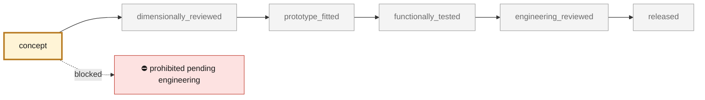

<!-- generated by scripts/render_part_pages.py - do not edit by hand -->

# 993 Turbo catalytic converters (front muffler section), left and right - PET-transcribed identity

**Status: **prohibited pending engineering**. No part is released; see [SAFETY.md](../../SAFETY.md).**

Identity-only catalogue record for the two Turbo catalytic converter / front muffler sections, transcribed per-line from the local PET transcriptions: illustration 202-15 (exhaust system, Turbo) position 14 = 993 113 213 57 and position 15 = 993 113 214 57 in the KAT 17 transcription, with position 15 also listed as 993 113 214 58 in the Porsche Classic KAT 517 USA transcription. Same-assembly context transcribed at the same positions: tail pipes (pos 12/13), oxygen sensors 993 606 128 01 (pos 20) and 993 606 127 01 (pos 22), converter cover 993 113 247 51 (pos 19). No dimensions, substrate data, cell counts, pressure drop or geometry are claimed.

*Validation ladder of `catalog/schemas/part.schema.json`; this record is at `concept`.*

Catalogue record: [`catalog/parts/993-exh-cat-converter-pair-pet-0001.json`](../../catalog/parts/993-exh-cat-converter-pair-pet-0001.json)

## Identity

| field | value |
|---|---|
| identifier | 993-EXH-CAT-CONVERTER-PAIR-PET-0001 |
| generation | 993 |
| variants | 993_Turbo |
| model years | 1995 to 1998 |
| Porsche part numbers | 99311321357, 99311321457, 99311321458 |
| category | exhaust_catalytic_converter |
| safety class | prohibited_pending_engineering |
| intended use | Identity anchor for the exhaust subsystem of the M64 digital twin; no manufacturing, fitment or engine use is authorized by this record |

## Material and manufacturing

| field | value |
|---|---|
| preferred process | undecided |
| candidate processes | CNC |
| material family | unknown |
| grade | unknown |
| standard | not recorded |
| supplier requirements | professional engineering review before any manufacturing claim, dimensional inspection on a real part before any geometry work |
| post-processing | not recorded |

## Geometry

| field | value |
|---|---|
| source type | estimated |
| master format | none |
| units | mm |
| accuracy (mm) | not recorded |

**Master file**

- none

**Derived files**

- none

## Provenance and sources

| field | value |
|---|---|
| record license | All rights reserved (see LICENSE) for this record; no PET illustration or PDF redistributed |

**Sources**

- [Porsche Fanatics local dataset - data/oem-listed.json, PET illustration 202-15 lines (993)](https://porschefanatics.com/oem/993/202-15/)
- [Porsche 993 Workshop Manual - Heat exchanger / catalytic converter torque page 61](https://porschefanatics.com/oem/993/202-15/)

## Validation

| field | value |
|---|---|
| status | concept |
| vehicle tested | not recorded |
| reviewed by |  |
| limitations | not recorded |

**Evidence**

- `SRC-PORSCHEFANATICS-993-OEM-LISTED-PET (202-15 pos 14 and 15)` — *missing from the repository*
- `catalog/manual/993-workshop-manual-measurements.json (torque specs p. 61)` — *missing from the repository*

---

*Page generated from the catalogue record by `scripts/render_part_pages.py`, checked by `make check`. Corrections go in the record, not here.*
