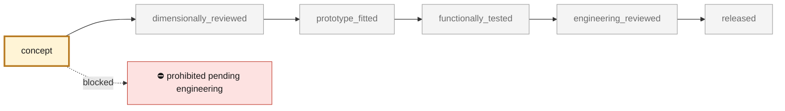

<!-- generated by scripts/render_part_pages.py - do not edit by hand -->

# 993 Turbo exhaust heat exchangers (manifolds), left and right - PET-transcribed identity

**Status: **prohibited pending engineering**. No part is released; see [SAFETY.md](../../SAFETY.md).**

Identity-only catalogue record for the two Turbo exhaust heat exchangers (exhaust manifolds with integrated catalysis in the Turbo line), transcribed per-line from the local PET transcriptions: illustration 202-10 (exhaust system, Turbo) position 1 left 993 211 039 55 and position 2 right 993 211 040 55, confirmed independently by two Porsche PET catalogue transcriptions (KAT 17 and Porsche Classic KAT 517 USA, which lists the -56 suffixes). The record carries part number, group, position, applicability and catalogue context only: no dimensions, materials, wall thicknesses, flow data or geometry are claimed. Quantity per car is not carried by the local transcription; the engine uses one unit per bank (2 per car).

*Validation ladder of `catalog/schemas/part.schema.json`; this record is at `concept`.*

Catalogue record: [`catalog/parts/993-exh-heat-exchanger-pair-pet-0001.json`](../../catalog/parts/993-exh-heat-exchanger-pair-pet-0001.json)

## Identity

| field | value |
|---|---|
| identifier | 993-EXH-HEAT-EXCHANGER-PAIR-PET-0001 |
| generation | 993 |
| variants | 993_Turbo |
| model years | 1995 to 1998 |
| Porsche part numbers | 99321103955, 99321104055, 99321103956, 99321104056 |
| category | exhaust_manifold_heat_exchanger |
| safety class | prohibited_pending_engineering |
| intended use | Identity anchor for the exhaust subsystem of the M64 digital twin; no manufacturing, fitment or engine use is authorized by this record |

## Material and manufacturing

| field | value |
|---|---|
| preferred process | undecided |
| candidate processes | CNC |
| material family | unknown |
| grade | unknown (an IN625 aftermarket offer exists, see 993-ENG-EXHAUST-MANIFOLD-IN625-F0-0001) |
| standard | not recorded |
| supplier requirements | professional engineering review before any manufacturing claim, dimensional inspection on a real part before any geometry work |
| post-processing | not recorded |

## Geometry

| field | value |
|---|---|
| source type | estimated |
| master format | none |
| units | mm |
| accuracy (mm) | not recorded |

**Master file**

- none

**Derived files**

- none

## Provenance and sources

| field | value |
|---|---|
| record license | All rights reserved (see LICENSE) for this record; no PET illustration or PDF redistributed |

**Sources**

- [Porsche Fanatics local dataset - data/oem-listed.json, PET illustration 202-10 lines (993)](https://porschefanatics.com/oem/993/202-10/)
- [Porsche PET 993 - Turbo heat exchangers illustration 202-10 (Porsche Classic KAT 517)](https://assets-v2.porsche.com/us/-/media/Project/PCOM/SharedSite/PorscheClassic/Original-Parts-Catalogue/PDF-EN-US/KAT517_USA_911_98_KATALOG)
- [Porsche 993 Workshop Manual - Exhaust system torque page 61](https://porschefanatics.com/oem/993/202-10/)

## Validation

| field | value |
|---|---|
| status | concept |
| vehicle tested | not recorded |
| reviewed by |  |
| limitations | not recorded |

**Evidence**

- `SRC-PORSCHEFANATICS-993-OEM-LISTED-PET (202-10 pos 1 and 2, both catalogue transcriptions)` — *missing from the repository*
- `SRC-PORSCHE-PET-993-TURBO-HEAT-EXCHANGER-202-10` — *missing from the repository*

---

*Page generated from the catalogue record by `scripts/render_part_pages.py`, checked by `make check`. Corrections go in the record, not here.*
