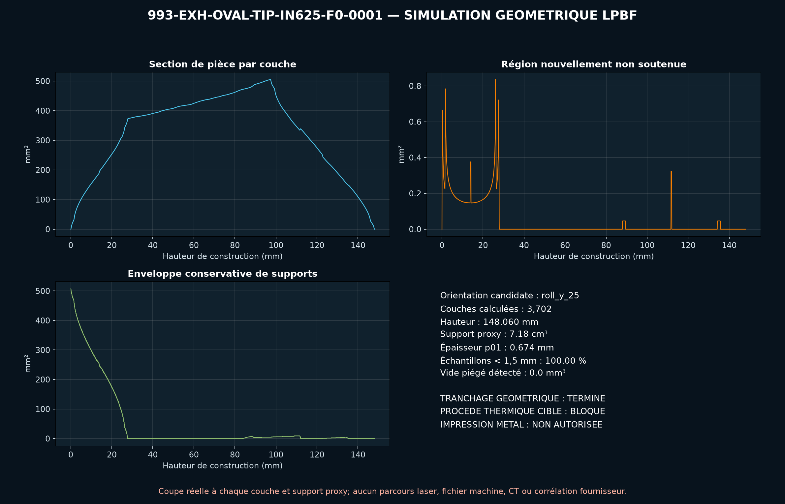

<!-- engendre par scripts/render_part_pages.py - ne pas editer a la main -->

# Embout d'échappement ovale 993, concept double paroi IN625 F0

**Statut : fonctionnel. Aucune pièce n'est libérée ; voir [SAFETY.md](../../SAFETY.md).**

Concept indépendant rond-vers-ovale à double paroi ventilée et huit attaches intégrées pour cribler une fabrication LPBF en IN625. FVD publie uniquement une enveloppe de sortie de 120 x 85 mm pour son embout inox FVD11199300 ; PorscheFanatics documente séparément un précédent IN625 sur des échappements 993 Turbo.

Fiche du catalogue : [`catalog/parts/993-exh-oval-tip-in625-f0-0001.json`](../../catalog/parts/993-exh-oval-tip-in625-f0-0001.json)

## Identité

| champ | valeur |
|---|---|
| identifiant | 993-EXH-OVAL-TIP-IN625-F0-0001 |
| génération | 993 |
| variantes | 993_C2, 993_C4, 993_RS_narrow_body |
| années | 1994 à 1998 |
| références Porsche | non renseigné |
| catégorie | exhaust_tip |
| classe de sécurité | functional |
| usage prévu | Criblage CAO, DfAM, débit, thermique, pression et modal ; aucune fabrication pour montage ni installation véhicule autorisée |

## Matière et fabrication

| champ | valeur |
|---|---|
| procédé préféré | à décider |
| procédés candidats | LPBF, DMLS, sheet_metal |
| famille de matière | superalliage nickel LPBF candidat |
| nuance | EOS NickelAlloy IN625 / UNS N06625 de criblage ; produit FVD déclaré en inox |
| norme | ASTM F3055, AMS 7000 ou AMS 7001 à contractualiser si la voie LPBF est retenue |
| exigences fournisseur | poudre, machine, paramètres, orientation, lot et recyclage traçables, capabilité démontrée sur doubles parois de 0,8 mm et entrefer ouvert de 2,7 mm, stratégie de supports et simulation de distorsion avant lancement, contrôle dimensionnel du raccord, de l'ovale, de l'angle et des jeux, CT ou radiographie de la double paroi et ressuage après finition, essais de fuite, vibration, cycles thermiques et température de jupe arrière avant véhicule |
| post-traitement | évacuation complète de la poudre par les deux extrémités de la double paroi, détensionnement qualifié pour la machine et les paramètres, découpe du plateau avec contrôle de l'ovalisation, usinage de l'emmanchement et de la portée de serrage après ajout de surépaisseurs, ébavurage et polissage du chemin de gaz, passivation ou finition de surface à définir après essais |

## Géométrie

| champ | valeur |
|---|---|
| type de source | mixed |
| format du maître | build123d |
| unités | mm |
| précision (mm) | non renseigné |

**Fichier maître**

- [`parts/993-exh-oval-tip-in625-f0-0001/source/oval_exhaust_tip.py`](../../parts/993-exh-oval-tip-in625-f0-0001/source/oval_exhaust_tip.py)

**Fichiers dérivés**

- [`parts/993-exh-oval-tip-in625-f0-0001/derived/oval_exhaust_tip_in625_f0.step`](../../parts/993-exh-oval-tip-in625-f0-0001/derived/oval_exhaust_tip_in625_f0.step)

## Images

*parts/993-exh-oval-tip-in625-f0-0001/evidence/lpbf-f0/993-exh-oval-tip-in625-f0-0001-lpbf-geometry-screen.png*

## Provenance et sources

| champ | valeur |
|---|---|
| licence de la fiche | MIT pour le concept, le script et les calculs ; aucune photographie, marque, illustration PET ou géométrie commerciale redistribuée |

**Sources**

- [FVD - embouts inox ovales 993 étroites](https://www.fvd.net/de-de/FVD11199300/endrohrsatz-edelstahl-poliert-oval-schraeg-993-120x85mm.html)
- [PorscheFanatics - registre des matériaux déclarés](https://porschefanatics.com/materials/)
- [EOS NickelAlloy IN625 material data sheet](https://www.eos.info/05-datasheet-images/Assets_MDS_Metal/EOS_NickelAlloy_IN625/Material_DataSheet_EOS_NickelAlloy_IN625_en.pdf)
- [Special Metals - INCONEL alloy 625](https://www.specialmetals.com/documents/technical-bulletins/inconel/inconel-alloy-625.pdf)

## Validation

| champ | valeur |
|---|---|
| statut | concept |
| essais véhicule | non renseigné |
| revu par |  |
| limites | non renseigné |

**Preuves**

- [`catalog/sources/src-fvd-993-exhaust-tips-dimensions.json`](../../catalog/sources/src-fvd-993-exhaust-tips-dimensions.json)
- [`catalog/sources/src-porschefanatics-993-in625-exhaust-register.json`](../../catalog/sources/src-porschefanatics-993-in625-exhaust-register.json)
- [`catalog/sources/src-eos-in625-material-data.json`](../../catalog/sources/src-eos-in625-material-data.json)
- [`catalog/sources/src-special-metals-inconel-625.json`](../../catalog/sources/src-special-metals-inconel-625.json)
- [`parts/993-exh-oval-tip-in625-f0-0001/evidence/engineering-screen.json`](../../parts/993-exh-oval-tip-in625-f0-0001/evidence/engineering-screen.json)
- [`parts/993-exh-oval-tip-in625-f0-0001/evidence/openfoam-flow-screen.json`](../../parts/993-exh-oval-tip-in625-f0-0001/evidence/openfoam-flow-screen.json)
- [`twins/993-oval-exhaust-tip-in625-f0/evidence/openfoam-f0/openfoam-evidence-audit.json`](../../twins/993-oval-exhaust-tip-in625-f0/evidence/openfoam-f0/openfoam-evidence-audit.json)
- [`twins/993-oval-exhaust-tip-in625-f0/evidence/lpbf-f0/993-exh-oval-tip-in625-f0-0001-lpbf-geometry-report.json`](../../twins/993-oval-exhaust-tip-in625-f0/evidence/lpbf-f0/993-exh-oval-tip-in625-f0-0001-lpbf-geometry-report.json)
- [`twins/993-oval-exhaust-tip-in625-f0/evidence/lpbf-f0/omniverse-build-screen-summary.json`](../../twins/993-oval-exhaust-tip-in625-f0/evidence/lpbf-f0/omniverse-build-screen-summary.json)
- [`twins/993-oval-exhaust-tip-in625-f0/evidence/simready-f0/simready-validation-summary.json`](../../twins/993-oval-exhaust-tip-in625-f0/evidence/simready-f0/simready-validation-summary.json)

## Dossiers de conception

- [993_EMBOUT_TITANE_F1](../../docs/993/993_EMBOUT_TITANE_F1.md)
- [993_OVAL_EXHAUST_TIP_IN625_F0](../../docs/993/993_OVAL_EXHAUST_TIP_IN625_F0.md)

---

*Page engendrée depuis la fiche du catalogue par `scripts/render_part_pages.py`, vérifiée par `make check`. Toute correction se fait dans la fiche, pas ici.*
