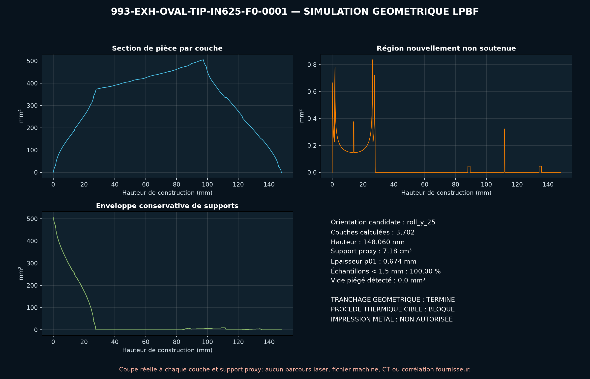
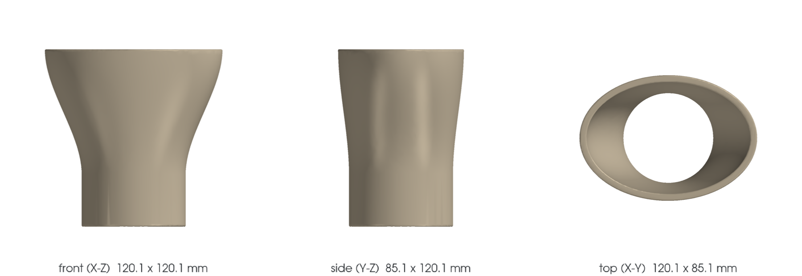

<!-- generated by scripts/render_part_pages.py - do not edit by hand -->

# 993 oval exhaust tip, IN625 double-wall F0 concept

**Status: functional. No part is released; see [SAFETY.md](../../SAFETY.md).**

Independent round-to-oval concept with a ventilated double wall and eight integrated attachments to screen LPBF manufacture in IN625. FVD publishes only a 120 x 85 mm outlet envelope for its FVD11199300 stainless tip; PorscheFanatics separately documents an IN625 precedent on 993 Turbo exhausts.

```mermaid
flowchart LR
    L0["concept"]
    L1["dimensionally_reviewed"]
    L2["prototype_fitted"]
    L3["functionally_tested"]
    L4["engineering_reviewed"]
    L5["released"]
    L0 --> L1 --> L2 --> L3 --> L4 --> L5
    classDef here fill:#fff4d6,stroke:#b7791f,color:#1a1a1a,stroke-width:3px;
    classDef done fill:#e3f1e6,stroke:#2e7d32,color:#1a1a1a;
    classDef todo fill:#f4f4f4,stroke:#9e9e9e,color:#6b6b6b;
    classDef stop fill:#fde2e1,stroke:#c0392b,color:#1a1a1a;
    class L0 here
    class L1 todo
    class L2 todo
    class L3 todo
    class L4 todo
    class L5 todo
```

*Validation ladder of `catalog/schemas/part.schema.json`; this record is at `concept`.*

Catalogue record: [`catalog/parts/993-exh-oval-tip-in625-f0-0001.json`](../../catalog/parts/993-exh-oval-tip-in625-f0-0001.json)

## Identity

| field | value |
|---|---|
| identifier | 993-EXH-OVAL-TIP-IN625-F0-0001 |
| generation | 993 |
| variants | 993_C2, 993_C4, 993_RS_narrow_body |
| model years | 1994 to 1998 |
| Porsche part numbers | not recorded |
| category | exhaust_tip |
| safety class | functional |
| intended use | CAD, DfAM, flow, thermal, pressure and modal screening; no manufacturing for fitting and no vehicle installation authorized |

## Material and manufacturing

| field | value |
|---|---|
| preferred process | undecided |
| candidate processes | LPBF, DMLS, sheet_metal |
| material family | candidate LPBF nickel superalloy |
| grade | EOS NickelAlloy IN625 / UNS N06625 for screening; FVD product declared stainless |
| standard | ASTM F3055, AMS 7000 or AMS 7001 to be contracted if the LPBF route is selected |
| supplier requirements | traceable powder, machine, parameters, orientation, lot and recycling, demonstrated capability on 0.8 mm double walls and a 2.7 mm open air gap, support strategy and distortion simulation before launch, dimensional inspection of the connection, oval, angle and clearances, CT or radiography of the double wall and dye penetrant inspection after finishing, leak, vibration, thermal cycling and rear valance temperature tests before vehicle use |
| post-processing | complete powder removal through both ends of the double wall, stress relief qualified for the machine and parameters, build plate cut-off with ovality control, machining of the slip fit and clamping seat after adding machining stock, deburring and polishing of the gas path, passivation or surface finish to be defined after testing |

## Geometry

| field | value |
|---|---|
| source type | mixed |
| master format | build123d |
| units | mm |
| accuracy (mm) | not recorded |

**Master file**

- [`parts/993-exh-oval-tip-in625-f0-0001/source/oval_exhaust_tip.py`](../../parts/993-exh-oval-tip-in625-f0-0001/source/oval_exhaust_tip.py)

**Derived files**

- [`parts/993-exh-oval-tip-in625-f0-0001/derived/oval_exhaust_tip_in625_f0.step`](../../parts/993-exh-oval-tip-in625-f0-0001/derived/oval_exhaust_tip_in625_f0.step)

## Images

*parts/993-exh-oval-tip-in625-f0-0001/evidence/lpbf-f0/993-exh-oval-tip-in625-f0-0001-lpbf-geometry-screen.png*

*parts/993-exh-oval-tip-in625-f0-0001/media/preview.png*

*parts/993-exh-oval-tip-in625-f0-0001/media/views.png*

## Provenance and sources

| field | value |
|---|---|
| record license | MIT for the concept, the script and the calculations; no photograph, trademark, PET illustration or commercial geometry redistributed |

**Sources**

- [FVD - 993 narrow-body oval stainless tips](https://www.fvd.net/de-de/FVD11199300/endrohrsatz-edelstahl-poliert-oval-schraeg-993-120x85mm.html)
- [PorscheFanatics - register of declared materials](https://porschefanatics.com/materials/)
- [EOS NickelAlloy IN625 material data sheet](https://www.eos.info/05-datasheet-images/Assets_MDS_Metal/EOS_NickelAlloy_IN625/Material_DataSheet_EOS_NickelAlloy_IN625_en.pdf)
- [Special Metals - INCONEL alloy 625](https://www.specialmetals.com/documents/technical-bulletins/inconel/inconel-alloy-625.pdf)

## Validation

| field | value |
|---|---|
| status | concept |
| vehicle tested | not recorded |
| reviewed by |  |
| limitations | not recorded |

**Evidence**

- [`catalog/sources/src-fvd-993-exhaust-tips-dimensions.json`](../../catalog/sources/src-fvd-993-exhaust-tips-dimensions.json)
- [`catalog/sources/src-porschefanatics-993-in625-exhaust-register.json`](../../catalog/sources/src-porschefanatics-993-in625-exhaust-register.json)
- [`catalog/sources/src-eos-in625-material-data.json`](../../catalog/sources/src-eos-in625-material-data.json)
- [`catalog/sources/src-special-metals-inconel-625.json`](../../catalog/sources/src-special-metals-inconel-625.json)
- [`parts/993-exh-oval-tip-in625-f0-0001/evidence/engineering-screen.json`](../../parts/993-exh-oval-tip-in625-f0-0001/evidence/engineering-screen.json)
- [`parts/993-exh-oval-tip-in625-f0-0001/evidence/openfoam-flow-screen.json`](../../parts/993-exh-oval-tip-in625-f0-0001/evidence/openfoam-flow-screen.json)
- [`twins/993-oval-exhaust-tip-in625-f0/evidence/openfoam-f0/openfoam-evidence-audit.json`](../../twins/993-oval-exhaust-tip-in625-f0/evidence/openfoam-f0/openfoam-evidence-audit.json)
- [`twins/993-oval-exhaust-tip-in625-f0/evidence/lpbf-f0/993-exh-oval-tip-in625-f0-0001-lpbf-geometry-report.json`](../../twins/993-oval-exhaust-tip-in625-f0/evidence/lpbf-f0/993-exh-oval-tip-in625-f0-0001-lpbf-geometry-report.json)
- [`twins/993-oval-exhaust-tip-in625-f0/evidence/lpbf-f0/omniverse-build-screen-summary.json`](../../twins/993-oval-exhaust-tip-in625-f0/evidence/lpbf-f0/omniverse-build-screen-summary.json)
- [`twins/993-oval-exhaust-tip-in625-f0/evidence/simready-f0/simready-validation-summary.json`](../../twins/993-oval-exhaust-tip-in625-f0/evidence/simready-f0/simready-validation-summary.json)

## Design dossiers

- [993_EMBOUT_TITANE_F1](../../docs/993/993_EMBOUT_TITANE_F1.md)
- [993_OVAL_EXHAUST_TIP_IN625_F0](../../docs/993/993_OVAL_EXHAUST_TIP_IN625_F0.md)

---

*Page generated from the catalogue record by `scripts/render_part_pages.py`, checked by `make check`. Corrections go in the record, not here.*
