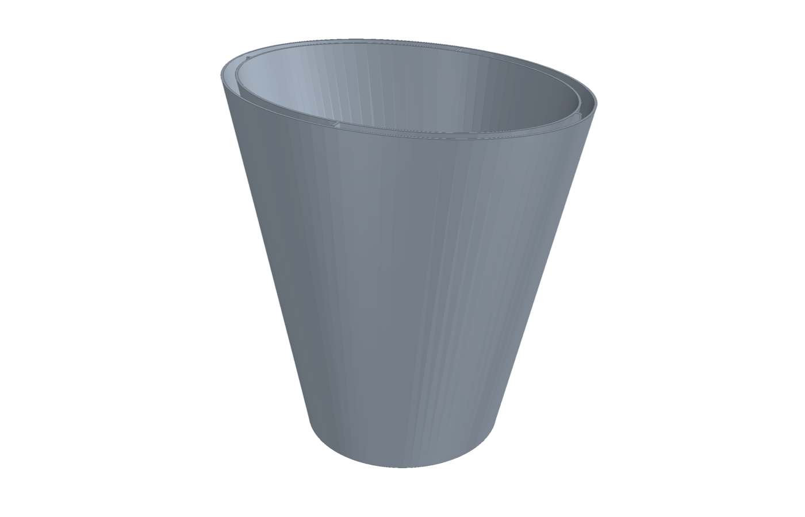
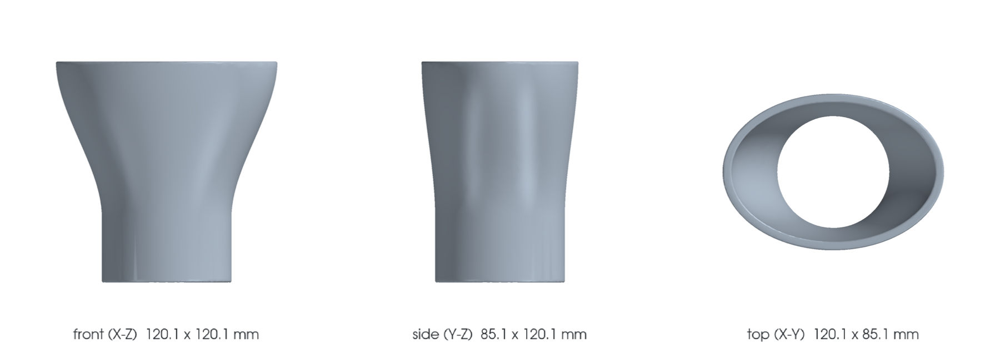

<!-- generated by scripts/render_part_pages.py - do not edit by hand -->

# Oval exhaust tip, F1 titanium variant

**Status: functional. No part is released; see [SAFETY.md](../../SAFETY.md).**

Same double-wall geometry as the IN625 F0 variant, screened in titanium. Selected by the repository titanium screening as the only part in the catalogue where both titanium and additive manufacturing win without running into the safety class. The alloy is deliberately not fixed in the identifier: Ti-6Al-4V and Ti-6242 are both screened, and a temperature that has never been measured separates them.

```mermaid
flowchart LR
    L0["concept"]
    L1["dimensionally_reviewed"]
    L2["prototype_fitted"]
    L3["functionally_tested"]
    L4["engineering_reviewed"]
    L5["released"]
    L0 --> L1 --> L2 --> L3 --> L4 --> L5
    classDef here fill:#fff4d6,stroke:#b7791f,color:#1a1a1a,stroke-width:3px;
    classDef done fill:#e3f1e6,stroke:#2e7d32,color:#1a1a1a;
    classDef todo fill:#f4f4f4,stroke:#9e9e9e,color:#6b6b6b;
    classDef stop fill:#fde2e1,stroke:#c0392b,color:#1a1a1a;
    class L0 here
    class L1 todo
    class L2 todo
    class L3 todo
    class L4 todo
    class L5 todo
```

*Validation ladder of `catalog/schemas/part.schema.json`; this record is at `concept`.*

Catalogue record: [`catalog/parts/993-exh-oval-tip-ti-f1-0001.json`](../../catalog/parts/993-exh-oval-tip-ti-f1-0001.json)

## Identity

| field | value |
|---|---|
| identifier | 993-EXH-OVAL-TIP-TI-F1-0001 |
| generation | 993 |
| variants | 993_C2, 993_C4, 993_RS_narrow_body |
| model years | 1994 to 1998 |
| Porsche part numbers | not recorded |
| category | exhaust_tip |
| safety class | functional |
| intended use | CAD, DfAM, flow, thermal, pressure and modal screening; no manufacturing for fitting and no vehicle installation authorized |

## Material and manufacturing

| field | value |
|---|---|
| preferred process | LPBF |
| candidate processes | LPBF, DMLS, sheet_metal |
| material family | titanium |
| grade | Ti-6Al-4V if the actual temperature allows it; Ti-6242 otherwise, but with no supplier identified |
| standard | ASTM F2924 for PBF-LB Ti-6Al-4V; AMS 4975/4976 for wrought Ti-6242 |
| supplier requirements | Material certificate, powder lot and number of reuses, Proposed orientation and support topology, with justification, Evidence of depowdering of the annular channel, by borescope or tomography, Documented heat treatment and delivery condition, Layer thickness used and coupon properties at that thickness |
| post-processing | trimming, support removal and rework of the attachments, stress relief heat treatment, 800 °C 2 h under argon on the EOS Ti64 route, controlled depowdering of the 2.7 mm annular channel, borescope inspection required, external surface finish to be defined, the tip is visible |

**Titanium**

| field | value |
|---|---|
| alloy | Ti-6Al-4V primary candidate, Ti-6242 high-temperature fallback |
| heat treatment | 800 °C 2 h under argon for the EOS Ti64 route; not fixed for Ti-6242 |
| HIP | to_be_determined |
| machined surfaces | not recorded |
| inspection | dimensional inspection of the outlet envelope, borescope inspection of the annular channel |
| galvanic isolation | Titanium/stainless steel couple at the outlet mounting: to be addressed; titanium is noble and stainless follows it closely, but moisture and road salt remain present. |
| fatigue assumptions | not recorded |

## Geometry

| field | value |
|---|---|
| source type | mixed |
| master format | build123d |
| units | mm |
| accuracy (mm) | not recorded |

**Master file**

- [`parts/993-exh-oval-tip-in625-f0-0001/source/oval_exhaust_tip.py`](../../parts/993-exh-oval-tip-in625-f0-0001/source/oval_exhaust_tip.py)

**Derived files**

- [`parts/993-exh-oval-tip-ti-f1-0001/derived/oval_exhaust_tip_ti_f1.step`](../../parts/993-exh-oval-tip-ti-f1-0001/derived/oval_exhaust_tip_ti_f1.step)
- [`parts/993-exh-oval-tip-ti-f1-0001/derived/oval_exhaust_tip_ti_f1.stl`](../../parts/993-exh-oval-tip-ti-f1-0001/derived/oval_exhaust_tip_ti_f1.stl)

## Images

*`parts/993-exh-oval-tip-ti-f1-0001/media/preview.png` — concept CAD block, **not** the original part, not a print file.*

*`parts/993-exh-oval-tip-ti-f1-0001/media/views.png` — concept CAD block, **not** the original part, not a print file.*

## Provenance and sources

| field | value |
|---|---|
| record license | All rights reserved (see LICENSE) for the concept, the script and the calculations; no photograph, trademark, PET illustration or commercial geometry redistributed |

**Sources**

- [FVD - 993 narrow-body oval stainless tips](https://www.fvd.net/de-de/FVD11199300/endrohrsatz-edelstahl-poliert-oval-schraeg-993-120x85mm.html)
- [PorscheFanatics - register of declared materials](https://porschefanatics.com/materials/)
- [EOS NickelAlloy IN625 material data sheet](https://www.eos.info/05-datasheet-images/Assets_MDS_Metal/EOS_NickelAlloy_IN625/Material_DataSheet_EOS_NickelAlloy_IN625_en.pdf)
- [Special Metals - INCONEL alloy 625](https://www.specialmetals.com/documents/technical-bulletins/inconel/inconel-alloy-625.pdf)

## Validation

| field | value |
|---|---|
| status | concept |
| vehicle tested | not recorded |
| reviewed by |  |
| limitations | not recorded |

**Evidence**

- [`twins/993-exhaust-tip-ti-f0/evidence/selection/titanium-candidate-screen.json`](../../twins/993-exhaust-tip-ti-f0/evidence/selection/titanium-candidate-screen.json)
- [`parts/993-exh-oval-tip-ti-f1-0001/evidence/engineering-screen-ti64.json`](../../parts/993-exh-oval-tip-ti-f1-0001/evidence/engineering-screen-ti64.json)
- [`parts/993-exh-oval-tip-ti-f1-0001/evidence/engineering-screen-ti6242.json`](../../parts/993-exh-oval-tip-ti-f1-0001/evidence/engineering-screen-ti6242.json)
- [`twins/993-exhaust-tip-ti-f0/evidence/lpbf-f1/993-exh-oval-tip-ti-f1-0001-lpbf-geometry-report.json`](../../twins/993-exhaust-tip-ti-f0/evidence/lpbf-f1/993-exh-oval-tip-ti-f1-0001-lpbf-geometry-report.json)

## Design dossiers

- [993_EMBOUT_TITANE_F1](../../docs/993/993_EMBOUT_TITANE_F1.md)

---

*Page generated from the catalogue record by `scripts/render_part_pages.py`, checked by `make check`. Corrections go in the record, not here.*
