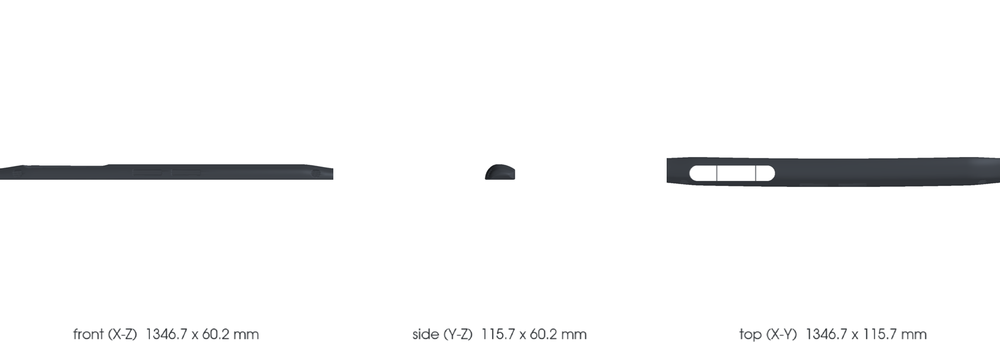

<!-- generated by scripts/render_part_pages.py - do not edit by hand -->

# Dashboard trim, composite

**Status: functional. No part is released; see [SAFETY.md](../../SAFETY.md).**

993 dashboard trim reproduced in composite, **for vehicles without a passenger airbag only**. The part is not the dashboard itself: that one, 993 502 027 02, is a body shell panel. This is the trim that covers it, fitted on clip nuts and self-tapping screws. Selected because no manufacturer offers it in carbon, unlike body panels.

*Validation ladder of `catalog/schemas/part.schema.json`; this record is at `concept`.*

Catalogue record: [`catalog/parts/993-int-dashboard-trim-0001.json`](../../catalog/parts/993-int-dashboard-trim-0001.json)

## Identity

| field | value |
|---|---|
| identifier | 993-INT-DASHBOARD-TRIM-0001 |
| generation | 993 |
| variants | M564 without airbag, Carrera RS M002, Carrera RS Clubsport M003 |
| model years | 1994 to 1998 |
| Porsche part numbers | 993 552 055 00, 993 552 056 00, 993 552 055 70, 993 552 056 70 |
| category | interior_trim |
| safety class | functional |
| intended use | Visible trim of the dashboard cross member on a vehicle without a passenger airbag, carrying the air vents and the instrument hood, and receiving the knee protection strip, which stays original |

## Material and manufacturing

| field | value |
|---|---|
| preferred process | undecided |
| candidate processes | casting |
| material family | organic matrix composite |
| grade | fiber and resin to be determined; the visible finish requires a fabric and a surface finish, which no hidden panel does |
| standard | none |
| supplier requirements | not recorded |
| post-processing | trimming of the air vent and instrument openings, fitting of inserts and attachment points, visible surface finish, clear coat and UV resistance, clearance check with instrument hood, center console and pillars |

## Geometry

| field | value |
|---|---|
| source type | estimated |
| master format | build123d |
| units | mm |
| accuracy (mm) | not recorded |

**Master file**

- [`scripts/build_993_concept_f0.py`](../../scripts/build_993_concept_f0.py)

**Derived files**

- [`parts/993-int-dashboard-trim-0001/derived/dashboard_trim_concept_f0.step`](../../parts/993-int-dashboard-trim-0001/derived/dashboard_trim_concept_f0.step)

## Images

*`parts/993-int-dashboard-trim-0001/media/preview.png` — concept CAD block, **not** the original part, not a print file.*

*`parts/993-int-dashboard-trim-0001/media/views.png` — concept CAD block, **not** the original part, not a print file.*

## Provenance and sources

| field | value |
|---|---|
| record license | MIT for the record, geometry not yet produced |

**Sources**

- [Porsche PET - 911 1994-1998 Type 993, parts catalogue revision Kat 017](https://rsworkshop.ch/downloaded/pet-porsche/993_1994-98_KATALOG.pdf)
- [Federleichte Elfer - mass table, 993 interior](http://www.federleichte-elfer.de/dp93/innen.html)

## Validation

| field | value |
|---|---|
| status | concept |
| vehicle tested | not recorded |
| reviewed by |  |
| limitations | not recorded |

**Evidence**

- none

---

*Page generated from the catalogue record by `scripts/render_part_pages.py`, checked by `make check`. Corrections go in the record, not here.*
